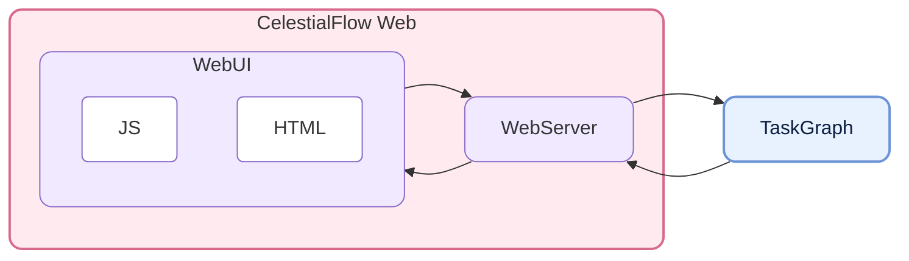
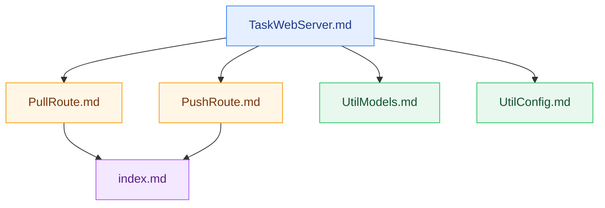

# CelestialFlow Web - CelestialFlow 的独立任务监控与交互界面

<p align="center">
  
  
  
  
</p>

<p align="center">
  <a href="https://github.com/Mr-xiaotian/celestialflow-web">GitHub</a> |
  <a href="https://github.com/Mr-xiaotian/CelestialFlow">CelestialFlow</a> |
  <a href="./docs/zh-CN/src/__init__.md">中文文档</a>
</p>

**CelestialFlow Web** 是从 `CelestialFlow` 主仓库中拆分出的独立 Web 仓库，提供基于 **FastAPI + TypeScript** 的任务图监控界面，用于展示任务结构、节点状态、错误日志、图分析信息，以及通过页面向运行中的任务图注入任务或终止符。

它本身不负责任务调度，而是作为 `TaskReporter` 与浏览器之间的中转层：

- 后端通过 `push_*` 接口持续上报结构、状态、分析和错误
- 前端通过 `pull_*` 接口按版本号增量拉取数据
- Web 页面可直接下发任务注入和终止符注入请求
- 错误记录持久化到 SQLite，支持分页、过滤和错误类型聚合

## 项目结构（Project Structure）



## 快速开始（Quick Start）

如果你只想启动 Web 服务本身，可以单独安装本项目。  
如果你希望它与 `CelestialFlow` 任务图联动，则还需要在同一环境中安装 `celestialflow`。

### 安装

```bash
# 推荐用 uv
uv pip install celestialflow-web

# 或者使用 pip
pip install celestialflow-web
```

如果你要接入实际运行中的 `CelestialFlow` 图任务，还需要额外安装主框架：

```bash
uv pip install celestialflow
```

### 启动 Web 服务

```bash
# 默认监听 0.0.0.0:5000
celestialflow-web

# 指定端口
celestialflow-web --port 5005

# 指定主机和端口
celestialflow-web --host 127.0.0.1 --port 5005
```

也可以直接在代码中启动：

```python
from celestialflow_web import TaskWebServer

server = TaskWebServer(host="127.0.0.1", port=5005, log_level="info")
server.start_server()
```

启动后访问：

👉 [http://localhost:5005](http://localhost:5005)

页面可查看任务结构、节点状态、错误日志、错误类型分布，以及实时注入任务。


<p align="center"><em>gif图压缩了过多细节(｡•́︿•̀｡)</em></p>

### 在 CelestialFlow 中启用 Reporter

以当前主机和端口为例：

```python
graph.set_reporter(True, host="127.0.0.1", port=5005)
```

一个更完整的接入示例：

```python
from celestialflow import TaskGraph, TaskStage


def process(x: int) -> int:
    return x * 2


stage = TaskStage("StageA", process, execution_mode="thread")
graph = TaskGraph(name="DemoGraph")
graph.set_stages(stages=[stage])
graph.set_reporter(True, host="127.0.0.1", port=5005)
graph.start_graph({stage.get_name(): [1, 2, 3]})
```

## 深入阅读（Further Reading）

如果你想了解这个 Web 仓库的后端结构和前端模块，下面这些文档最值得先看：

- [TaskWebServer.md](./docs/zh-CN/src/server/core_server.md)
- [PullRoute.md](./docs/zh-CN/src/routes/core_pull.md)
- [PushRoute.md](./docs/zh-CN/src/routes/core_push.md)
- [UtilModels.md](./docs/zh-CN/src/runtime/util_models.md)
- [UtilConfig.md](./docs/zh-CN/src/runtime/util_config.md)
- [index.md](./docs/zh-CN/src/templates/index.md)

推荐阅读顺序：



## API 概览（API Overview）

### Pull 接口

用于前端拉取数据，核心特点是 `known_rev` 版本号守卫：

| 端点 | 作用 |
|------|------|
| `GET /api/pull_server_state` | 获取 Reporter 同步所需的服务端状态 |
| `GET /api/pull_config` | 获取前端配置 |
| `GET /api/pull_status` | 获取节点状态快照 |
| `GET /api/pull_structure` | 获取图结构 |
| `GET /api/pull_errors` | 获取分页错误日志 |
| `GET /api/pull_analysis` | 获取图分析结果 |
| `GET /api/pull_error_type_counts` | 获取错误类型聚合统计 |
| `GET /api/pull_injection` | 取出并清空待注入任务与终止符 |

### Push 接口

用于 Reporter 或前端向服务端推送数据：

| 端点 | 作用 |
|------|------|
| `POST /api/push_config` | 保存前端配置并更新刷新间隔 |
| `POST /api/push_structure` | 推送图结构 |
| `POST /api/push_analysis` | 推送图分析结果 |
| `POST /api/push_status` | 推送状态快照 |
| `POST /api/push_errors` | 推送错误记录 |
| `POST /api/push_injection_tasks` | 前端提交任务注入 |
| `POST /api/push_injection_terminations` | 前端提交终止符注入 |

## 环境要求（Requirements）

| 依赖项 | 说明 |
|--------|------|
| **Python >= 3.12** | 运行环境 |
| **fastapi** | Web API 服务 |
| **uvicorn** | ASGI Server |
| **jinja2** | HTML 模板渲染 |
| **pydantic** | 请求/响应与配置模型 |

开发与测试常用依赖：

| 依赖项 | 说明 |
|--------|------|
| **pytest** | 单元测试 |
| **pytest-asyncio** | 异步测试支持 |
| **httpx2** | FastAPI TestClient 相关依赖 |
| **build / twine** | 打包与发布 |

## 开发命令（Development）

```bash
# 安装开发依赖
uv sync --group dev

# 运行测试
uv run pytest -q

# 构建包
uv build

# 本地编译前端 TS
cd src/celestialflow_web
npm install
npm run build
```

## 文件结构（File Structure）

当前仓库主要分为以下几个区域：

```text
src/celestialflow_web/
  __init__.py
  config.json
  server/
  routes/
  runtime/
  templates/
  static/
tests/
docs/zh-CN/
```

- `server/`：`TaskWebServer` 与 CLI 入口
- `routes/`：Pull / Push 接口注册
- `runtime/`：配置、模型、SQLite 和参数归一化工具
- `templates/`：Jinja2 HTML 模板
- `static/ts/`：前端 TypeScript 源码
- `tests/`：服务端 API 与状态一致性测试

## 版本日志（Version Log）

- `0.1.0`
  - 从 `CelestialFlow` 主仓库拆分为独立 Web 项目
  - 收口为合法 Python 包 `celestialflow_web`
  - 将后端结构整理为 `server/`、`routes/`、`runtime/`
  - 保留 FastAPI + TypeScript 的独立任务监控与交互能力

## Star History

如果这个项目对你有帮助，欢迎点一个 Star。  
如果你在使用过程中遇到问题，也欢迎提交 Issues 或 Discussions。


## 许可（License）

This project is licensed under the MIT License - see the [LICENSE](./LICENSE) file for details.

## 作者（Author）

Author: Mr-xiaotian  
Email: mingxiaomingtian@gmail.com  
Project Link: [https://github.com/Mr-xiaotian/celestialflow-web](https://github.com/Mr-xiaotian/celestialflow-web)
