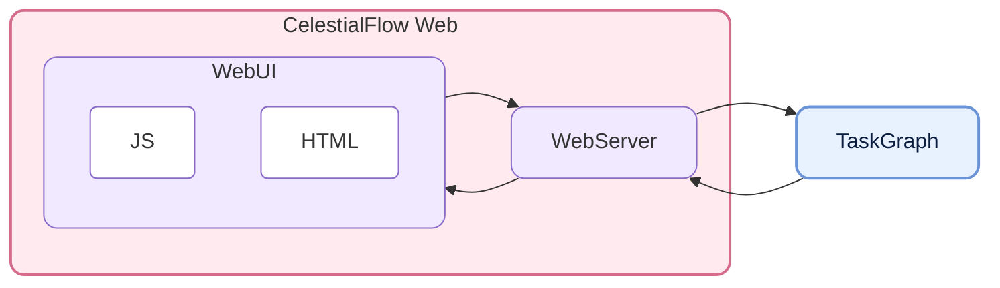
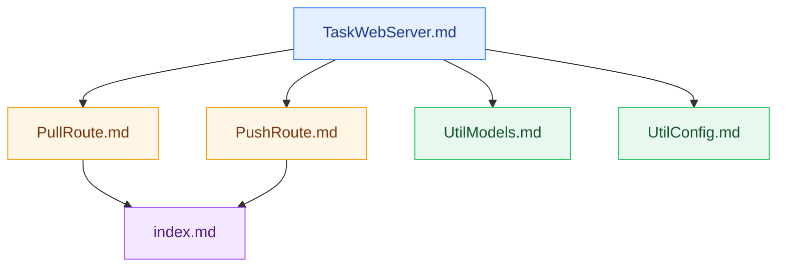

# CelestialFlow Web - Standalone Task Monitoring and Interaction Interface for CelestialFlow

<p align="center">
  
  
  
  
</p>

<p align="center">
  <a href="https://github.com/Mr-xiaotian/celestialflow-web">GitHub</a> |
  <a href="https://github.com/Mr-xiaotian/CelestialFlow">CelestialFlow</a> |
  <a href="./docs/zh-CN/src/__init__.md">Chinese Docs</a>
</p>

**CelestialFlow Web** is a standalone Web repository split out from the main `CelestialFlow` repository. It provides a task graph monitoring interface built on **FastAPI + TypeScript**, used to display the task structure, node status, error logs, and graph analysis information, as well as to inject tasks or termination markers into a running task graph through the page.

It does not handle task scheduling itself; instead, it acts as a relay layer between `TaskReporter` and the browser:

- The backend continuously reports structure, status, analysis, and errors through the `push_*` endpoints
- The frontend incrementally pulls data by version number through the `pull_*` endpoints
- The Web page can directly issue task injection and termination injection requests
- Error records are persisted to SQLite, supporting pagination, filtering, and error type aggregation

## Project Structure



## Quick Start

If you only want to start the Web service itself, you can install this project on its own.  
If you want it to work together with a `CelestialFlow` task graph, you also need to install `celestialflow` in the same environment.

### Installation

```bash
# uv is recommended
uv pip install celestialflow-web

# or use pip
pip install celestialflow-web
```

If you want to connect to a `CelestialFlow` graph task that is actually running, you also need to install the main framework:

```bash
uv pip install celestialflow
```

### Starting the Web Service

```bash
# Listen on 0.0.0.0:5000 by default
celestialflow-web

# Specify the port
celestialflow-web --port 5005

# Specify the host and port
celestialflow-web --host 127.0.0.1 --port 5005
```

You can also start it directly in code:

```python
from celestialflow_web import TaskWebServer

server = TaskWebServer(host="127.0.0.1", port=5005, log_level="info")
server.start_server()
```

After starting, visit:

👉 [http://localhost:5005](http://localhost:5005)

The page lets you view the task structure, node status, error logs, and error type distribution, as well as inject tasks in real time.


<p align="center"><em>The gif compresses away too much detail (｡•́︿•̀｡)</em></p>

### Enabling the Reporter in CelestialFlow

Taking the current host and port as an example:

```python
graph.set_reporter(True, host="127.0.0.1", port=5005)
```

A more complete integration example:

```python
from celestialflow import TaskGraph, TaskStage


def process(x: int) -> int:
    return x * 2


stage = TaskStage("StageA", process, execution_mode="thread")
graph = TaskGraph(name="DemoGraph")
graph.set_stages(stages=[stage])
graph.set_reporter(True, host="127.0.0.1", port=5005)
graph.start_graph({stage.get_name(): [1, 2, 3]})
```

## Further Reading

If you want to understand the backend structure and frontend modules of this Web repository, these documents are the most worth reading first:

- [TaskWebServer.md](./docs/zh-CN/src/server/core_server.md)
- [PullRoute.md](./docs/zh-CN/src/routes/core_pull.md)
- [PushRoute.md](./docs/zh-CN/src/routes/core_push.md)
- [UtilModels.md](./docs/zh-CN/src/runtime/util_models.md)
- [UtilConfig.md](./docs/zh-CN/src/runtime/util_config.md)
- [index.md](./docs/zh-CN/src/templates/index.md)

Recommended reading order:



## API Overview

### Pull Endpoints

Used by the frontend to pull data; its core feature is the `known_rev` version-number guard:

| Endpoint | Purpose |
|------|------|
| `GET /api/pull_server_state` | Get the server-side state required for Reporter synchronization |
| `GET /api/pull_config` | Get the frontend configuration |
| `GET /api/pull_status` | Get a snapshot of node status |
| `GET /api/pull_structure` | Get the graph structure |
| `GET /api/pull_errors` | Get paginated error logs |
| `GET /api/pull_analysis` | Get the graph analysis result |
| `GET /api/pull_error_type_counts` | Get error type aggregate statistics |
| `GET /api/pull_injection` | Fetch and clear pending injection tasks and terminations |

### Push Endpoints

Used by the Reporter or the frontend to push data to the server:

| Endpoint | Purpose |
|------|------|
| `POST /api/push_config` | Save the frontend configuration and update the refresh interval |
| `POST /api/push_structure` | Push the graph structure |
| `POST /api/push_analysis` | Push the graph analysis result |
| `POST /api/push_status` | Push a status snapshot |
| `POST /api/push_errors` | Push error records |
| `POST /api/push_injection_tasks` | Frontend submits a task injection |
| `POST /api/push_injection_terminations` | Frontend submits a termination injection |

## Requirements

| Dependency | Description |
|--------|------|
| **Python >= 3.12** | Runtime environment |
| **fastapi** | Web API service |
| **uvicorn** | ASGI Server |
| **jinja2** | HTML template rendering |
| **pydantic** | Request/response and configuration models |

Common dependencies for development and testing:

| Dependency | Description |
|--------|------|
| **pytest** | Unit testing |
| **pytest-asyncio** | Async test support |
| **httpx2** | Dependency related to FastAPI TestClient |
| **build / twine** | Packaging and publishing |

## Development

```bash
# Install development dependencies
uv sync --group dev

# Run tests
uv run pytest -q

# Build the package
uv build

# Compile the frontend TS locally
cd src/celestialflow_web
npm install
npm run build
```

## File Structure

The current repository is mainly divided into the following areas:

```text
src/celestialflow_web/
  __init__.py
  config.json
  server/
  routes/
  runtime/
  templates/
  static/
tests/
docs/zh-CN/
```

- `server/`: `TaskWebServer` and the CLI entry point
- `routes/`: Pull / Push endpoint registration
- `runtime/`: configuration, models, SQLite, and parameter normalization utilities
- `templates/`: Jinja2 HTML templates
- `static/ts/`: frontend TypeScript source code
- `tests/`: server API and state consistency tests

## Version Log

- `0.1.0`
  - Split from the main `CelestialFlow` repository into an independent Web project
  - Consolidated into a valid Python package `celestialflow_web`
  - Reorganized the backend structure into `server/`, `routes/`, and `runtime/`
  - Retained the standalone task monitoring and interaction capabilities of FastAPI + TypeScript

## Star History

If this project is helpful to you, feel free to give it a Star.  
If you run into any problems while using it, you are also welcome to submit Issues or Discussions.


## License

This project is licensed under the MIT License - see the [LICENSE](./LICENSE) file for details.

## Author

Author: Mr-xiaotian  
Email: mingxiaomingtian@gmail.com  
Project Link: [https://github.com/Mr-xiaotian/celestialflow-web](https://github.com/Mr-xiaotian/celestialflow-web)
