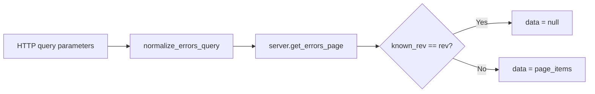

# src/celestialflow_web/routes/core_pull.py

> 📅 Last Updated: 2026/09/24

## Role

The `core_pull` module provides all the GET endpoints for the client to **pull** data. Most endpoints adopt a **rev (version number) guard** mechanism: when the `known_rev` supplied by the client matches the current version, it returns `data: null` to save bandwidth; the full data body is returned only when the data has changed.

## Core Functions

### `register(router: APIRouter, server: TaskWebServer) -> None`

Registers all 7 GET endpoints on the given `APIRouter`.

| Parameter | Type | Description |
|------|------|------|
| `router` | `APIRouter` | FastAPI router instance |
| `server` | `TaskWebServer` | Web server instance holding shared state |

---

## Endpoints

### 1. `GET /api/pull_server_state`

Returns the server-side state required for the reporter's synchronization decisions.

| Parameter | Type | Default | Description |
|------|------|--------|------|
| `graph_id` | `str` | `""` | Unique identifier of the reporter's current task graph instance |

**Returns:** `dict[str, Any]` — contains `interval`, `is_current_graph`, `has_graph_meta`, `max_event_id_in_fail`.

### 2. `GET /api/pull_injection`

Fetches and clears the current queue of pending injection tasks. This is a **one-time consumption** endpoint: after returning, the queue is cleared, and the same batch of tasks will not be fetched again.

**Returns:** `{"tasks": dict[str, list[Any]], "terminations": list[str]}`.

### 3. `GET /api/pull_config`

Gets the frontend configuration.

**Returns:** The complete `server.config` dictionary, containing the four configuration groups `global`, `dashboard`, `errors`, and `injection`.

### 4. `GET /api/pull_status`

Gets the running status of each node, supporting the rev guard.

**Returns:** `{"rev": int, "timestamp": float, "data": dict | None}`

### 5. `GET /api/pull_graph_meta`

Gets graph meta information (graph structure + node construction-time meta information + graph analysis result), supporting the rev guard.

**Returns:** `{"rev": int, "data": dict | None}`

### 6. `GET /api/pull_errors`

Gets paginated error logs, supporting node filtering, keyword filtering, sorting, and the rev guard.

| Parameter | Type | Default | Description |
|------|------|--------|------|
| `known_rev` | `int` | `-1` | Version number known to the client |
| `page` | `int` | `1` | Page number |
| `page_size` | `int` | `10` | Number of items per page |
| `node` | `str` | `""` | Filter by node name |
| `keyword` | `str` | `""` | Filter by keyword |
| `sort_order` | `str` | `"newest"` | Sort order, supporting `newest` / `oldest` |

**Returns:** `{"rev": int, "page": int, "page_size": int, "total": int, "total_pages": int, "sort_order": str, "data": list | None}`, where `page` is clamped to the range `[1, total_pages]`; `sort_order` is the value after normalization by `normalize_errors_query` (`newest` / `oldest`).

Call flow:



### 7. `GET /api/pull_error_type_counts`

Aggregates statistics by error type, supporting node filtering and the rev guard.

**Returns:** `{"rev": int, "data": list[dict[str, Any]] | None}`

---

## Key Details

- Query parameter normalization is handled by `runtime.util_cal.normalize_errors_query()`.
- `pull_injection` has side effects: it clears the task and termination caches after reading.

## Usage Example

```python
import requests
import time

known_rev = -1

while True:
    resp = requests.get(
        "http://localhost:5000/api/pull_status",
        params={"known_rev": known_rev},
        timeout=3,
    )
    payload = resp.json()
    if payload["data"] is not None:
        known_rev = payload["rev"]
        print(payload["timestamp"], payload["data"])
    time.sleep(2)
```
