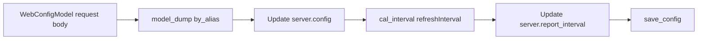

# src/celestialflow_web/routes/core_push.py

> 📅 Last Updated: 2026/09/24

## Role

The `core_push` module provides all the POST endpoints for the **Reporter (reporting side)** and the frontend to **push** data to the server. Each push updates the corresponding in-memory store and increments the version number (`store_revs`), so that clients can perceive the data change through the Pull routes.

## Core Functions

### `register(router: APIRouter, server: TaskWebServer, config_path: str) -> None`

Registers all 6 POST endpoints on the given `APIRouter`.

| Parameter | Type | Description |
|------|------|------|
| `router` | `APIRouter` | FastAPI router instance |
| `server` | `TaskWebServer` | Web server instance holding shared state |
| `config_path` | `str` | On-disk path of the configuration file, used to persist configuration |

---

## Endpoints

### 1. `POST /api/push_config`

Saves the frontend configuration and synchronously updates `server.report_interval`.

Processing flow:



> Note: The current implementation updates the in-memory configuration first, then attempts to write to disk; if `save_config()` fails, the request returns 500, but the in-process configuration has still been updated.

### 2. `POST /api/push_injection_tasks`

Receives a frontend task injection request. The request body is `TaskInjectionModel`, in the format `{node_name: [tasklist]}`.

- Writes to `server.injection_tasks` node by node
- A new task list for the same node overwrites the old value (**per-node overwrite**, not append)
- The entire write process is protected by `task_injection_lock`
- On failure, returns `JSONResponse({"ok": False, "msg": ...}, 500)`

### 3. `POST /api/push_injection_terminations`

Receives a termination injection request. The request body is `TerminationInjectionModel`, in the format `[node_name, ...]`.

- Writes to `server.injection_terminations`
- Uses set semantics, so duplicate nodes are automatically deduplicated
- On failure, returns `JSONResponse({"ok": False, "msg": ...}, 500)`

### 4. `POST /api/push_graph_meta`

The Reporter pushes graph meta information (graph structure + node construction-time meta information + graph analysis result).

- Writes only when `graph_id` matches the current graph context; otherwise returns 409
- The graph structure, node meta information, and analysis result all belong to construction-time frozen information, arrive together with the first push, and are merged into a single atomic write
- After a successful write, increments `store_revs["graph_meta"]`

### 5. `POST /api/push_status`

The Reporter pushes a node status snapshot.

- Validates `graph_id`
- Updates `status_timestamp` and `status_store`
- Increments `store_revs["status"]`

### 6. `POST /api/push_errors`

The Reporter pushes a list of error records.

- Validates `graph_id`
- Calls `append_records()` to write to SQLite
- Increments `store_revs["errors"]`

---

## Key Details

- All Push endpoints on the reporter side rely on `server.is_current_graph(data.graph_id)` for graph context validation.
- `push_injection_tasks` and `push_injection_terminations` are frontend-facing, and the current implementation does not require `graph_id`.
- `push_config` uses `runtime.util_cal.cal_interval()` to normalize the millisecond refresh interval to `[1.0, 60.0]` seconds.

## Usage Examples

### Frontend Saving Configuration

```javascript
const resp = await fetch("/api/push_config", {
  method: "POST",
  headers: { "Content-Type": "application/json" },
  body: JSON.stringify({
    global: {
      theme: "dark",
      autoRefreshEnabled: true,
      refreshInterval: 10000,
      language: "zh-CN",
    },
    dashboard: {
      historyLimit: 20,
      showStructureEdgeDelta: false,
      useTotalPendingInStatus: false,
      layout: { left: ["mermaid"], middle: ["status"], right: ["progress"] },
    },
    errors: {
      pageSize: 10,
      sortOrder: "newest",
      jumpToInjectionAfterRetry: true,
    },
    injection: {
      showInjectableOnly: true,
    },
  }),
});
console.log(await resp.json());
```

### Reporter Pushing Status

```python
import requests

requests.post(
    "http://localhost:5000/api/push_status",
    json={
        "graph_id": "graph-001",
        "timestamp": 1716883200.5,
        "status": {
            "StageA": {"tasks_succeeded": 10, "tasks_failed": 0},
        },
    },
    timeout=3,
)
```
