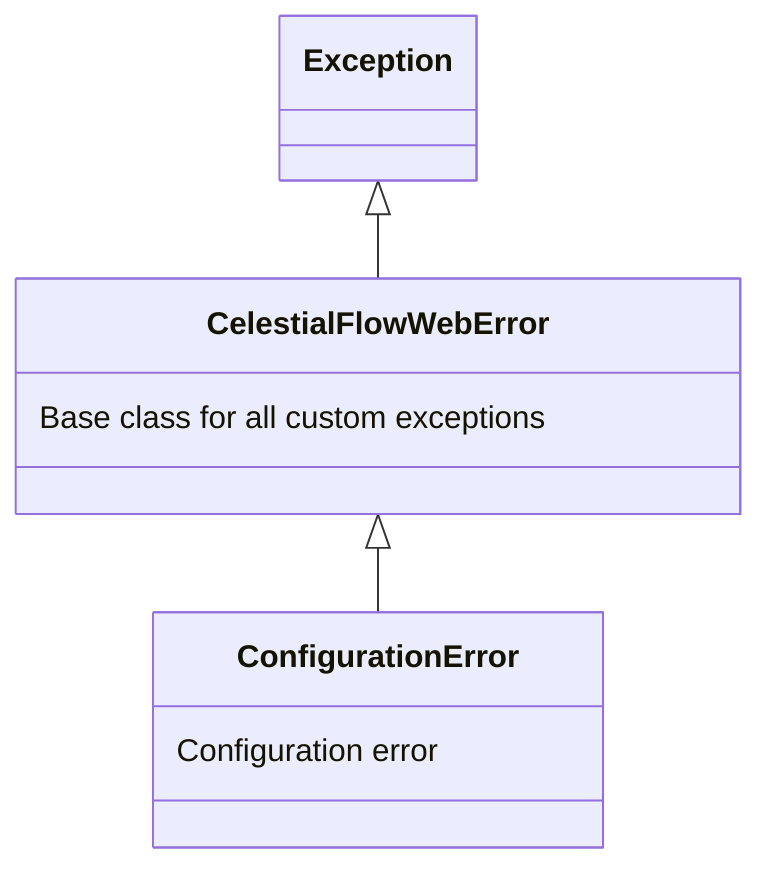

# src/celestialflow_web/runtime/util_errors.py

> 📅 Last Updated: 2026/09/24

## Role

`celestialflow_web.runtime.util_errors` defines the custom exception hierarchy for the CelestialFlow Web module, for internal use by `server/` and `runtime/`.

## Exception Hierarchy



## Exception List

### CelestialFlowWebError

```python
class CelestialFlowWebError(Exception):
    """Base class for all CelestialFlow custom exceptions"""
```

The root of all business exceptions, inheriting from `Exception`. It carries no extra logic itself and is only used for classification and filtering (`except CelestialFlowWebError`).

### ConfigurationError

```python
class ConfigurationError(CelestialFlowWebError):
    """Configuration error (illegal parameters, unsupported combinations, etc.)"""
```

Inherits from `CelestialFlowWebError` and represents configuration-related errors. It is currently thrown by `util_config.load_config()` when the configuration file does not exist.

## Usage Example

```python
from celestialflow_web.runtime.util_errors import (
    CelestialFlowWebError,
    ConfigurationError,
)

# Catch all CelestialFlow business exceptions
try:
    ...
except CelestialFlowWebError as e:
    print(f"Business exception: {e}")

# Catch configuration errors precisely
try:
    ...
except ConfigurationError as e:
    print(f"Configuration error: {e}")
```

## Notes

> These exception classes are not publicly exported through `runtime/__init__.py`; callers should import them directly from the `util_errors` module.
