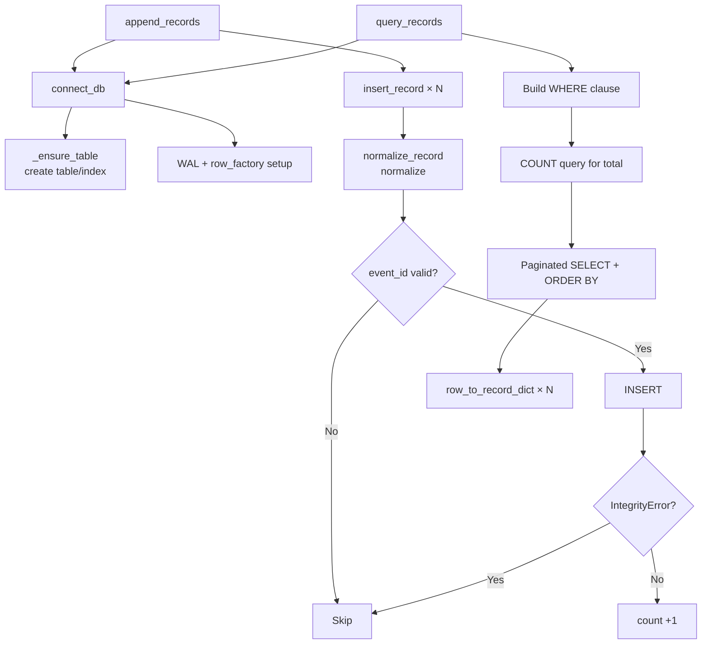

# src/celestialflow_web/runtime/util_sqlite.py

> 📅 Last Updated: 2026/09/24

## Role

`celestialflow_web.runtime.util_sqlite` encapsulates all read and write operations for the SQLite error record database, including table creation, insertion, queries, pagination, and aggregate statistics.

The database uses WAL mode (`journal_mode=WAL`) to improve concurrent read performance, and uses `row_factory = sqlite3.Row` so that query results can be accessed by column name.

## Database Table Structure

| Column | Type | Description |
|------|------|------|
| `id` | `INTEGER PRIMARY KEY AUTOINCREMENT` | Auto-increment primary key |
| `event_id` | `INTEGER NOT NULL` | Event ID, unique index |
| `ts` | `REAL` | Timestamp (Unix) |
| `stage` | `TEXT NOT NULL` | Node name |
| `status` | `TEXT NOT NULL` | Record status (e.g. `failed`) |
| `error_type` | `TEXT NOT NULL DEFAULT ''` | Error type |
| `error_message` | `TEXT NOT NULL DEFAULT ''` | Error message |
| `task_json` | `TEXT NOT NULL` | Task data (JSON string) |
| `result_json` | `TEXT NOT NULL DEFAULT 'null'` | Result data (JSON string) |

Indexes:
- `idx_records_event_id` — unique index on `event_id`
- `idx_records_status_id` — composite index on `(status, id)`

## Core Functions

### Connection Management

#### `connect_db`

```python
def connect_db(db_path: str | Path) -> sqlite3.Connection:
```

Creates a SQLite connection and leaves lifecycle management to the caller. It automatically creates the directory containing the database file, enables WAL mode, sets `row_factory`, and ensures the `records` table and indexes exist.

- `check_same_thread=False` allows multi-threaded access
- Automatically runs `_ensure_table()` to ensure the table structure exists

#### `_ensure_table` (private)

```python
def _ensure_table(conn: sqlite3.Connection) -> None:
```

Creates the `records` table and indexes on the given connection (`CREATE TABLE IF NOT EXISTS` / `CREATE INDEX IF NOT EXISTS`); idempotent and safe.

### Data Normalization

#### `normalize_record`

```python
def normalize_record(record: dict[str, Any]) -> dict[str, Any] | None:
```

Converts a raw record dictionary into a parameter dictionary that can be written directly to SQLite. If `event_id` is `None`, returns `None`, indicating that the record should be skipped.

Conversion rules:
- `event_id` is converted to `int`
- `stage`, `status`, `error_type`, `error_message` are converted to `str`
- `ts` is converted to `float`, defaulting to `0.0`
- `task_json`, `result_json` are converted to JSON strings

#### `row_to_record_dict`

```python
def row_to_record_dict(row: sqlite3.Row) -> dict[str, Any]:
```

Converts a SQLite query row into an external dictionary. `task_json` and `result_json` are deserialized from JSON strings into Python objects.

### Write Operations

#### `insert_record`

```python
def insert_record(conn: sqlite3.Connection, record: dict[str, Any]) -> bool:
```

Inserts a single record on the given connection. Internally calls `normalize_record()` to normalize the data. If the normalized result is empty, returns `False`.

> **Note**: This function does not commit the transaction; the caller must call `conn.commit()` itself.

#### `clear_records`

```python
def clear_records(db_path: str | Path) -> None:
```

Creates and closes its own connection, clearing all records in the database (`DELETE FROM records`).

#### `append_records`

```python
def append_records(db_path: str | Path, records: Iterable[dict[str, Any]]) -> int:
```

Creates and closes its own connection, appending records in batch. When an `IntegrityError` is encountered (e.g. a duplicate `event_id`), that record is skipped and processing continues. Returns the number of records actually written.

### Query Operations

#### `load_records`

```python
def load_records(db_path: str | Path, status: str = "failed") -> list[dict[str, Any]]:
```

Creates and closes its own connection, returning all records of the specified status in `id ASC` order. Queries the `failed` status by default.

#### `query_records`

```python
def query_records(
    db_path: str | Path,
    page: int,
    page_size: int,
    node: str,
    keyword: str,
    sort_order: str,
    status: str = "failed",
) -> tuple[int, int, list[dict[str, Any]]]:
```

Creates and closes its own connection, performing a conditional paginated query of records of the specified status. Returns `(total, total_pages, page_items)`.

Filter conditions:
- `status` — record status (WHERE `status = ?`)
- `node` — exact match on the `stage` field (optional)
- `keyword` — fuzzy search in `error_type` / `error_message` / `task_json` (optional, case-insensitive)
- `sort_order` — `ASC` if `"oldest"`, otherwise `DESC` (sorted by `ts, id`)
- An out-of-range `page` is automatically clipped to the valid range

#### `get_max_event_id_in_fail`

```python
def get_max_event_id_in_fail(db_path: str | Path) -> int | None:
```

Creates and closes its own connection, returning the maximum `event_id` among failed records (`status = 'failed'`). Returns `None` if there are no failed records.

#### `query_error_type_counts`

```python
def query_error_type_counts(
    db_path: str | Path,
    node: str = "",
    status: str = "failed",
) -> list[dict[str, Any]]:
```

Creates and closes its own connection, grouping records of the specified status by `error_type` and aggregating their counts. Returns `[{"error_type": str, "count": int}, ...]`, sorted by `count DESC, error_type ASC`.

Optionally filters by node name via `node` (`stage = ?`).

## Key Flows



## Usage Examples

### Connection and Writing

```python
from celestialflow_web.runtime.util_sqlite import (
    connect_db,
    append_records,
    clear_records,
)

db_path = "data/errors.db"

# Clear historical data
clear_records(db_path)

# Batch append error records
records = [
    {
        "event_id": 1,
        "stage": "StageA",
        "status": "failed",
        "error_type": "ValueError",
        "error_message": "Invalid input value",
        "ts": 1721116800.0,
        "task_json": {"id": 1, "value": 42},
        "result_json": None,
    },
    {
        "event_id": 2,
        "stage": "StageB",
        "status": "failed",
        "error_type": "TimeoutError",
        "error_message": "Connection timed out",
        "ts": 1721116900.0,
        "task_json": {"id": 2, "value": 99},
    },
]

count = append_records(db_path, records)
print(f"Actually wrote {count} records")  # 2
```

### Paginated Query

```python
from celestialflow_web.runtime.util_sqlite import query_records

total, total_pages, items = query_records(
    db_path="data/errors.db",
    page=1,
    page_size=10,
    node="",
    keyword="timeout",
    sort_order="newest",
    status="failed",
)

print(f"{total} matching records in total, {total_pages} pages")
for item in items:
    print(
        f"  event_id={item['event_id']}, stage={item['stage']}, error={item['error_type']}"
    )
```

### Error Type Statistics

```python
from celestialflow_web.runtime.util_sqlite import query_error_type_counts

counts = query_error_type_counts("data/errors.db", node="", status="failed")
for entry in counts:
    print(f"{entry['error_type']}: {entry['count']} times")
# Example output:
# TimeoutError: 15 times
# ValueError: 8 times
```

### Getting the Maximum Event ID of Failed Records

```python
from celestialflow_web.runtime.util_sqlite import get_max_event_id_in_fail

max_id = get_max_event_id_in_fail("data/errors.db")
if max_id is not None:
    print(f"Maximum event_id among failed records: {max_id}")
else:
    print("No failed records")
```

## Notes

> - `connect_db` is not responsible for closing the connection — the caller must manually call `conn.close()` when it is no longer used. `clear_records`, `append_records`, `load_records`, `query_records`, `get_max_event_id_in_fail`, and `query_error_type_counts` manage the connection lifecycle themselves.
> - `append_records` silently skips duplicate `event_id`s (`IntegrityError`) and will not interrupt the batch write.
> - The `keyword` search in `query_records` uses `LIKE` for case-insensitive matching, so its performance is limited for large data volumes.
