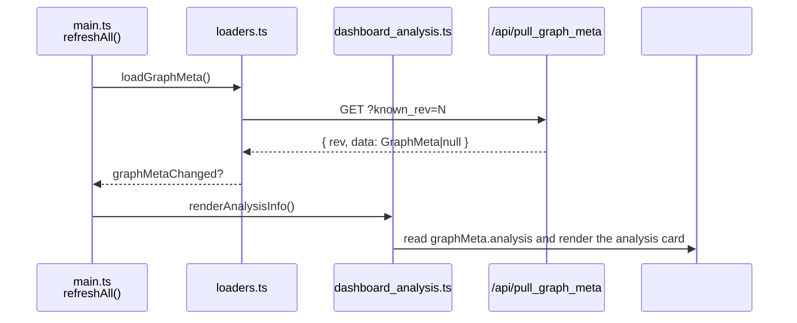

# src/celestialflow_web/static/ts/dashboard_analysis.ts

> 📅 Last Updated: 2026/09/24

Renders the "Graph Analysis Info" card, presenting deep insights into the task graph topology (structure type, DAG detection, graph mode, layer count, etc.).

> The analysis result arrives together with the graph metadata in a single shot (`graphMeta.analysis`) and is maintained by `loaders.ts`; this file only reads it and never pulls, and it has no independent request/version-number logic.

## Type Definitions

The analysis result `AnalysisData` (defined in [`types.d.ts`](types.d.md)):

| Field | Type | Description |
|------|------|------|
| `name` | `string` | Task graph name |
| `startTime` | `number` | Task graph start timestamp |
| `className` | `string` | Graph structure class name |
| `isDAG` | `boolean` | Whether the current task graph is a DAG |
| `graphMode` | `string` | Graph-level execution mode name (serial / thread / async) |
| `layersDict` | `Record<string, unknown>` | Layer analysis result; the number of keys is used to count layers |

## Functions

### `renderAnalysisInfo(): void`

Reads `graphMeta.analysis` and renders it into the `#analysis-info` container; when `analysis` is `null`, displays the internationalized empty-state placeholder (`analysis.noData`).

**Displayed fields:**

| Display label (i18n key) | Corresponding field | Description |
|---------|---------|------|
| `analysis.graphName` | `name` | Task graph name |
| `analysis.graphMode` | `graphMode` | Graph-level execution mode, with a tooltip bubble |
| `analysis.startTime` | `startTime` | Graph start timestamp (formatted when `> 0`, otherwise shows `-`) |
| `analysis.structType` | `className` | Graph structure class name, with a tooltip bubble |
| `analysis.isDAG` | `isDAG` | Shows the green `.ok` class when `true`, the red `.warn` class when `false` |
| `analysis.layerCount` | `layersDict` | Derives the total layer count via `Object.keys(layersDict).length` |

## Data Flow



## Usage Examples

```typescript
// graphMeta.analysis is extracted from the graph metadata by loaders.ts's loadGraphMeta():
// {
//   name: "MyTaskGraph",
//   startTime: 1718000000,
//   className: "TaskGraph",
//   isDAG: true,
//   graphMode: "thread",
//   layersDict: { "0": ["StageA"], "1": ["StageB", "StageC"] },
// }

// Called by refreshAll() when graphMetaChanged:
renderAnalysisInfo();

// If graphMeta.analysis === null → show the empty-state placeholder
// Otherwise render: graph name, graph mode, start time, structure type, whether DAG, layer count
```
