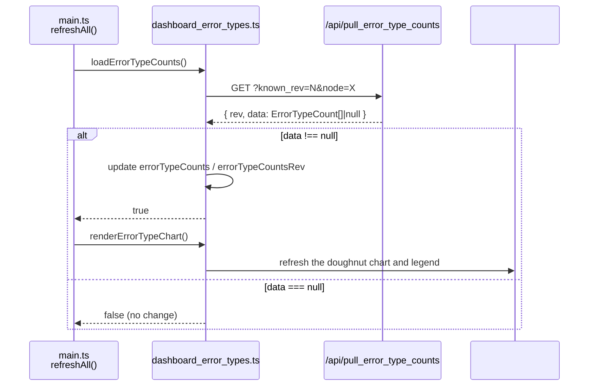
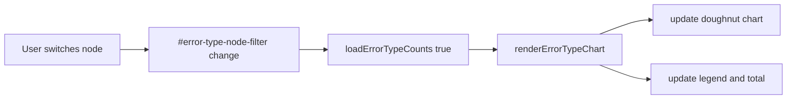

# src/celestialflow_web/static/ts/dashboard_error_types.ts

> 📅 Last Updated: 2026/09/24

Error type distribution card module. Responsible for pulling aggregated error type data filtered by node, rendering the doughnut chart, and displaying the legend.

## Data Types

`ErrorTypeCount` and `ErrorTypeCountsPullResponse` are declared in [`types.d.ts`](types.d.md) (the latter is `ApiVersionedResponse<ErrorTypeCount[]>`, following the common versioned response format).

## Global Variables

| Variable | Type | Description |
|------|------|------|
| `errorTypeCounts` | `ErrorTypeCount[]` | Aggregated error type result under the current filter |
| `errorTypeCountsRev` | `number` | Version number of the aggregated error type data, initialized to `-1` |
| `errorTypeCountsQueryKey` | `string` | Cache key of the filter conditions used by the most recent request |
| `errorTypeRequestSeq` | `number` | Request sequence number, to prevent a slow response from overwriting newer filter results |
| `errorTypeChart` | `ChartInstance \| null` | Chart.js doughnut chart instance |
| `ERROR_TYPE_COLORS` | `string[]` | Sector color palette, cycling through 8 colors |

## Functions

### `getErrorTypeNodeFilter(): HTMLSelectElement | null`

Gets the node filter dropdown of the error type chart (`#error-type-node-filter`).

---

### `getErrorTypeLabel(errorType: string): string`

Normalizes an error type name into displayable text. An empty string falls back to the i18n text `errorTypes.unknown`.

---

### `getErrorTypeColor(index: number): string`

Picks a color from `ERROR_TYPE_COLORS` by index, cycling with modulo.

---

### `getEmptyErrorTypeColor(): string`

Returns the placeholder color used by the empty ring chart when there is no data. Determines the light/dark theme by the `dark-theme` class name:

- Dark theme: `#4b5563`
- Light theme: `#e5e7eb`

---

### `initErrorTypeChart(): void`

Initializes the Chart.js doughnut chart instance and binds it to the canvas `#error-type-chart`.

**Key chart configuration:**

- Type: `doughnut`, cutout ratio `58%`
- Legend hidden (manually rendered by `renderErrorTypeLegend`)
- Animation disabled (`animation: false`), suitable for real-time data refresh

---

### `renderErrorTypeLegend(): void`

Renders a custom legend into the `#error-type-legend` container based on `errorTypeCounts`, and displays the total error count in the `#error-type-total` element.

- **With data**: shows the color block, error type name, count, and percentage on each row.
- **Without data**: shows a single-row placeholder using `getEmptyErrorTypeColor()` as the color and the i18n label `errorTypes.noData`.

---

### `renderErrorTypeChart(): void`

Refreshes the chart and legend based on the current aggregation result `errorTypeCounts`. If the chart instance does not exist, calls `initErrorTypeChart()` first to initialize it.

- When there is no data, the chart shows a single placeholder sector and falls back to the empty-state legend.

---

### `loadErrorTypeCounts(forceReload = false): Promise<boolean>`

Pulls the aggregated error type result under the current node filter from the backend `GET /api/pull_error_type_counts`.

- **Query parameters**: `known_rev`, `node`.
- **Caching strategy**: when the filter conditions (`errorTypeCountsQueryKey`) change or `forceReload=true`, `known_rev` is reset to `-1` to force a full pull.
- **Race protection**: uses `errorTypeRequestSeq` to discard stale responses.
- **Return value**: returns `true` when the backend returned new aggregation data; returns `false` if only the version number was returned or the response was discarded.

---

### `populateErrorTypeNodeFilter(statuses: Record<string, NodeStatus>): void`

Populates the `#error-type-node-filter` dropdown based on the current node status snapshot.

- Generates options sorted by node name, preserving the user's previous filter value as much as possible.
- If the selected node has disappeared, the last selected value is kept (still visible in the dropdown).

## Event Bindings

| Element | Event | Behavior |
|------|------|------|
| `#error-type-node-filter` | `change` | Forces a reload `loadErrorTypeCounts(true)` and refreshes the chart `renderErrorTypeChart()` |

Events are bound after `DOMContentLoaded`.

## Data Flow



When the filter changes:



## Collaboration with Other Modules

| Collaborator | Method | Description |
|---------|------|------|
| `main.ts` / `refreshAll()` | Direct call | Calls `loadErrorTypeCounts()` on each refresh cycle, and calls `renderErrorTypeChart()` if it returns `true` |
| `i18n.ts` | `t()` | Uses the `errorTypes.*` key family to get i18n text |
| `utils.ts` | `escapeHtml()` | HTML-escapes error type labels when rendering the legend |
| `types.d.ts` | Type declarations | Uses contract types such as `ErrorTypeCount`, `ErrorTypeCountsPullResponse` |
| `globals.d.ts` | Type declarations | Uses external library types such as `ChartInstance` |
| `dashboard_statuses.ts` | Passes in `NodeStatus` | `populateErrorTypeNodeFilter()` receives the node status snapshot to populate the filter |

## Usage Examples

```typescript
// Automatically called from refreshAll:
// const errorTypeCountsChanged = await loadErrorTypeCounts();
// if (errorTypeCountsChanged) renderErrorTypeChart();

// Manually force a reload:
await loadErrorTypeCounts(true);
renderErrorTypeChart();

// Populate the node filter (node statuses are maintained by dashboard_statuses.ts):
populateErrorTypeNodeFilter(nodeStatuses);

// Example of the modified errorTypeCounts:
// [
//   { error_type: "TimeoutError", count: 42 },
//   { error_type: "ValueError",  count: 18 },
// ]
// renderErrorTypeChart() will render a 2-sector doughnut chart based on this
```
