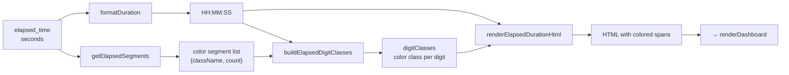

# src/celestialflow_web/static/ts/dashboard_statuses.ts

> 📅 Last Updated: 2026/09/24

Renders the node status cards in the middle of the dashboard: reads the node status snapshot and graph-level derived values exposed by `loaders.ts`, and displays metrics such as succeeded/pending/error/duplicated, execution mode and concurrency, as well as the color-segmented elapsed time.

> This module only reads data and does not initiate network requests. `nodeStatuses`, `lastNodeStatuses`, `nodeEstimates`, `lastNodeEstimates`, and `graphMeta` are all maintained by `loaders.ts`; the graph-level remaining time is computed in place by `calcRemaining()` from `util_estimators.ts`.

## Type Definitions

```typescript
type ElapsedSegment = {
  className: string; // Corresponding color CSS class name
  count: number;     // Number of tasks of this type
};
```

> See [`types.d.ts`](types.d.md) for the field definitions of `NodeStatus`, and [`loaders.ts`](loaders.md) for the definition of `NodeEstimate`.

## DOM Element References

| Variable | DOM ID | Description |
|------|--------|------|
| `dashboardGrid` | `#dashboard-grid` | Grid container for node status cards |

## Config-Driven Functions

The following functions dynamically switch the data source of the "pending task count" and "remaining time" in the status card based on the `webConfig.dashboard.useTotalPendingInStatus` switch.

### `getDisplayPending(status: NodeStatus, estimate?: NodeEstimate): number`

Returns the graph-level estimated `estimate.total_tasks_pending` when total-pending mode is enabled; otherwise returns the node's own `status.tasks_pending`. `estimate` may be missing before the graph metadata is ready, in which case it is treated as 0.

### `getDisplayRemainingTime(status: NodeStatus, estimate?: NodeEstimate): number`

Returns `estimate.total_remaining_time` when total-pending mode is enabled; otherwise calls `calcRemaining(tasks_processed, tasks_pending, elapsed_time)` to compute it in place based on this node's counts.

### `getPendingLabelHtml(): string`

Returns the HTML of the pending label and tooltip bubble, switching between the two i18n key groups `status.pending` / `status.pendingGlobal` based on the config.

---

## Helper Functions: Color-Segmented Elapsed Time Rendering

The following four functions together implement color HTML rendering of `elapsed_time`. Color segments are allocated to each digit according to the proportion of succeeded/failed/duplicated tasks.

### `formatElapsedDuration(seconds, successCount, failedCount, duplicateCount): string`

Entry function. Calls `formatDuration()` to get the formatted time text, then generates the color `<span>` HTML via `getElapsedSegments()`, `buildElapsedDigitClasses()`, and `renderElapsedDurationHtml()`.

### `getElapsedSegments(successCount, failedCount, duplicateCount): ElapsedSegment[]`

Generates the list of color segments driven by non-zero counts.

| CSS class | Statistics field | Meaning |
|--------|---------|------|
| `elapsed-success` | `tasks_succeeded` | Succeeded tasks |
| `elapsed-error` | `tasks_failed` | Failed tasks |
| `elapsed-duplicate` | `tasks_duplicated` | Duplicated tasks |

Returns only segments with `count > 0`. If all are zero, returns an empty array.

### `buildElapsedDigitClasses(segments: ElapsedSegment[], digitCount: number): string[]`

Allocates color classes to each digit of `HH:MM:SS` (with colons removed) according to the task status proportions.

- **Segment count ≥ digit count**: directly takes the first N segments.
- **Segment count < digit count**: proportionally allocates the remaining digits to each segment, then fills in allocation errors by sorting the remainders, ensuring every digit has a color class.

### `renderElapsedDurationHtml(duration, digitClasses, defaultClassName): string`

Wraps each character of the time string in a `<span>`. The colon `:` uses the color class of the digit to its left; digit characters use the class names from `digitClasses` in order.

---

## Core Function

### `renderDashboard(): void`

Iterates over `nodeStatuses` to generate a status card for each node.

**Card rendering features:**

- **Real-time deltas**: compares `lastNodeStatuses` / `lastNodeEstimates` to compute the deltas of succeeded/pending/failed/duplicated tasks and display them in color (the pending delta is based on the value of `getDisplayPending()`).
- **Status marker**: the card class name reflects the node status (`status-running` = running, `status-stopped` = stopped, otherwise a normal card).
- **Build-time metadata**: the execution mode and concurrency are taken from `graphMeta.node_meta[node]` (`execution_mode` / `max_workers`); in `serial` mode or when the metadata is missing, the concurrency shows `-`.
- **Color-segmented elapsed time**: calls `formatElapsedDuration()` to generate HTML for `elapsed_time` colored by the proportions of succeeded/failed/duplicated tasks.
- **Four-segment progress bar**: intuitively shows the proportions of succeeded (green), error (red), duplicated (yellow), and pending (gray).
- **Time estimation**: shows the elapsed time, estimated remaining time, average task duration, and completion progress percentage.
- **Interactive jump**: clicking the error count in the card (`.error-clickable`) automatically jumps to the "Error Log" tab and presets that node's filter.

## Card Style Classes

| Status | CSS class | Description |
|------|--------|------|
| Running | `node-card status-running` | Blue left border |
| Stopped | `node-card status-stopped` | Gray left border |
| Not started | `node-card` | Default gray left border |

## Elapsed Time Rendering Flow



## Usage Examples

```typescript
// Construct a node status object (fields match the /api/pull_status payload)
const nodeStatus: NodeStatus = {
  status: 1,
  tasks_processed: 250,
  tasks_succeeded: 240,
  tasks_failed: 5,
  tasks_duplicated: 5,
  tasks_pending: 30,
  upstream_counts: {},
  downstream_counts: {},
  start_time: 1745400000,
  elapsed_time: 3600,
};

// Graph-level derived values for this round (computed by loaders.ts's refreshNodeEstimates())
const estimate = { total_tasks_pending: 50, total_remaining_time: 1200 };

// Compute the color-segmented elapsed time
const coloredDuration = formatElapsedDuration(
  nodeStatus.elapsed_time,
  nodeStatus.tasks_succeeded,
  nodeStatus.tasks_failed,
  nodeStatus.tasks_duplicated,
);
// Returns an HTML string with colored spans

// Get display values according to the config
// getDisplayPending(nodeStatus, estimate) → 30 or 50
// getDisplayRemainingTime(nodeStatus, estimate) → computed in place or 1200
```
