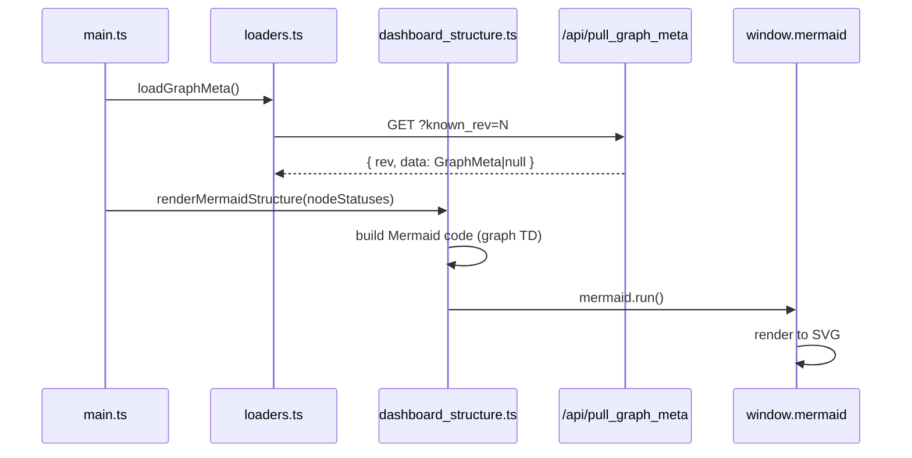

# src/celestialflow_web/static/ts/dashboard_structure.ts

> 📅 Last Updated: 2026/09/24

Renders the task directed graph as a flowchart with Mermaid.js, coloring it in real time according to node status, and showing delta or cumulative labels on edges based on the config.

> The graph metadata (`graphMeta`) is provided by `loaders.ts`; this file only reads it and never pulls. The previous round's statuses `lastNodeStatuses` also come from `loaders.ts` and are used to compute edge deltas.

## Type Definitions

```typescript
/** Mermaid node shape; the value is determined by getNodeShape */
type NodeShape = "box" | "rhombus" | "subgraph";
```

## Functions

### `getNodeId(nodeName: string): string`

Generates a Mermaid-compatible node ID (replacing non-word characters with `_`).

### `getNodeShape(className?: string): NodeShape`

Derives the Mermaid shape from the graph metadata `node_meta[node].class_name`, decoupled from each round's status snapshot:

| `class_name` | Shape | Mermaid syntax | Description |
|--------------|------|--------------|------|
| `TaskSplitter` | `subgraph` | `[[label]]` | Split/fan-out node |
| `TaskRouter` | `rhombus` | `{{label}}` | Routing/decision node |
| Other / missing | `box` | `[label]` | Normal processing node |

### `getShapeWrappedLabel(label: string, shape: NodeShape): string`

Generates a node label in Mermaid syntax according to the shape type; only `box`, `rhombus`, and `subgraph` are supported.

### `renderMermaidStructure(statuses?: Record<string, NodeStatus>): void`

Builds the Mermaid code and calls `window.mermaid.run()` to render it.

**Main features:**

- **Empty-state handling**: when the graph metadata is not yet ready (`nodes` is empty), replaces `#mermaid-container` with an empty-state placeholder.
- **Dynamic coloring**: applies `classDef` according to the `status` code in `statuses` (`greenNode`=running, `greyNode`=stopped, `whiteNode`=not started).
- **Theme adaptation**: recognizes the `dark-theme` class and switches `classDef` between the dark and light color schemes.
- **Edge label mode**: controlled by `webConfig.dashboard.structureEdgeLabel`:
  - `none`: shows no edge labels;
  - `delta`: shows the delta `|+N|` of that edge relative to the previous round's `downstream_counts` (only when the delta is positive);
  - `cumulative`: shows the cumulative transfer count `|N|` from that upstream to that downstream.
- **Source nodes first**: `source_nodes` are placed before non-source nodes to improve the readability of the topology graph.
- **Container replacement**: each render creates a new `#mermaid-container` to replace the old container, avoiding leftover issues from Mermaid's old DOM state.

## Node Status Color Mapping

| `status` | Style class | Meaning |
|----------|--------|------|
| `1` | `greenNode` | Running |
| `2` | `greyNode` | Stopped |
| None/other | `whiteNode` | Not started/unknown |

## Data Flow



## Usage Examples

```typescript
// graphMeta is maintained by loaders.ts's loadGraphMeta(), with a structure like:
// {
//   nodes: ["DataLoader", "Processor", "Router"],
//   edges: { DataLoader: ["Processor"], Processor: ["Router"] },
//   source_nodes: ["DataLoader"],
//   node_meta: {
//     DataLoader: { class_name: "TaskExecutor", execution_mode: "serial", max_workers: 1 },
//     Processor:  { class_name: "TaskExecutor", execution_mode: "thread", max_workers: 4 },
//     Router:     { class_name: "TaskRouter",   execution_mode: "serial", max_workers: 1 },
//   },
//   analysis: null,
// }

// Get the node ID and shape
// getNodeId("DataLoader") → "DataLoader"
// getNodeShape("TaskRouter") → "rhombus"

// Render the structure graph (with node status coloring)
// renderMermaidStructure(nodeStatuses);
```
