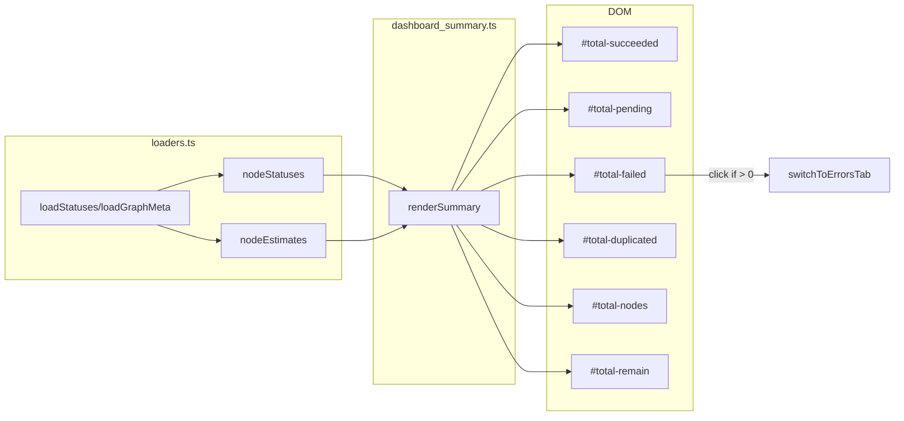

# src/celestialflow_web/static/ts/dashboard_summary.ts

> 📅 Last Updated: 2026/09/24

Renders the "Overall Status Summary" panel. **The aggregation is computed entirely on the frontend based on the `nodeStatuses` and `nodeEstimates` exposed by `loaders.ts`**, without relying on a dedicated backend API, and it does not maintain a version number.

## DOM Element References

| Variable | DOM ID | Description |
|------|--------|------|
| `totalSucceeded` | `#total-succeeded` | Total succeeded tasks |
| `totalPending` | `#total-pending` | Total pending tasks |
| `totalDuplicated` | `#total-duplicated` | Total duplicated tasks |
| `totalFailed` | `#total-failed` | Total failed tasks |
| `totalNodes` | `#total-nodes` | Number of active nodes |
| `totalRemain` | `#total-remain` | Total remaining time |

## Functions

### `renderSummary(): void`

Aggregates the totals based on the latest snapshot of `nodeStatuses` and renders them to the summary panel; the graph-level remaining time is taken from `nodeEstimates`.

**Frontend aggregation items:**

| Display item | Calculation | Formatting function |
|--------|---------|-----------|
| Total succeeded tasks | `sum(status.tasks_succeeded)` | `formatLargeNumber()` |
| Total pending tasks | `sum(status.tasks_pending)` | `formatLargeNumber()` |
| Total failed tasks | `sum(status.tasks_failed)` | `formatLargeNumber()` |
| Total duplicated tasks | `sum(status.tasks_duplicated)` | `formatLargeNumber()` |
| Number of active nodes | `count(status.status === 1)` | `formatLargeNumber()` |
| Total remaining time | `max(estimate.total_remaining_time)` (from `nodeEstimates`) | `formatDuration()` |

> The graph-level remaining time is taken from the maximum of each node's derived estimate `total_remaining_time` (accounting for the estimates of each chain), rather than a simple sum.

**Interactive features:**

- When the total failed count is `> 0`, the `#total-failed` element gets the `.error-clickable` class and an `onclick` binding that calls `switchToErrorsTab()`, so clicking jumps to the error log page; when it is 0, the class and event are removed.

## Data Flow



## Usage Examples

```typescript
// renderSummary() is called automatically by refreshAll() when statusesChanged

// Illustration of the internal aggregation logic:
const statusList = Object.values(nodeStatuses || {});
const total_succeeded = statusList.reduce((sum, s) => sum + (s.tasks_succeeded || 0), 0);
const total_pending   = statusList.reduce((sum, s) => sum + (s.tasks_pending || 0), 0);
const total_failed    = statusList.reduce((sum, s) => sum + (s.tasks_failed || 0), 0);
const total_duplicated = statusList.reduce((sum, s) => sum + (s.tasks_duplicated || 0), 0);
const total_nodes     = statusList.reduce((sum, s) => sum + (s.status === 1 ? 1 : 0), 0);
const total_remain    = Math.max(
  ...Object.values(nodeEstimates).map((e) => e.total_remaining_time),
  0,
);

// Update the DOM
totalSucceeded.innerHTML = formatLargeNumber(total_succeeded);
totalPending.innerHTML   = formatLargeNumber(total_pending);
// ... the remaining DOM updates
totalRemain.textContent  = formatDuration(total_remain);
```
