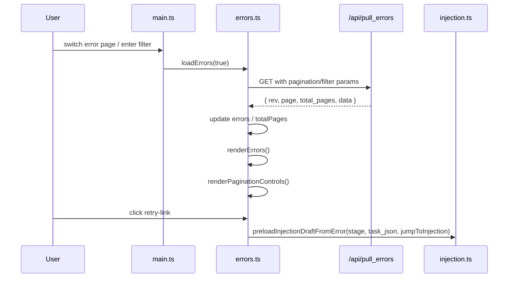

# src/celestialflow_web/static/ts/errors.ts

> 📅 Last Updated: 2026/09/24

Error log pagination and filtering module. Responsible for asynchronous pulling of error records, frontend pagination logic, filtering display by node/keyword search, and runtime editing of table column order (`#errors-columns-editor-overlay`).

## Type Definitions

Contract types such as `ErrorData`, `ErrorsPullResponse`, and `ErrorColumnKey` are declared uniformly in [`types.d.ts`](types.d.md). This module additionally defines a field metadata type internally:

```typescript
type ErrorColumnMeta = {
  labelKey: string;         // i18n key for the column title
  headerClassName?: string; // Extra style class for the header
  cellClassName?: string;   // Extra style class for the cell
};
```

## Global Variables

| Variable | Type | Description |
|------|------|------|
| `errors` | `ErrorData[]` | List of error records on the current page |
| `currentPage` | `number` | Current page number, default `1` |
| `pageSize` | `number` | Number of records per page, default `10`, synced by `webConfig.errors.pageSize` |
| `errorSortOrder` | `"newest" \| "oldest"` | Current error log sort order, default `"newest"` |
| `totalPages` | `number` | Total number of pages, default `1` |
| `errorsRev` | `number` | Data version number for incremental pulling, default `-1` |
| `lastQueryKey` | `string` | Cache key of the last query, used to determine whether the filter conditions changed |
| `errorsRequestSeq` | `number` | Request sequence number, to prevent old responses from overwriting new results |
| `originalErrorColumns` | `ErrorColumnKey[]` | Snapshot of the columns when the column editor was opened |
| `errorColumnSortableInstances` | `Partial<Record<..., SortableInstance>>` | Cache of drag instances in the column editor |
| `ERROR_COLUMN_META` | `Record<ErrorColumnKey, ErrorColumnMeta>` | i18n key and cell/header class names for each column |
| `ALL_ERROR_COLUMN_IDS` | `ErrorColumnKey[]` | All column keys selectable in the column editor |
| `ERROR_COLUMNS_ZONE_IDS` | `readonly [...]` | List of IDs of the two dropzones ("shown/not shown") in the column editor |

## DOM Element References

| Variable | DOM selector | Description |
|------|-----------|------|
| `searchInput` | `#error-search` | Keyword search input |
| `nodeFilter` | `#node-filter` | Filter-by-node dropdown |
| `errorSortSelect` | `#error-sort-order` | Sort order dropdown |
| `errorsTableHeadRow` | `#errors-table thead tr` | Error table header row |
| `errorsTableBody` | `#errors-table tbody` | Error table body |
| `paginationContainer` | `#pager-container` | Pagination control container |
| `openErrorColumnsEditorBtn` | `#open-error-columns-editor` | "Edit table columns" button in the settings panel |
| `errorColumnsEditorOverlay` | `#errors-columns-editor-overlay` | Column editor overlay |
| `errorColumnsEditorCloseBtn` | `#errors-columns-editor-close` | Column editor close button |
| `errorColumnsSaveBtn` | `#errors-columns-save-btn` | Column editor save button |
| `errorColumnsResetBtn` | `#errors-columns-reset-btn` | Column editor reset-to-default button |

## Functions

### `buildErrorsQueryKey(page, pageSizeValue, node, keyword, sortOrder): string`

Builds the query cache key containing pagination, page size, node filter, keyword, and sort order, used to determine whether a forced full pull is needed.

### `loadErrors(forceReload = false): Promise<boolean>`

Pulls the error log under the current filter conditions from the backend `GET /api/pull_errors`.

- **Query parameters**: `known_rev`, `page`, `page_size`, `node`, `keyword`, `sort_order`.
- **Caching strategy**: when the filter conditions (`lastQueryKey`) change or `forceReload=true`, `known_rev` is reset to `-1` to force a full pull.
- **Race protection**: uses `errorsRequestSeq` to discard stale responses.
- **Return value**: returns `true` when the backend returned new error record data.

### `renderErrors(): void`

Renders the `errors` array into the table. Each row contains the error index, event ID, error message, node, task data, occurrence time, and a retry button.

- When `task_json !== undefined`, shows a clickable "task injection" retry link; otherwise shows an unavailable "unknown format" placeholder.
- Clicking retry calls `preloadInjectionDraftFromError(stage, task_json, webConfig.errors.jumpToInjectionAfterRetry)`.
- Shows an empty-state placeholder when there are no records.

### `goToErrorsPage(nextPage): Promise<void>`

Jumps to the specified page number and reloads the data. The target page number is clamped to the range `[1, totalPages]`.

### `buildPageList(current, total): Array<number \| string>`

Generates the pagination page number list, including the first/last, current page, and adjacent pages, inserting an ellipsis `…` when the gap exceeds 1.

### `renderPaginationControls(totalPages): void`

Renders the pagination controls, including "Previous/Next" buttons and a numeric page number area with ellipses. Not rendered when the total number of pages is `<= 1`.

### `populateNodeFilter(statuses): void`

Populates the node filter dropdown based on the current node status snapshot, preserving the user's previous filter value as much as possible. If the selected node has disappeared, it reverts to "All nodes".

### Column Editor (runtime configuration of error table column order and visibility)

- `getActiveErrorColumns()`: reads `webConfig.errors.columns` and hands it to `web_config.normalizeErrorColumns()` for normalization.
- `normalizeErrorColumns(rawColumns)` (from `web_config.ts`): deduplicates and filters out invalid columns using the default column list as a whitelist.
- `renderErrorColumnsEditor(visibleColumns)`: renders the two dropzones "shown" and "not shown" in the given order, and initializes SortableJS.
- `openErrorColumnsEditor()` / `closeErrorColumnsEditor(restore = true)`: opens/closes the column editor; when closing with `restore=true`, rolls back to the `originalErrorColumns` snapshot.
- `initErrorColumnSortable()` / `destroyErrorColumnSortable()`: creates/destroys the SortableJS instances on the dropzones (sharing the `errors-columns` group).
- `syncErrorColumnsFromEditor()`: writes the current dropzone order back to `webConfig.errors.columns`.
- `saveErrorColumns()`: writes back the order and calls `saveWebConfig()` to persist it; closes the editor after a successful save.
- `resetErrorColumns()`: resets `webConfig.errors.columns` to a copy of `DEFAULT_WEB_CONFIG.errors.columns`.
- `renderErrorsTableHeader()`: redraws the `<thead>` row according to the current column order; called by both `applyConfig()` and `closeErrorColumnsEditor(restore=true)`.

## Event Bindings

| Element | Event | Behavior |
|------|------|------|
| `searchInput` | `input` | Returns to the first page, forces a reload and re-render |
| `nodeFilter` | `change` | Returns to the first page, forces a reload and re-render |
| `errorSortSelect` | `change` | Updates `errorSortOrder` and `webConfig.errors.sortOrder`, returns to the first page, pulls and renders, and calls `saveWebConfig()` to save the setting |
| `openErrorColumnsEditorBtn` | `click` | Opens the error column editor |
| `errorColumnsEditorCloseBtn` | `click` | Closes the column editor and restores the original order |
| `errorColumnsEditorOverlay` | `click` | Closes the editor when clicking outside the overlay (`restore=true`) |
| `errorColumnsSaveBtn` | `click` | Saves the current column order and persists it |
| `errorColumnsResetBtn` | `click` | Resets the column order to the default value |

## Data Flow



## Usage Examples

```typescript
// Jump directly to page 3
await goToErrorsPage(3);

// Filter by node (equivalent to setting nodeFilter and triggering change)
nodeFilter.value = "Processor";
nodeFilter.dispatchEvent(new Event("change"));

// Build the query cache key
const key = buildErrorsQueryKey(1, 10, "Processor", "timeout", "newest");
// "1|10|Processor|timeout|newest"

// renderErrors reads the global errors and renders the table
// renderPaginationControls(totalPages) renders the bottom pagination
```
