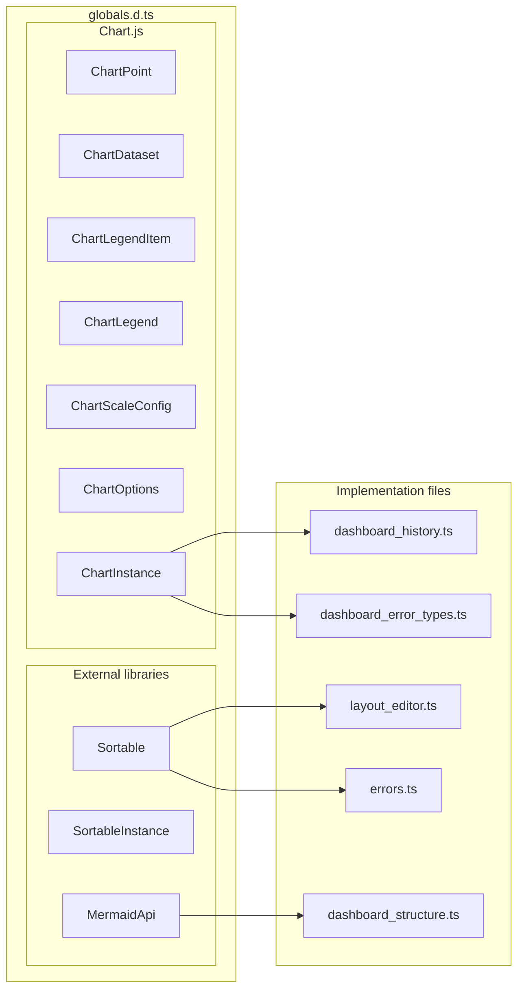

# src/celestialflow_web/static/ts/globals.d.ts

> 📅 Last Updated: 2026/09/24

Global type declaration file, containing only the minimal types injected by external CDN scripts that need to be globally visible: Chart.js, Sortable.js, and Mermaid.

> Cross frontend-backend contract types (interface payloads / responses, config structures, etc.) are placed uniformly in [`types.d.ts`](types.d.md); this file is a pure type declaration (`.d.ts`) that produces no `.js` output, so it does not need to be referenced in `scripts.html`.

## Chart.js Types

```typescript
type ChartPoint = { x: number; y: number };

type ChartDataset = {
  label: string;
  data: ChartPoint[] | number[];
  borderColor?: string | string[];
  backgroundColor?: string | string[];
  borderWidth?: number;
  fill?: boolean;
  tension?: number;
  hidden?: boolean;
};

type ChartLegendItem = {
  datasetIndex: number;
  hidden?: boolean;
};

type ChartLegend = {
  legendItems: ChartLegendItem[];
};

type ChartScaleConfig = {
  ticks: { color: string };
  grid: { color: string };
  title: { display: boolean; text: string; color: string };
  border: { color: string };
};

type ChartOptions = {
  animation: boolean;
  responsive: boolean;
  plugins: {
    legend?: {
      display?: boolean;
      labels?: { color: string };
      onClick?: (event: Event, legendItem: ChartLegendItem, legend: { chart: ChartInstance }) => void;
    };
  };
  interaction?: { intersect: boolean; mode: string };
  scales?: { x: ChartScaleConfig; y: ChartScaleConfig };
  cutout?: string;
};

interface ChartInstance {
  data: { labels: string[]; datasets: ChartDataset[] };
  options: ChartOptions;
  legend?: ChartLegend;
  destroy(): void;
  update(): void;
  getDatasetMeta(index: number): { hidden: boolean | null };
}

declare const Chart: {
  new (ctx: CanvasRenderingContext2D | null, config: {
    type: string;
    data: ChartInstance["data"];
    options: ChartOptions;
  }): ChartInstance;
};
```

## Sortable.js Types

```typescript
type SortableInstance = {
  destroy(): void;
};

declare const Sortable: {
  create(element: HTMLElement, options: {
    group: string;
    animation: number;
    ghostClass: string;
    dragClass: string;
  }): SortableInstance;
};
```

## Mermaid Types

```typescript
type MermaidApi = {
  run(): void; // Scans the page for Mermaid source and performs rendering
};

interface Window {
  mermaid: MermaidApi;
}
```

`mermaid` is initialized by the ESM `<script type="module">` in `partials/head.html` and attached to `window`, for `dashboard_structure.ts` to call `window.mermaid.run()`.

## Type Relationships



## Usage Examples

```typescript
// These types are global declarations and can be used directly in any TS module without import:
const ctx = (document.getElementById("node-progress-chart") as HTMLCanvasElement).getContext("2d");
const chart: ChartInstance = new Chart(ctx, {
  type: "line",
  data: { labels: [], datasets: [] },
  options: { animation: false, responsive: true },
});
chart.destroy();

const zone = document.getElementById("layout-dropzone-left")!;
const sortable = Sortable.create(zone, {
  group: "dashboard-layout",
  animation: 150,
  ghostClass: "dragging",
  dragClass: "dragging",
});
sortable.destroy();

window.mermaid.run();
```
