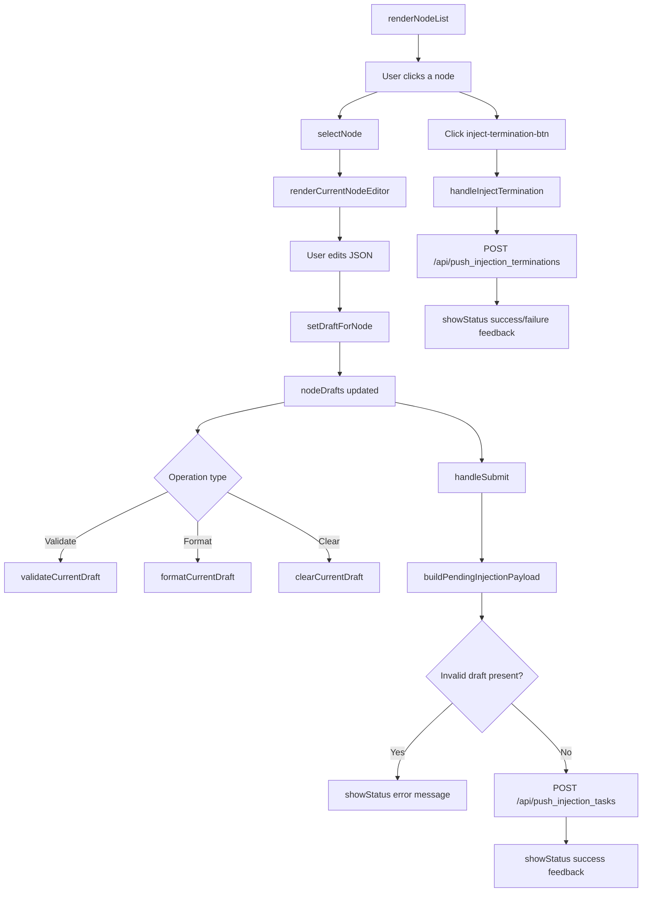

# src/celestialflow_web/static/ts/injection.ts

> 📅 Last Updated: 2026/09/24

Task manual injection module. Adopts a **single-node editing + batch submission** draft-style architecture: each node maintains an independent JSON draft, and they are finally sent together as a `{ node_name: [tasklist] }` structure. Terminator injection is an independent network operation and is **not** mixed with task drafts.

## Type Definitions

```typescript
type ValidationState = "success" | "error" | "neutral";
```

## Global Variables

| Variable | Type | Description |
|------|------|------|
| `currentNodeName` | `string \| null` | Name of the node currently being edited; `null` when none is selected |
| `nodeDrafts` | `Record<string, string>` | Mapping of JSON draft text keyed by node name |
| `statusHideTimer` | `number \| null` | Auto-hide timer for the bottom status message |

## i18n Metadata Helper Functions

Some dynamic text on the injection page needs to be redrawn after a language switch, so the original translation information is cached with `data-message-key` / `data-message-args`.

| Function | Signature | Description |
|------|------|------|
| `setLocalizedMessageMeta` | `(element, messageKey, args = []) => void` | Records the translation key and placeholder arguments on the element |
| `getLocalizedMessageArgs` | `(element) => string[]` | Reads and parses the cached placeholder arguments |

## Status Message Helper Functions

| Function | Signature | Description |
|------|------|------|
| `getStatusIconSvg` | `(isSuccess: boolean) => string` | Returns the corresponding SVG icon HTML based on success/failure status |
| `renderStatusMessage` | `(statusDiv, messageKey, isSuccess, args = []) => void` | Renders the translated text with an icon in the specified container |
| `showStatus` | `(messageKey, isSuccess = false, ...args) => void` | Shows a status message in `#status-message`, auto-hiding after 3 seconds |

## DOM Element Accessor Functions

| Function | Return type | Corresponding DOM ID |
|------|----------|-------------|
| `getSearchInput` | `HTMLInputElement` | `#search-input` |
| `getInjectableOnlyToggle` | `HTMLInputElement` | `#injectable-only-toggle` |
| `getJsonTextarea` | `HTMLTextAreaElement` | `#json-textarea` |
| `getEditorButtons` | `HTMLButtonElement[]` | `#validate-json-btn`, `#format-json-btn`, `#clear-draft-btn`, `#inject-termination-btn` |

## Event Bindings

The module calls `setupEventListeners()` on `DOMContentLoaded` to bind the following interactions:

| Element | Event | Behavior |
|------|------|------|
| `#search-input` | `input` | Filters the node list on the left in real time |
| `#json-textarea` | `input` | Synchronously writes back the current node draft and redraws the message/preview |
| `#node-list` | `click` (event delegation) | Switches to the corresponding node |
| `#validate-json-btn` | `click` | Validates the current draft |
| `#format-json-btn` | `click` | Formats the current draft |
| `#clear-draft-btn` | `click` | Clears the current node draft |
| `#inject-termination-btn` | `click` | Sends a termination signal separately to the currently selected node (`handleInjectTermination`) |
| `#submit-btn` | `click` | Batch-submits all drafts |

> Note: The `change` event of `#injectable-only-toggle` is bound centrally in `main.ts`; after toggling, it calls `renderInjectionPage()` and saves the config.

## Node List and Status Synchronization

### `isInjectableNode(nodeName: string): boolean`

Determines whether a node is currently allowed to receive injection. As long as the node exists and its status is not stopped (`status !== 2`), it is considered injectable; a node that is not running but has not yet stopped can still be submitted to.

### `syncInjectionStateWithStatuses(): void`

Aligns the draft state with the latest node status snapshot:
- Drafts of nodes that have disappeared or stopped are cleaned up.
- If the currently edited node is no longer injectable, the current selection is cancelled.

### `renderNodeList(searchTerm = ""): void`

Renders the node browsing list on the left. Supports:
- Search keyword filtering (case-insensitive).
- "Show injectable nodes only" toggle filtering.
- Highlighting the currently selected node (`.active-node`).
- Showing non-injectable nodes in a disabled style (`.disabled-node`).
- Showing an "edited" label for nodes with an edited draft.

### `selectNode(nodeName: string): void`

Switches the currently edited node. If the target node is no longer injectable, it synchronously cleans up the state and refreshes the page.

### `renderCurrentNodeEditor(): void`

Renders the editor area on the right, including the current node name, draft status label, JSON edit box, and the enabled/disabled state of the action buttons.

### `renderInjectionPage(): void`

Refreshes the injection page as a whole: calls `syncInjectionStateWithStatuses()`, `renderNodeList()`, `renderCurrentNodeEditor()`, `renderDraftList()`, and `updateSubmitButtonAvailability()` in order.

## Draft Management

### `setDraftForNode(nodeName: string, value: string): void`

Writes or deletes a node's draft. Empty text directly removes that node's draft entry.

### `preloadInjectionDraftFromError(nodeName, taskData, switchTab = true): void`

Called by `errors.ts`. Appends the task data associated with the error to the corresponding node's draft (without overwriting existing content).

- If the current node already has a valid draft array, the new task is appended to the end.
- If `switchTab` is `true`, automatically switches to the task injection tab.
- After completion, focuses the end of the JSON edit box.

### `parseDraftTaskList(draftText: string): { ok: true; taskList: unknown[] } \| { ok: false; reason: "invalid_json" \| "not_array" }`

Parses the node draft text. Task injection requires that each node's value must be a JSON array.

### `buildPendingInjectionPayload(): { payload: Record<string, unknown[]>; invalidNode: string \| null; invalidReason: "invalid_json" \| "not_array" \| null }`

Iterates over all drafts, builds the final injection mapping to submit to the backend, and returns the first node that failed validation along with the reason.

### `updateSubmitButtonAvailability(): void`

Enables or disables the submit button based on whether there is any submittable draft. The button availability is not modified while in the submitting state.

### `renderDraftList(): void`

Renders the bottom "data preview to be sent", staying as close as possible to the final data structure to be sent. If a draft fails to parse, the `invalid_json` or `invalid_task_list` marker is shown under that node.

## Validation and Formatting

### `setValidationMessage(messageKey: string, state: ValidationState, args: string[] = []): void`

Shows a validation message in the `#json-validation` area, and caches the translation key for redrawing after a language switch.

### `validateCurrentDraft(showSyntaxError = true): boolean`

Validates whether the current node draft is a valid JSON array.

- No node selected → shows `injection.validationSelectNode`.
- Draft empty → shows `injection.validationEmpty`.
- Validation passed → shows `injection.validationOk`.
- Validation failed → shows `injection.invalidJson` or `injection.invalidTaskList` according to the failure reason.

Returning `true` means the current draft is valid.

### `formatCurrentDraft(): void`

Runs `JSON.parse` + `JSON.stringify(..., null, 2)` formatting on the current node draft, and writes it back to the text area and the draft cache.

### `clearCurrentDraft(): void`

Clears the current node's draft and the editor area content.

## Submission and Loading State

### `handleSubmit(): Promise<void>`

Submits all node drafts to be sent:
1. Calls `syncInjectionStateWithStatuses()` to align the state.
2. Calls `buildPendingInjectionPayload()` to build the payload.
3. If there is a node that failed validation, jumps to that node and prompts for correction.
4. If there is no valid payload, prompts "no draft to submit".
5. Sends the JSON payload via `POST /api/push_injection_tasks`.
6. On success, clears the drafts and refreshes the page; on failure, shows a generic failure message.

### `handleInjectTermination(): Promise<void>`

Injects a termination signal separately to the currently selected node. This operation is an **independent** network request and **does not** modify any node's draft content:

- Submits the current node name via `POST /api/push_injection_terminations`.
- On success, shows `injection.terminationInjected`; on failure, shows `injection.terminationInjectFailed`; both carry the node name as a placeholder argument.
- During submission, the button is locked via `setTerminationButtonLoading(true)` to avoid repeated triggering.

### `setButtonLoading(loading: boolean): void`

Toggles the loading state of the submit button. While loading, shows a spinner (`.spinner`) and the `injection.submitting` text, and disables the button.

### `setTerminationButtonLoading(loading: boolean): void`

Toggles the loading state of the terminator injection button. While loading, shows the `injection.terminationInjecting` text and disables the button; after it finishes, restores the `injection.injectTermination` text and re-disables it when no node is selected.

### `refreshInjectionLocalizedText(): void`

Redraws the dynamic text on the injection page after a language switch, including the validation message, status message, terminator button text, and submit button text.

## Core Flow



## Usage Examples

```typescript
// Simulate node draft data
nodeDrafts["StageA"] = '[{"id": 1, "payload": "data1"}, {"id": 2, "payload": "data2"}]';
nodeDrafts["StageB"] = '[{"id": 3}]';

// Select a node and render the editor
selectNode("StageA");  // automatically calls renderInjectionPage()

// Validate the current draft
validateCurrentDraft();  // the result is rendered to #json-validation

// Format the JSON
formatCurrentDraft();

// Build the submission payload
const { payload, invalidNode, invalidReason } = buildPendingInjectionPayload();
// payload = { StageA: [{id:1,...}, {id:2,...}], StageB: [{id:3}] }

// Submit the drafts
await handleSubmit();

// Inject a terminator separately to the currently selected node (does not modify drafts)
await selectNode("StageA");
await handleInjectTermination();

// Prefill the draft from the error page (called by errors.ts)
preloadInjectionDraftFromError("StageA", { id: 999 }, true);
// automatically switches to the injection tab and appends task_999 to StageA's draft
```
