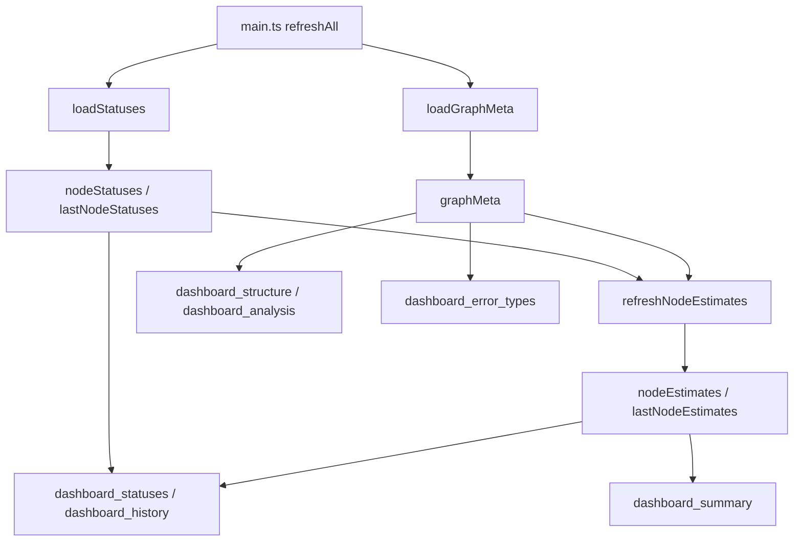

# src/celestialflow_web/static/ts/loaders.ts

> 📅 Last Updated: 2026/09/24

Data layer: model state and pulling. Responsible for pulling metric data, version guarding, and local derivation.

> Rendering modules only read the global variables exposed here and do not initiate requests themselves — this way, "where the data comes from" and "how the data is drawn" are no longer mixed into the same file. See [`types.d.ts`](types.d.md) for the contract types; functions named starting with `load*` are the only network entry points.

## Type Definitions

```typescript
/**
 * Graph-level derived values inferred by the frontend from status snapshots and the static topology
 *
 * Not mixed with NodeStatus: these two items require whole-graph information to compute, and are local derivations rather than reported content.
 */
export type NodeEstimate = {
  total_tasks_pending: number;   // Total pending tasks (including downstream chains)
  total_remaining_time: number;  // Estimated total remaining seconds (accounting for the state of each chain)
};
```

## Global Variables

| Variable | Type | Description |
|------|------|------|
| `nodeStatuses` | `Record<string, NodeStatus>` | Current running status of each node |
| `lastNodeStatuses` | `Record<string, NodeStatus>` | Previous round's status snapshot, used to compute deltas |
| `nodeEstimates` | `Record<string, NodeEstimate>` | This round's graph-level derived values, rotating in sync with `nodeStatuses` |
| `lastNodeEstimates` | `Record<string, NodeEstimate>` | Previous round's derived values, used to compute deltas |
| `lastStatusTimestamp` | `number` | Unified timestamp of the most recent status snapshot, used for recording history curves |
| `graphMeta` | `GraphMeta` | Graph metadata (directed graph + node metadata + analysis result) |

The module also maintains request versions and race sequence numbers internally (not exported): `statusRev`, `statusesRequestSeq`, `graphMetaRev`, `graphMetaRequestSeq`. The default value `-1` means a full pull for the first time.

## Functions

### `loadStatuses(): Promise<boolean>`

Asynchronously pulls node statuses from `GET /api/pull_status?known_rev=N` and updates the global variables.

- **Race protection**: assigns an incrementing `statusesRequestSeq` to each request; discards the response when the sequence number does not match.
- **Snapshot rotation**: on success, moves the old `nodeStatuses` into `lastNodeStatuses` and updates `lastStatusTimestamp`.
- **Return value**: returns `true` when the data version changed and was successfully updated.
- Global estimation and history curve synchronization are finalized by `main.ts`'s `refreshAll()`; this function is not responsible for them.

### `loadGraphMeta(): Promise<boolean>`

Asynchronously pulls the graph metadata (graph topology + node build-time metadata + graph analysis result) from `GET /api/pull_graph_meta?known_rev=N`, updating the global `graphMeta` in one go. Uses `graphMetaRequestSeq` for race protection.

### `refreshNodeEstimates(): void`

Based on the raw counts within the same snapshot and the static topology, refreshes each node's graph-level derived values `nodeEstimates`:

- `total_tasks_pending` and `total_remaining_time` require each node's counts, each edge's output volume, and the topology and DAG determination provided by the graph metadata.
- If the graph metadata is not yet ready (`graphMeta.nodes` is empty or `analysis` is `null`), it returns directly to avoid silently computing degraded results.
- A non-DAG cannot be propagated topologically, so `total_tasks_pending` degrades to the node's own pending amount (`calcGlobalPending` is only called on a DAG).
- Before writing the results, the old `nodeEstimates` is moved into `lastNodeEstimates`.

The estimation itself is done by `calcGlobalPending()` and `calcRemaining()` in [`util_estimators.ts`](util_estimators.md).

## Data Flow



## Usage Examples

```typescript
import { loadStatuses, loadGraphMeta, refreshNodeEstimates, nodeStatuses, graphMeta, nodeEstimates } from "./loaders.js";

// Pull one round of data
const statusesChanged = await loadStatuses();
const graphMetaChanged = await loadGraphMeta();

// Once the graph metadata is ready, finalize local derivation in one place
if (statusesChanged || graphMetaChanged) {
  refreshNodeEstimates();
}

console.log(Object.keys(nodeStatuses), graphMeta.nodes, nodeEstimates);
```
