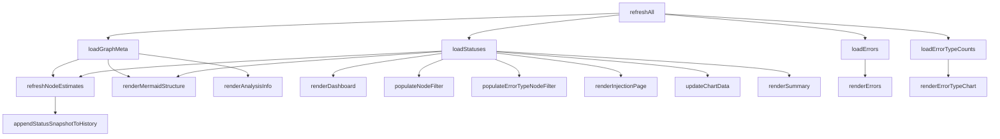
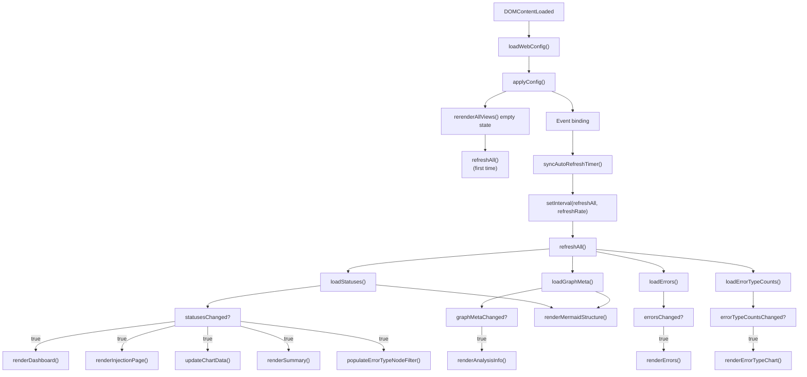

# src/celestialflow_web/static/ts/main.ts

> 📅 Last Updated: 2026/09/24

The dashboard's main entry script, responsible for coordinating global initialization, event listening, settings panel interaction, and the core data polling logic.

> `refreshRate` is maintained by `web_config.ts` (exported only by that module, imported and used by `main.ts`); this file is responsible for writing the settings panel's dropdown value into `setRefreshRate()`.

## Global Variables

| Variable | Type | Description |
|------|------|------|
| `refreshIntervalId` | `ReturnType<typeof setInterval> \| null` | Polling timer ID |
| `settingsStatusTimer` | `ReturnType<typeof setTimeout> \| null` | Auto-hide timer for the settings save status message |

## DOM Element References

| Variable | DOM selector | Description |
|------|-----------|------|
| `refreshSelect` | `#refresh-interval` | Refresh interval dropdown |
| `autoRefreshToggle` | `#auto-refresh-toggle` | Auto-refresh toggle |
| `historyLimitSelect` | `#history-limit` | History length dropdown |
| `settingsBtn` | `#settings-btn` | Settings gear button |
| `settingsPanel` | `#settings-panel` | Settings floating panel |
| `themeToggleBtn` | `#theme-toggle` | Theme toggle button |
| `languageSelect` | `#language-select` | Language selection dropdown |
| `errorPageSizeSelect` | `#error-page-size` | Error page size dropdown |
| `errorJumpToInjectionToggle` | `#error-jump-to-injection-toggle` | Toggle for jumping after error re-injection |
| `structureEdgeLabelSelect` | `#structure-edge-label` | Structure graph edge label display mode dropdown (none / delta / cumulative) |
| `statusTotalPendingToggle` | `#status-total-pending-toggle` | Node status card pending-value mode toggle |
| `injectableOnlyToggle` | `#injectable-only-toggle` | Injection page "show injectable nodes only" toggle |
| `tabButtons` | `.tab-btn` | List of tab buttons |
| `tabContents` | `.tab-content` | List of tab contents |
| `settingsClose` | `#settings-close` | Settings panel close button |
| `settingsStatus` | `#settings-status` | Settings save status message |
| `settingsCurrentGroup` | `#settings-current-group` | Container for the current page's settings group |
| `settingsCurrentLabel` | `#settings-current-label` | Title of the current page's settings group |
| `settingsCurrentEmpty` | `#settings-current-empty` | Prompt shown when the current page has no dedicated settings |
| `settingsCurrentItems` | `[data-settings-tab]` | List of settings items for the current page |

## Core Features

### Polling Refresh (`refreshAll`)

Each round launches 4 asynchronous pulls in parallel: `loadStatuses()`, `loadGraphMeta()`, `loadErrors()`, `loadErrorTypeCounts()`, and then renders on demand according to the change flags returned by each module. Graph-level derived metrics are estimated locally on the frontend, and must be finalized in one place after the graph metadata is ready and before rendering.

- `statusesChanged || graphMetaChanged` → `refreshNodeEstimates()`
- `statusesChanged` → `appendStatusSnapshotToHistory()` (depends on the `nodeEstimates` computed in the previous step)
- `statusesChanged || graphMetaChanged` → `renderMermaidStructure()`
- `graphMetaChanged` → `renderAnalysisInfo()`
- `statusesChanged` → `renderDashboard()` / `populateNodeFilter()` / `populateErrorTypeNodeFilter()` / `renderInjectionPage()` / `updateChartData()` / `renderSummary()`
- `errorsChanged` → `renderErrors()`
- `errorTypeCountsChanged` → `renderErrorTypeChart()`



> Because the page's initial empty state and language switching share the same redraw sequence, `rerenderAllViews()` extracts the unified render calls; the injection page is handled separately due to its different refresh granularity (full-page redraw / text-only redraw).

### Settings Interaction

| Setting | Event | Triggered behavior |
|-------|------|----------|
| **Refresh interval** | `change` | Updates `refreshRate`, saves the config, rebuilds the timer |
| **Auto refresh** | `change` | Toggles `autoRefreshEnabled`, syncs the timer, saves the config |
| **History length** | `change` | Updates `historyLimit`, trims the history and redraws, saves the config |
| **UI language** | `change` | `setLang()` + `applyI18nDOM()`, fully refreshes all cards and charts |
| **Structure graph edge label** | `change` | Toggles `structureEdgeLabel` (none/delta/cumulative), redraws Mermaid, saves the config |
| **Node pending mode** | `change` | Toggles `useTotalPendingInStatus`, redraws node cards, saves the config |
| **Injection page node filter** | `change` | Toggles `showInjectableOnly`, refreshes the injection page, saves the config |
| **Error page size** | `change` | Updates `pageSize`, reloads the error list, saves the config |
| **Error re-injection jump** | `change` | Toggles `jumpToInjectionAfterRetry`, saves the config |
| **Light/dark theme** | `click` | Toggles the `dark-theme` class, updates the chart theme colors, saves the config |

### UI Helper Functions

#### `toggleDarkTheme(): boolean`
Toggles the `dark-theme` class on the `body` element, and returns whether it is dark mode after toggling.

#### `showSettingsSaveStatus(messageKey: string): void`
Shows a timed status message at the bottom of the settings panel (auto-hides after 2 seconds on success and 5 seconds on failure).

#### `updateSettingsStatusText(): void`
Updates the settings status message text after a language switch.

#### `syncAutoRefreshTimer(): void`
Creates or clears the polling timer based on `webConfig.global.autoRefreshEnabled`.

#### Settings Panel Management
`isSettingsPanelOpen()` / `openSettingsPanel()` / `closeSettingsPanel(options?)` / `toggleSettingsPanel()` — manage the visibility and focus return of the settings panel.

#### Tab Management
`getActiveTab(): string` / `activateTab(button): void` / `updateCurrentPageSettings(): void` — manage the top tab switching and the "current page dedicated settings" group in the settings panel.

## Data Flow Diagram



## Usage Examples

```typescript
// Manually trigger a full refresh
// await refreshAll();

// Change the polling frequency
// setRefreshRate(2000);
// syncAutoRefreshTimer();

// Theme switching
// const isDark = toggleDarkTheme();
// themeToggleBtn.textContent = isDark ? t("theme.light") : t("theme.dark");
// updateChartTheme();
// renderMermaidStructure(nodeStatuses);

// Switch tabs
// activateTab(document.querySelector('[data-tab="errors"]'));
```
