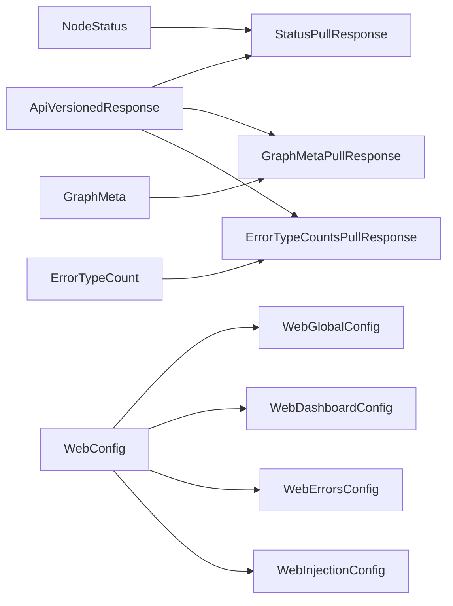

# src/celestialflow_web/static/ts/types.d.ts

> 📅 Last Updated: 2026/09/24

Cross frontend-backend contract type declarations. It only collects data shapes "sent from outside this frontend": HTTP interface payloads / responses, and config file structures; frontend local derivations (such as `NodeEstimate`) or vocabulary serving only a single renderer (such as `NodeShape`) stay in their respective files.

> This file is a pure type declaration (`.d.ts`) that produces no `.js` output, so it does not need to be referenced in `scripts.html`.

## General

```typescript
export type Lang = "zh-CN" | "en" | "ja"; // Supported UI languages

type ApiVersionedResponse<T> = {
  rev: number;  // Current data version number
  data: T | null; // May return null when known_rev has not changed
};
```

## Node Status: `/api/pull_status`

```typescript
/** Definition of a node's runtime status snapshot (matching the field shape of the backend payload) */
export type NodeStatus = {
  status: number;              // Status code: 0-not running, 1-running, 2-stopped
  tasks_processed: number;     // Total number of processed tasks
  tasks_pending: number;       // Number of tasks waiting in the queue
  tasks_succeeded: number;     // Number of successfully processed tasks
  tasks_failed: number;        // Number of failed tasks
  tasks_duplicated: number;    // Number of tasks filtered out by deduplication
  upstream_counts: Record<string, number>;   // Number of tasks each upstream node transferred to this node
  downstream_counts: Record<string, number>; // Number of tasks this node transferred to each downstream node
  start_time: number;          // Startup Unix timestamp
  elapsed_time: number;        // Number of seconds elapsed
};

export type StatusPullResponse = ApiVersionedResponse<Record<string, NodeStatus>> & {
  timestamp: number; // Unified timestamp of this status snapshot
};
```

> Build-time metadata such as `execution_mode` / `max_workers` is not in the status snapshot, but in the graph metadata `node_meta`.

## Graph Metadata: `/api/pull_graph_meta`

```typescript
/** A node's build-time metadata, not included in each round's status snapshot */
type NodeMeta = {
  class_name: string;     // Node class name (TaskStage/TaskSplitter/TaskRouter)
  execution_mode: string; // Execution mode (serial/thread/async)
  max_workers: number;    // Maximum concurrency
};

/** Graph topology analysis result, arriving together with the graph metadata in a single shot */
type AnalysisData = {
  name: string;                            // Task graph name
  startTime: number;                       // Task graph start timestamp
  className: string;                       // Graph structure class name
  isDAG: boolean;                          // Whether the current task graph is a DAG
  graphMode: string;                       // Graph-level execution mode name
  layersDict: Record<string, unknown>;     // Layer analysis result; the number of keys can be used to count layers
};

/** Graph metadata: graph topology, each node's build-time metadata, and the graph analysis result */
export type GraphMeta = {
  nodes: string[];                        // List of all node names
  edges: Record<string, string[]>;        // Directed edge adjacency list
  source_nodes: string[];                 // List of source nodes with in-degree 0
  node_meta: Record<string, NodeMeta>;    // Each node's build-time metadata
  analysis: AnalysisData | null;          // Graph analysis result; null when the reporter has not pushed yet
};

export type GraphMetaPullResponse = ApiVersionedResponse<GraphMeta>;
```

> The topology, `node_meta`, and `analysis` are written atomically by the reporter in the same push, so a non-empty `nodes` means all three are ready.

## Error Log: `/api/pull_errors`

```typescript
/** Definition of a single error record */
export type ErrorData = {
  ts: number;             // Lifecycle timestamp, in seconds
  stage: string;          // Name of the node/stage where the error occurred, used for node filtering
  event_id: number;       // Unique identifier ID of the failed event, globally unique
  error_type: string;     // Category type of the error
  error_message: string;  // Specific description of the error
  task_json: unknown;     // Task data that triggered the error, used for display and retry backfill
  result_json: unknown;   // Success result, or a placeholder result on failure
};

export type ErrorsPullResponse = {
  rev: number;
  page: number;
  page_size: number;
  total: number;
  total_pages: number;
  sort_order: "newest" | "oldest";
  data: ErrorData[] | null;
};
```

## Error Type Aggregation: `/api/pull_error_type_counts`

```typescript
export type ErrorTypeCount = {
  error_type: string; // Error type name
  count: number;      // Number of errors of this type
};

export type ErrorTypeCountsPullResponse = ApiVersionedResponse<ErrorTypeCount[]>;
```

## Config: `/api/pull_config` / `/api/push_config`

```typescript
export type DashboardColumnKey = "left" | "middle" | "right";
export type DashboardLayout = Record<DashboardColumnKey, string[]>;

export type ErrorColumnKey =
  | "index" | "event_id" | "message" | "stage" | "task" | "time" | "retry";

export type StructureEdgeLabel = "none" | "delta" | "cumulative";

type WebGlobalConfig = {
  theme: "light" | "dark";
  autoRefreshEnabled: boolean;
  refreshInterval: number;
  language: Lang;
};

type WebDashboardConfig = {
  historyLimit: number;
  structureEdgeLabel: StructureEdgeLabel;
  useTotalPendingInStatus: boolean;
  layout: DashboardLayout;
};

type WebErrorsConfig = {
  pageSize: number;
  sortOrder: "newest" | "oldest";
  jumpToInjectionAfterRetry: boolean;
  columns: ErrorColumnKey[];
};

type WebInjectionConfig = {
  showInjectableOnly: boolean;
};

export type WebConfig = {
  global: WebGlobalConfig;
  dashboard: WebDashboardConfig;
  errors: WebErrorsConfig;
  injection: WebInjectionConfig;
};
```

## Type Relationships



## Usage Examples

```typescript
import type {
  NodeStatus,
  GraphMeta,
  StatusPullResponse,
  WebConfig,
  StructureEdgeLabel,
} from "./types.js";

// Consume the /api/pull_status response
const body: StatusPullResponse = await (await fetch("/api/pull_status?known_rev=-1")).json();
const statuses: Record<string, NodeStatus> = body.data ?? {};

// Build-time metadata in the graph metadata
const meta: GraphMeta["node_meta"] = {
  StageA: { class_name: "TaskExecutor", execution_mode: "thread", max_workers: 4 },
};

// Structure graph edge label mode
const label: StructureEdgeLabel = "cumulative";
```
