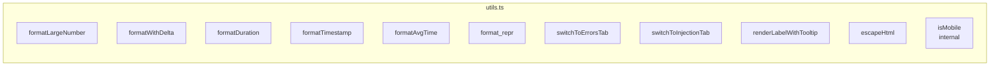

# src/celestialflow_web/static/ts/utils.ts

> 📅 Last Updated: 2026/09/24

Contains common formatting utilities, UI helper logic, DOM operation wrappers, and environment detection functions for the web frontend.

## Number and Time Formatting

### `formatLargeNumber(n: number): string`
Converts a large number into an easy-to-read HTML format.
- `< 10,000,000`: uses `toLocaleString('en-US')` for thousands-separator commas.
- `>= 10,000,000`: converts to scientific notation HTML (such as `~1.23×10⁹`).

### `formatWithDelta(value: number, delta: number, deltaClass: string, negClass: string): string`
Formats a value with a delta. If the delta is non-zero, appends a colored `+N` or `-N` small `<small>` tag after the main value.

### `formatDuration(seconds: number): string`
Formats seconds into an `HH:MM:SS` (≥1 hour) or `MM:SS` (<1 hour) string. Positive numbers show at least 1 second.

### `formatTimestamp(timestamp: number): string`
Formats a Unix timestamp (seconds) into a `YYYY-MM-DD HH:MM:SS` local time string.

### `formatAvgTime(elapsed: number, processed: number): string`
Formats the average task duration: returns something like `"1.44s/it"` when `elapsed / processed >= 1`, otherwise something like `"8.00it/s"`; returns `"N/A"` when samples are missing (`elapsed` or `processed` is 0).

### `format_repr(obj: unknown, max_length: number): string`
Formats an arbitrary object into a string, truncating when it exceeds `max_length` (first 2/3 + `...` + last 1/3), preserving the visible form of newlines and backslashes.

---

## UI and Routing Helpers

### `switchToErrorsTab(nodeFilter?: string): void`
Global routing jump function.
- Switches to the "Error Log" tab (`activateTab`).
- If `nodeFilter` is passed in, sets the node filter dropdown and triggers the `change` event to start the query.

### `switchToInjectionTab(): void`
Switches to the "Task Injection" tab.

### `renderLabelWithTooltip(labelKey: string, tooltipKey: string): string`
Renders label HTML with a tooltip bubble. Includes an `i` button (`.tooltip-trigger`) that shows the translated tooltip text (`.tooltip-bubble`) on hover or focus.

> This function is widely used by `dashboard_statuses.ts` and `dashboard_analysis.ts` to provide instant explanations for technical terms such as `execution_mode` (execution mode), `parallelism` (concurrency), `graphMode` (graph mode), and `total_tasks_pending` (global pending).

---

## Security and Utilities

### `escapeHtml(str: string): string`
A basic HTML escaping function to prevent XSS risks when dynamically inserting text. Escaped characters: `&` `<` `>` `"` `'` `/`.

### `isMobile(): boolean` (module-internal)
A simple UserAgent-based mobile detection (matching `Mobi|Android|iPhone|iPad|iPod`). Not exported, used only inside `utils.ts`.

---

## ❌ Functions That Do Not Belong to utils.ts

The following functions are **not** defined in `utils.ts`; they belong to `main.ts`:

| Function | Actual location | Description |
|------|---------|------|
| `toggleDarkTheme()` | **main.ts** | Light/dark theme switching |
| `showSettingsSaveStatus()` | **main.ts** | Settings save status message |
| `calcRemaining()` | **util_estimators.ts** | Estimates the remaining time based on processed/pending/elapsed time (formerly named `calcRemainTime`) |

---

## Function Overview



## Usage Examples

```typescript
// ====== Number formatting ======
formatLargeNumber(1234567);     // "1,234,567"
formatLargeNumber(1234567890);  // "~1.23×10⁹"

// ====== Delta display ======
formatWithDelta(1000, 5, "text-delta-success", "text-delta-success");
// "1,000<small class="text-delta-success">+5</small>"

// ====== Time formatting ======
formatDuration(3661);           // "01:01:01"
formatTimestamp(1745400000);    // "2026-04-23 14:40:00"

// ====== Average duration ======
formatAvgTime(3600, 2500);      // "1.44s/it"
formatAvgTime(0, 0);            // "N/A"

// ====== String truncation ======
format_repr("very long string...", 10);  // "very lo...g..."

// ====== Tooltip label ======
renderLabelWithTooltip("status.executionMode", "status.executionModeHelp");
// returns HTML with tooltip-trigger and tooltip-bubble

// ====== Tab jumps ======
switchToErrorsTab("StageA");    // jump to the error page and filter StageA
switchToInjectionTab();          // jump to the injection page

// ====== HTML escaping ======
escapeHtml('<script>alert("xss")</script>');
// "&lt;script&gt;alert(&quot;xss&quot;)&lt;&#x2F;script&gt;"

// ====== Mobile detection ======
isMobile();  // false on desktop, true on mobile
```
