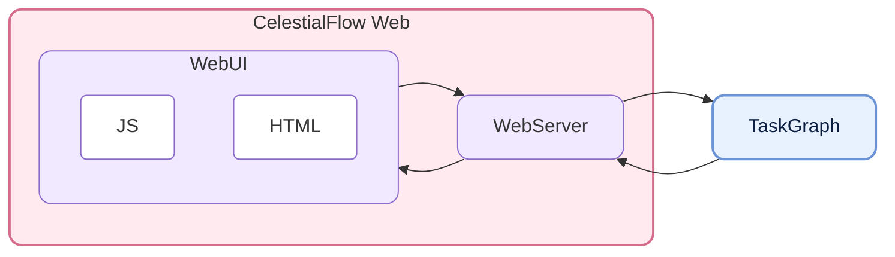
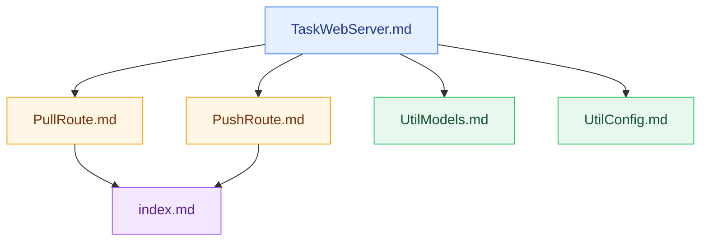

# CelestialFlow Web - CelestialFlow の独立したタスク監視・操作インターフェース

<p align="center">
  
  
  
  
</p>

<p align="center">
  <a href="https://github.com/Mr-xiaotian/celestialflow-web">GitHub</a> |
  <a href="https://github.com/Mr-xiaotian/CelestialFlow">CelestialFlow</a> |
  <a href="./docs/zh-CN/src/__init__.md">中文ドキュメント</a>
</p>

**CelestialFlow Web** は、`CelestialFlow` メインリポジトリから切り出された独立した Web リポジトリで、**FastAPI + TypeScript** ベースのタスクグラフ監視インターフェースを提供します。タスク構造、ノード状態、エラーログ、グラフ分析情報を表示し、ページから実行中のタスクグラフへタスクや終了信号を注入できます。

それ自体はタスクスケジューリングを担わず、`TaskReporter` とブラウザの間の中継層として機能します：

- バックエンドは `push_*` インターフェースを通じて構造・状態・分析・エラーを継続的に報告します
- フロントエンドは `pull_*` インターフェースを通じてバージョン番号に基づきデータを増分取得します
- Web ページからタスク注入と終了信号注入のリクエストを直接発行できます
- エラー記録は SQLite に永続化され、ページネーション、フィルタリング、エラータイプ集計に対応します

## プロジェクト構造（Project Structure）



## クイックスタート（Quick Start）

Web サービス自体を起動したいだけなら、本プロジェクトを単独でインストールできます。  
`CelestialFlow` タスクグラフと連携させたい場合は、同じ環境に `celestialflow` もインストールする必要があります。

### インストール

```bash
# uv を推奨
uv pip install celestialflow-web

# または pip を使用
pip install celestialflow-web
```

実際に動作中の `CelestialFlow` グラフタスクに接続する場合は、メインフレームワークも追加でインストールする必要があります：

```bash
uv pip install celestialflow
```

### Web サービスの起動

```bash
# デフォルトでは 0.0.0.0:5000 をリッスン
celestialflow-web

# ポートを指定
celestialflow-web --port 5005

# ホストとポートを指定
celestialflow-web --host 127.0.0.1 --port 5005
```

コード内から直接起動することもできます：

```python
from celestialflow_web import TaskWebServer

server = TaskWebServer(host="127.0.0.1", port=5005, log_level="info")
server.start_server()
```

起動後は次にアクセスします：

👉 [http://localhost:5005](http://localhost:5005)

ページではタスク構造、ノード状態、エラーログ、エラータイプ分布を確認でき、リアルタイムでタスクを注入できます。


<p align="center"><em>gif画像は細部が圧縮されすぎています(｡•́︿•̀｡)</em></p>

### CelestialFlow で Reporter を有効化

現在のホストとポートを例にすると：

```python
graph.set_reporter(True, host="127.0.0.1", port=5005)
```

より完全な連携例：

```python
from celestialflow import TaskGraph, TaskStage


def process(x: int) -> int:
    return x * 2


stage = TaskStage("StageA", process, execution_mode="thread")
graph = TaskGraph(name="DemoGraph")
graph.set_stages(stages=[stage])
graph.set_reporter(True, host="127.0.0.1", port=5005)
graph.start_graph({stage.get_name(): [1, 2, 3]})
```

## さらに読む（Further Reading）

この Web リポジトリのバックエンド構造とフロントエンドモジュールを理解したい場合、まず読む価値のあるドキュメントは次のとおりです：

- [TaskWebServer.md](./docs/zh-CN/src/server/core_server.md)
- [PullRoute.md](./docs/zh-CN/src/routes/core_pull.md)
- [PushRoute.md](./docs/zh-CN/src/routes/core_push.md)
- [UtilModels.md](./docs/zh-CN/src/runtime/util_models.md)
- [UtilConfig.md](./docs/zh-CN/src/runtime/util_config.md)
- [index.md](./docs/zh-CN/src/templates/index.md)

推奨する読む順序：



## API 概要（API Overview）

### Pull インターフェース

フロントエンドがデータを取得するためのもので、核心的な特徴は `known_rev` バージョン番号ガードです：

| エンドポイント | 役割 |
|------|------|
| `GET /api/pull_server_state` | Reporter 同期に必要なサーバー状態を取得 |
| `GET /api/pull_config` | フロントエンド設定を取得 |
| `GET /api/pull_status` | ノード状態スナップショットを取得 |
| `GET /api/pull_structure` | グラフ構造を取得 |
| `GET /api/pull_errors` | ページネーションされたエラーログを取得 |
| `GET /api/pull_analysis` | グラフ分析結果を取得 |
| `GET /api/pull_error_type_counts` | エラータイプ集計統計を取得 |
| `GET /api/pull_injection` | 注入待ちのタスクと終了信号を取り出してクリア |

### Push インターフェース

Reporter またはフロントエンドがサーバーへデータをプッシュするためのものです：

| エンドポイント | 役割 |
|------|------|
| `POST /api/push_config` | フロントエンド設定を保存しリフレッシュ間隔を更新 |
| `POST /api/push_structure` | グラフ構造をプッシュ |
| `POST /api/push_analysis` | グラフ分析結果をプッシュ |
| `POST /api/push_status` | 状態スナップショットをプッシュ |
| `POST /api/push_errors` | エラー記録をプッシュ |
| `POST /api/push_injection_tasks` | フロントエンドがタスク注入を送信 |
| `POST /api/push_injection_terminations` | フロントエンドが終了信号注入を送信 |

## 動作環境（Requirements）

| 依存項目 | 説明 |
|--------|------|
| **Python >= 3.12** | 実行環境 |
| **fastapi** | Web API サービス |
| **uvicorn** | ASGI サーバー |
| **jinja2** | HTML テンプレートレンダリング |
| **pydantic** | リクエスト/レスポンスと設定モデル |

開発・テストでよく使う依存：

| 依存項目 | 説明 |
|--------|------|
| **pytest** | 単体テスト |
| **pytest-asyncio** | 非同期テストサポート |
| **httpx2** | FastAPI TestClient 関連の依存 |
| **build / twine** | パッケージングとリリース |

## 開発コマンド（Development）

```bash
# 開発依存をインストール
uv sync --group dev

# テストを実行
uv run pytest -q

# パッケージをビルド
uv build

# ローカルでフロントエンド TS をコンパイル
cd src/celestialflow_web
npm install
npm run build
```

## ファイル構造（File Structure）

現在のリポジトリは主に以下の領域に分かれています：

```text
src/celestialflow_web/
  __init__.py
  config.json
  server/
  routes/
  runtime/
  templates/
  static/
tests/
docs/zh-CN/
```

- `server/`：`TaskWebServer` と CLI エントリ
- `routes/`：Pull / Push インターフェースの登録
- `runtime/`：設定、モデル、SQLite、パラメータ正規化ユーティリティ
- `templates/`：Jinja2 HTML テンプレート
- `static/ts/`：フロントエンド TypeScript ソース
- `tests/`：サーバー API と状態整合性のテスト

## バージョンログ（Version Log）

- `0.1.0`
  - `CelestialFlow` メインリポジトリから独立した Web プロジェクトとして切り出し
  - 正規の Python パッケージ `celestialflow_web` に収束
  - バックエンド構造を `server/`、`routes/`、`runtime/` に整理
  - FastAPI + TypeScript による独立したタスク監視・操作機能を維持

## Star History

このプロジェクトが役に立ったら、ぜひ Star をお願いします。  
使用中に問題が発生した場合も、Issues や Discussions の投稿を歓迎します。


## ライセンス（License）

This project is licensed under the MIT License - see the [LICENSE](./LICENSE) file for details.

## 作者（Author）

Author: Mr-xiaotian  
Email: mingxiaomingtian@gmail.com  
Project Link: [https://github.com/Mr-xiaotian/celestialflow-web](https://github.com/Mr-xiaotian/celestialflow-web)
