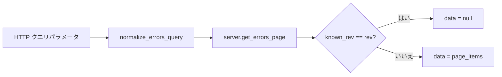

# src/celestialflow_web/routes/core_pull.py

> 📅 最終更新日: 2026/09/24

## 役割

`core_pull` モジュールはクライアントがデータを**取得**するためのすべての GET エンドポイントを提供します。大部分のインターフェースは **rev（バージョン番号）ガード** メカニズムを採用しています：クライアントが渡した保持済みの `known_rev` が現在のバージョンと一致する場合、帯域を節約するために `data: null` を返し、データが変化した場合にのみ完全なデータ本体を返します。

## コア関数

### `register(router: APIRouter, server: TaskWebServer) -> None`

与えられた `APIRouter` に全部で7つの GET エンドポイントを登録します。

| パラメータ | 型 | 説明 |
|------|------|------|
| `router` | `APIRouter` | FastAPI ルーターインスタンス |
| `server` | `TaskWebServer` | 共有状態を保持する Web サーバーインスタンス |

---

## エンドポイント

### 1. `GET /api/pull_server_state`

reporter の同期判断に必要なサーバー状態を返します。

| パラメータ | 型 | デフォルト値 | 説明 |
|------|------|--------|------|
| `graph_id` | `str` | `""` | Reporter が現在保持するタスクグラフインスタンスの一意な識別子 |

**返り値：** `dict[str, Any]` — `interval`、`is_current_graph`、`has_graph_meta`、`max_event_id_in_fail` を含みます。

### 2. `GET /api/pull_injection`

現在実行待ちの注入タスクキューを取り出してクリアします。これは**一度きりの消費**エンドポイントです：返した後キューは空になり、同じバッチのタスクが重複して取得されることはありません。

**返り値：** `{"tasks": dict[str, list[Any]], "terminations": list[str]}`。

### 3. `GET /api/pull_config`

フロントエンド設定を取得します。

**返り値：** 完全な `server.config` 辞書で、`global`、`dashboard`、`errors`、`injection` の4組の設定を含みます。

### 4. `GET /api/pull_status`

各ノードの実行状態を取得します。rev ガードをサポートします。

**返り値：** `{"rev": int, "timestamp": float, "data": dict | None}`

### 5. `GET /api/pull_graph_meta`

グラフメタ情報（グラフ構造 + ノード構築期メタ情報 + グラフ分析結果）を取得します。rev ガードをサポートします。

**返り値：** `{"rev": int, "data": dict | None}`

### 6. `GET /api/pull_errors`

ページネーションされたエラーログを取得します。ノードフィルタ、キーワードフィルタ、ソート、rev ガードをサポートします。

| パラメータ | 型 | デフォルト値 | 説明 |
|------|------|--------|------|
| `known_rev` | `int` | `-1` | クライアントが既知のバージョン番号 |
| `page` | `int` | `1` | ページ番号 |
| `page_size` | `int` | `10` | 1ページあたりの件数 |
| `node` | `str` | `""` | ノード名でフィルタ |
| `keyword` | `str` | `""` | キーワードでフィルタ |
| `sort_order` | `str` | `"newest"` | ソート方式。`newest` / `oldest` をサポート |

**返り値：** `{"rev": int, "page": int, "page_size": int, "total": int, "total_pages": int, "sort_order": str, "data": list | None}`。このうち `page` は `[1, total_pages]` の範囲にクランプされ、`sort_order` は `normalize_errors_query` で正規化された値（`newest` / `oldest`）です。

呼び出しフロー：



### 7. `GET /api/pull_error_type_counts`

エラータイプごとに集計した統計結果を返します。ノードによるフィルタをサポートし、rev ガードもサポートします。

**返り値：** `{"rev": int, "data": list[dict[str, Any]] | None}`

---

## 重要な詳細

- クエリパラメータの正規化は `runtime.util_cal.normalize_errors_query()` が処理します。
- `pull_injection` は副作用を持ち、読み取り後にタスクと終了信号のキャッシュをクリアします。

## 使用例

```python
import requests
import time

known_rev = -1

while True:
    resp = requests.get(
        "http://localhost:5000/api/pull_status",
        params={"known_rev": known_rev},
        timeout=3,
    )
    payload = resp.json()
    if payload["data"] is not None:
        known_rev = payload["rev"]
        print(payload["timestamp"], payload["data"])
    time.sleep(2)
```
