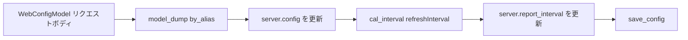

# src/celestialflow_web/routes/core_push.py

> 📅 最終更新日: 2026/09/24

## 役割

`core_push` モジュールは **Reporter（報告側）** とフロントエンドがサーバーへデータを**プッシュ**するためのすべての POST エンドポイントを提供します。プッシュのたびに対応するメモリ内ストアが更新され、バージョン番号（`store_revs`）がインクリメントされるため、クライアントは Pull ルートを通じてデータ変化を感知できます。

## コア関数

### `register(router: APIRouter, server: TaskWebServer, config_path: str) -> None`

与えられた `APIRouter` に全部で6つの POST エンドポイントを登録します。

| パラメータ | 型 | 説明 |
|------|------|------|
| `router` | `APIRouter` | FastAPI ルーターインスタンス |
| `server` | `TaskWebServer` | 共有状態を保持する Web サーバーインスタンス |
| `config_path` | `str` | 設定ファイルのディスクパス。設定の永続化に使用 |

---

## エンドポイント

### 1. `POST /api/push_config`

フロントエンド設定を保存し、`server.report_interval` を同期更新します。

処理フロー：



> 注意：現在の実装では先にメモリ内の設定を更新し、その後ディスクへの書き込みを試みます。`save_config()` が失敗した場合、リクエストは 500 を返しますが、プロセス内の設定はすでに更新されています。

### 2. `POST /api/push_injection_tasks`

フロントエンドのタスク注入リクエストを受け取ります。リクエストボディは `TaskInjectionModel` で、形式は `{node_name: [tasklist]}` です。

- ノードごとに `server.injection_tasks` へ書き込み
- 同じノードの新しいタスクリストは古い値を上書き（**ノード単位の上書き**、追記ではない）
- 書き込み処理全体は `task_injection_lock` で保護
- 失敗時は `JSONResponse({"ok": False, "msg": ...}, 500)` を返す

### 3. `POST /api/push_injection_terminations`

終了信号注入リクエストを受け取ります。リクエストボディは `TerminationInjectionModel` で、形式は `[node_name, ...]` です。

- `server.injection_terminations` へ書き込み
- 集合セマンティクスを採用し、重複ノードは自動的に重複排除
- 失敗時は `JSONResponse({"ok": False, "msg": ...}, 500)` を返す

### 4. `POST /api/push_graph_meta`

Reporter がグラフメタ情報（グラフ構造 + ノード構築期メタ情報 + グラフ分析結果）をプッシュします。

- `graph_id` が現在の graph コンテキストと一致する場合のみ書き込み、そうでなければ 409 を返す
- グラフ構造、ノードメタ情報、分析結果は同じ構築期に凍結される情報であり、初回 push とともに到達するため、単一の原子的な書き込みに統合される
- 書き込み成功後 `store_revs["graph_meta"]` をインクリメント

### 5. `POST /api/push_status`

Reporter がノード状態スナップショットをプッシュします。

- `graph_id` を検証
- `status_timestamp` と `status_store` を更新
- `store_revs["status"]` をインクリメント

### 6. `POST /api/push_errors`

Reporter がエラー記録リストをプッシュします。

- `graph_id` を検証
- `append_records()` を呼び出して SQLite に書き込み
- `store_revs["errors"]` をインクリメント

---

## 重要な詳細

- reporter 側のすべての Push インターフェースは `server.is_current_graph(data.graph_id)` に依存して graph コンテキストを検証します。
- `push_injection_tasks` と `push_injection_terminations` はフロントエンド向けで、現在の実装では `graph_id` を要求しません。
- `push_config` は `runtime.util_cal.cal_interval()` を使ってミリ秒のリフレッシュ間隔を `[1.0, 60.0]` 秒に正規化します。

## 使用例

### フロントエンドで設定を保存

```javascript
const resp = await fetch("/api/push_config", {
  method: "POST",
  headers: { "Content-Type": "application/json" },
  body: JSON.stringify({
    global: {
      theme: "dark",
      autoRefreshEnabled: true,
      refreshInterval: 10000,
      language: "zh-CN",
    },
    dashboard: {
      historyLimit: 20,
      showStructureEdgeDelta: false,
      useTotalPendingInStatus: false,
      layout: { left: ["mermaid"], middle: ["status"], right: ["progress"] },
    },
    errors: {
      pageSize: 10,
      sortOrder: "newest",
      jumpToInjectionAfterRetry: true,
    },
    injection: {
      showInjectableOnly: true,
    },
  }),
});
console.log(await resp.json());
```

### Reporter が状態をプッシュ

```python
import requests

requests.post(
    "http://localhost:5000/api/push_status",
    json={
        "graph_id": "graph-001",
        "timestamp": 1716883200.5,
        "status": {
            "StageA": {"tasks_succeeded": 10, "tasks_failed": 0},
        },
    },
    timeout=3,
)
```
