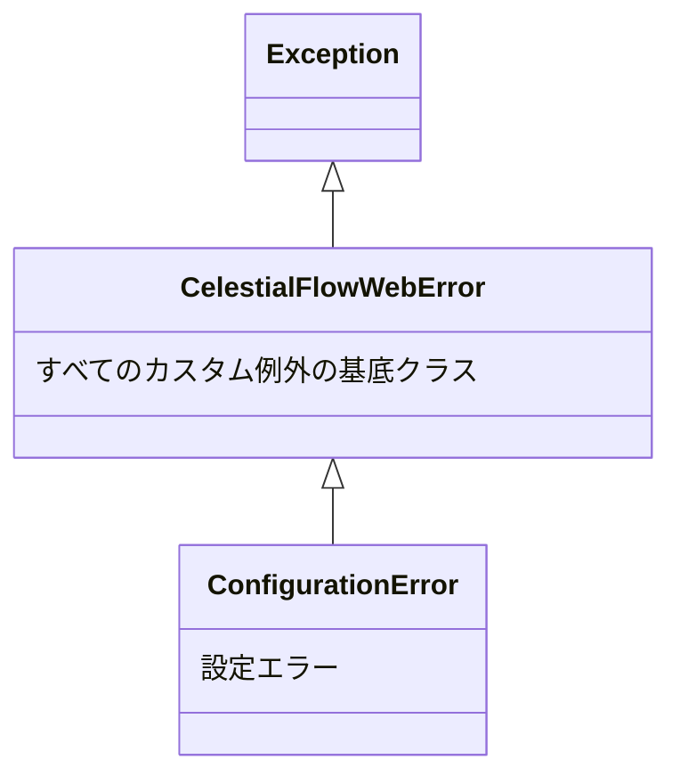

# src/celestialflow_web/runtime/util_errors.py

> 📅 最終更新日: 2026/09/24

## 役割

`celestialflow_web.runtime.util_errors` は CelestialFlow Web モジュールのカスタム例外階層を定義し、`server/` と `runtime/` の内部で使用されます。

## 例外階層



## 例外一覧

### CelestialFlowWebError

```python
class CelestialFlowWebError(Exception):
    """CelestialFlow のすべてのカスタム例外の基底クラス"""
```

すべての業務例外のルートで、`Exception` を継承します。自身は追加のロジックを持たず、分類による絞り込み（`except CelestialFlowWebError`）にのみ使用されます。

### ConfigurationError

```python
class ConfigurationError(CelestialFlowWebError):
    """設定エラー（パラメータ不正、組み合わせ非対応など）"""
```

`CelestialFlowWebError` を継承し、設定関連のエラーを表します。現在は `util_config.load_config()` が設定ファイルの存在しない場合にスローします。

## 使用例

```python
from celestialflow_web.runtime.util_errors import (
    CelestialFlowWebError,
    ConfigurationError,
)

# すべての CelestialFlow 業務例外を捕捉
try:
    ...
except CelestialFlowWebError as e:
    print(f"業務例外: {e}")

# 設定エラーを正確に捕捉
try:
    ...
except ConfigurationError as e:
    print(f"設定エラー: {e}")
```

## 注意事項

> これらの例外クラスは `runtime/__init__.py` を通じて公開エクスポートされていません。呼び出し側は `util_errors` モジュールから直接インポートする必要があります。
