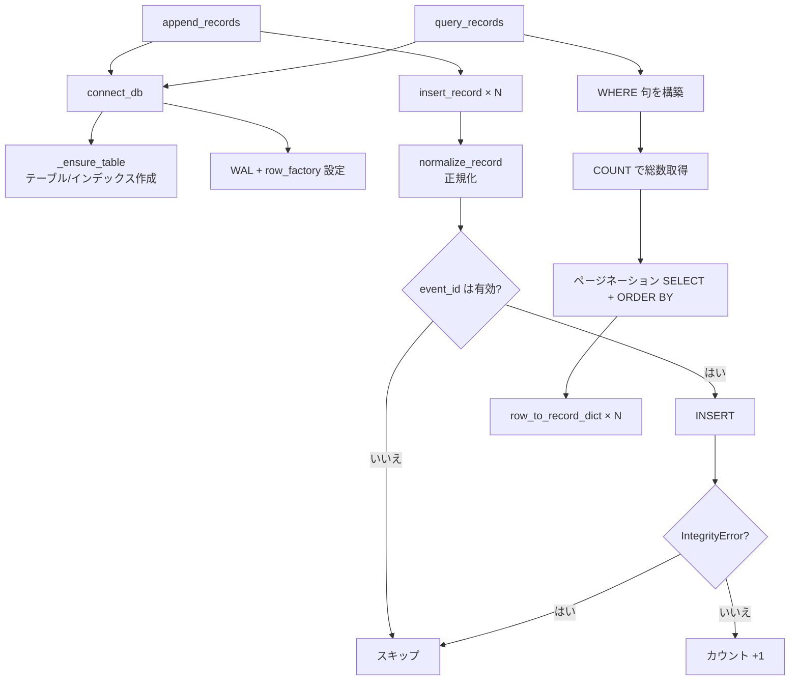

# src/celestialflow_web/runtime/util_sqlite.py

> 📅 最終更新日: 2026/09/24

## 役割

`celestialflow_web.runtime.util_sqlite` は SQLite エラー記録データベースのすべての読み書き操作をカプセル化します。テーブル作成、挿入、クエリ、ページネーション、集計統計を含みます。

データベースは並行読み取り性能を高めるために WAL モード（`journal_mode=WAL`）を採用し、`row_factory = sqlite3.Row` を使用してクエリ結果を列名でアクセスできるようにします。

## データベーステーブル構造

| 列名 | 型 | 説明 |
|------|------|------|
| `id` | `INTEGER PRIMARY KEY AUTOINCREMENT` | 自動増分主キー |
| `event_id` | `INTEGER NOT NULL` | イベント ID、一意インデックス |
| `ts` | `REAL` | タイムスタンプ（Unix） |
| `stage` | `TEXT NOT NULL` | ノード名 |
| `status` | `TEXT NOT NULL` | 記録状態（`failed` など） |
| `error_type` | `TEXT NOT NULL DEFAULT ''` | エラータイプ |
| `error_message` | `TEXT NOT NULL DEFAULT ''` | エラーメッセージ |
| `task_json` | `TEXT NOT NULL` | タスクデータ（JSON 文字列） |
| `result_json` | `TEXT NOT NULL DEFAULT 'null'` | 結果データ（JSON 文字列） |

インデックス：
- `idx_records_event_id` — `event_id` 一意インデックス
- `idx_records_status_id` — `(status, id)` 複合インデックス

## コア関数

### 接続管理

#### `connect_db`

```python
def connect_db(db_path: str | Path) -> sqlite3.Connection:
```

SQLite 接続を作成し、ライフサイクル管理を呼び出し側に委ねます。データベースファイルのディレクトリを自動作成し、WAL モードを有効化し、`row_factory` を設定し、`records` テーブルとインデックスの存在を保証します。

- `check_same_thread=False` でマルチスレッドアクセスを許可
- `_ensure_table()` を自動実行してテーブル構造の存在を保証

#### `_ensure_table`（プライベート）

```python
def _ensure_table(conn: sqlite3.Connection) -> None:
```

与えられた接続上で `records` テーブルとインデックスを作成します（`CREATE TABLE IF NOT EXISTS` / `CREATE INDEX IF NOT EXISTS`）。冪等で安全です。

### データ正規化

#### `normalize_record`

```python
def normalize_record(record: dict[str, Any]) -> dict[str, Any] | None:
```

生の記録辞書を SQLite に直接書き込めるパラメータ辞書に変換します。`event_id` が `None` の場合は `None` を返し、その記録をスキップすることを示します。

変換規則：
- `event_id` を `int` に変換
- `stage`、`status`、`error_type`、`error_message` を `str` に変換
- `ts` を `float` に変換、デフォルト `0.0`
- `task_json`、`result_json` を JSON 文字列に変換

#### `row_to_record_dict`

```python
def row_to_record_dict(row: sqlite3.Row) -> dict[str, Any]:
```

SQLite クエリ行を外部向け辞書に変換します。`task_json` と `result_json` は JSON 文字列から Python オブジェクトにデシリアライズされます。

### 書き込み操作

#### `insert_record`

```python
def insert_record(conn: sqlite3.Connection, record: dict[str, Any]) -> bool:
```

与えられた接続上で単一の記録を挿入します。内部で `normalize_record()` を呼び出してデータを正規化します。正規化結果が空の場合は `False` を返します。

> **注意**：この関数はトランザクションをコミットしません。呼び出し側が自ら `conn.commit()` する必要があります。

#### `clear_records`

```python
def clear_records(db_path: str | Path) -> None:
```

自ら接続を作成して閉じ、データベース内のすべての記録をクリアします（`DELETE FROM records`）。

#### `append_records`

```python
def append_records(db_path: str | Path, records: Iterable[dict[str, Any]]) -> int:
```

自ら接続を作成して閉じ、記録を一括追記します。`IntegrityError`（`event_id` の重複など）に遭遇した場合はそのレコードをスキップして続行します。実際に書き込まれた記録数を返します。

### クエリ操作

#### `load_records`

```python
def load_records(db_path: str | Path, status: str = "failed") -> list[dict[str, Any]]:
```

自ら接続を作成して閉じ、指定状態のすべての記録を `id ASC` 順で返します。デフォルトでは `failed` 状態をクエリします。

#### `query_records`

```python
def query_records(
    db_path: str | Path,
    page: int,
    page_size: int,
    node: str,
    keyword: str,
    sort_order: str,
    status: str = "failed",
) -> tuple[int, int, list[dict[str, Any]]]:
```

自ら接続を作成して閉じ、条件に応じて指定状態の記録をページネーションでクエリします。`(total, total_pages, page_items)` を返します。

フィルタ条件：
- `status` — 記録状態（WHERE `status = ?`）
- `node` — `stage` フィールドで完全一致（任意）
- `keyword` — `error_type` / `error_message` / `task_json` で曖昧検索（任意、大文字小文字を区別しない）
- `sort_order` — `"oldest"` なら `ASC`、そうでなければ `DESC`（`ts, id` でソート）
- 範囲外の `page` は自動的に有効範囲に切り詰められる

#### `get_max_event_id_in_fail`

```python
def get_max_event_id_in_fail(db_path: str | Path) -> int | None:
```

自ら接続を作成して閉じ、失敗記録（`status = 'failed'`）の最大 `event_id` を返します。失敗記録がなければ `None` を返します。

#### `query_error_type_counts`

```python
def query_error_type_counts(
    db_path: str | Path,
    node: str = "",
    status: str = "failed",
) -> list[dict[str, Any]]:
```

自ら接続を作成して閉じ、`error_type` ごとに指定状態の記録数をグループ集計します。`[{"error_type": str, "count": int}, ...]` を返し、`count DESC, error_type ASC` でソートします。

任意で `node` によりノード名をフィルタできます（`stage = ?`）。

## 主要フロー



## 使用例

### 接続と書き込み

```python
from celestialflow_web.runtime.util_sqlite import (
    connect_db,
    append_records,
    clear_records,
)

db_path = "data/errors.db"

# 履歴データをクリア
clear_records(db_path)

# エラー記録を一括追記
records = [
    {
        "event_id": 1,
        "stage": "StageA",
        "status": "failed",
        "error_type": "ValueError",
        "error_message": "输入值无效",
        "ts": 1721116800.0,
        "task_json": {"id": 1, "value": 42},
        "result_json": None,
    },
    {
        "event_id": 2,
        "stage": "StageB",
        "status": "failed",
        "error_type": "TimeoutError",
        "error_message": "连接超时",
        "ts": 1721116900.0,
        "task_json": {"id": 2, "value": 99},
    },
]

count = append_records(db_path, records)
print(f"{count} 件のレコードを実際に書き込み")  # 2
```

### ページネーションクエリ

```python
from celestialflow_web.runtime.util_sqlite import query_records

total, total_pages, items = query_records(
    db_path="data/errors.db",
    page=1,
    page_size=10,
    node="",
    keyword="timeout",
    sort_order="newest",
    status="failed",
)

print(f"一致するレコードは全 {total} 件、{total_pages} ページ")
for item in items:
    print(
        f"  event_id={item['event_id']}, stage={item['stage']}, error={item['error_type']}"
    )
```

### エラータイプ統計

```python
from celestialflow_web.runtime.util_sqlite import query_error_type_counts

counts = query_error_type_counts("data/errors.db", node="", status="failed")
for entry in counts:
    print(f"{entry['error_type']}: {entry['count']} 回")
# 出力例:
# TimeoutError: 15 回
# ValueError: 8 回
```

### 失敗記録の最大イベント ID の取得

```python
from celestialflow_web.runtime.util_sqlite import get_max_event_id_in_fail

max_id = get_max_event_id_in_fail("data/errors.db")
if max_id is not None:
    print(f"失敗記録の最大 event_id: {max_id}")
else:
    print("失敗記録なし")
```

## 注意事項

> - `connect_db` は接続のクローズを担当しません——呼び出し側は不要になった時点で手動で `conn.close()` する必要があります。`clear_records`、`append_records`、`load_records`、`query_records`、`get_max_event_id_in_fail`、`query_error_type_counts` は接続ライフサイクルを自ら管理します。
> - `append_records` は `event_id` の重複（`IntegrityError`）に遭遇すると静かにスキップし、一括書き込みを中断しません。
> - `query_records` の `keyword` 検索は `LIKE` を使用して大文字小文字を区別しないマッチングを行うため、大量データのシナリオでは性能が限定的です。
