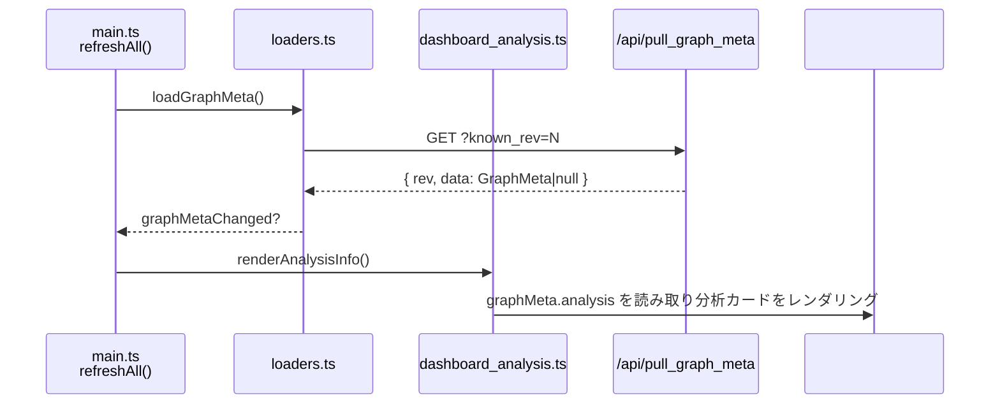

# src/celestialflow_web/static/ts/dashboard_analysis.ts

> 📅 最終更新日: 2026/09/24

「グラフ分析情報」カードをレンダリングし、タスクグラフのトポロジ構造に関する深い洞察（構造タイプ、DAG 検出、グラフモード、レイヤー数など）を表示します。

> 分析結果はグラフメタ情報とともに一度に到着し（`graphMeta.analysis`）、`loaders.ts` が管理します。本ファイルは読み取り専用で取得は行わず、独立したリクエスト／バージョン番号のロジックもありません。

## 型定義

分析結果 `AnalysisData`（定義は [`types.d.ts`](types.d.md) を参照）：

| フィールド | 型 | 説明 |
|------|------|------|
| `name` | `string` | タスクグラフ名 |
| `startTime` | `number` | タスクグラフの起動タイムスタンプ |
| `className` | `string` | グラフ構造の分類名 |
| `isDAG` | `boolean` | 現在のタスクグラフが DAG かどうか |
| `graphMode` | `string` | グラフレベルの実行モード名（serial / thread / async） |
| `layersDict` | `Record<string, unknown>` | レイヤー分析結果。キーの数がレイヤー数の集計に用いられる |

## 関数

### `renderAnalysisInfo(): void`

`graphMeta.analysis` を読み取り `#analysis-info` コンテナへレンダリングします。`analysis` が `null` のときは国際化された空状態プレースホルダ（`analysis.noData`）を表示します。

**表示フィールド：**

| 表示ラベル (i18n key) | 対応フィールド | 説明 |
|---------|---------|------|
| `analysis.graphName` | `name` | タスクグラフ名 |
| `analysis.graphMode` | `graphMode` | グラフレベルの実行モード。ツールチップ付き |
| `analysis.startTime` | `startTime` | グラフ起動タイムスタンプ（`> 0` ならフォーマット、それ以外は `-` を表示） |
| `analysis.structType` | `className` | グラフ構造の分類名。ツールチップ付き |
| `analysis.isDAG` | `isDAG` | `true` なら緑の `.ok` クラス、`false` なら赤の `.warn` クラスを表示 |
| `analysis.layerCount` | `layersDict` | `Object.keys(layersDict).length` からレイヤー総数を導出 |

## データフロー



## 使用例

```typescript
// graphMeta.analysis は loaders.ts の loadGraphMeta() がグラフメタ情報から取り出します：
// {
//   name: "MyTaskGraph",
//   startTime: 1718000000,
//   className: "TaskGraph",
//   isDAG: true,
//   graphMode: "thread",
//   layersDict: { "0": ["StageA"], "1": ["StageB", "StageC"] },
// }

// refreshAll() が graphMetaChanged のときに呼び出します：
renderAnalysisInfo();

// graphMeta.analysis === null なら → 空状態プレースホルダを表示
// それ以外はレンダリング：グラフ名、グラフモード、起動時間、構造タイプ、DAG かどうか、レイヤー数
```
