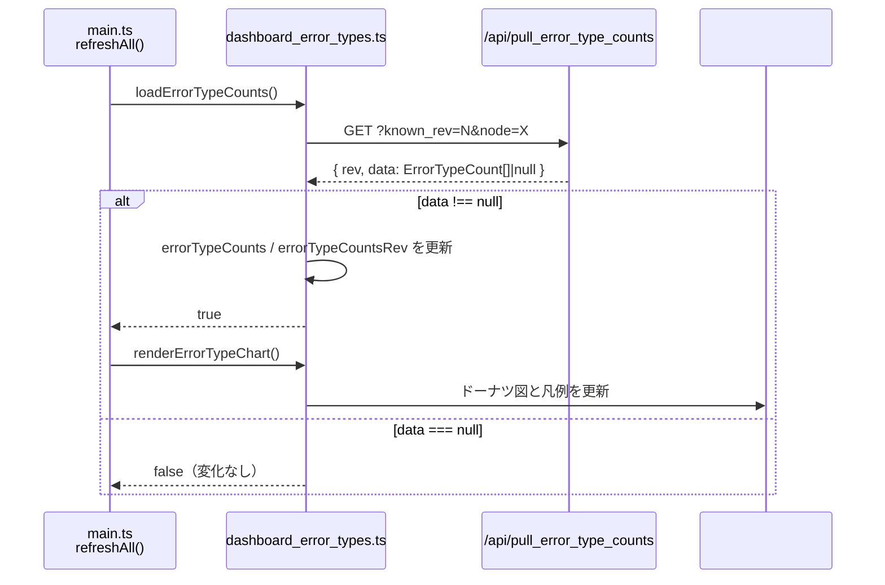
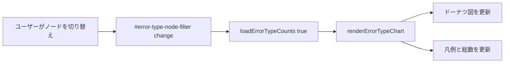

# src/celestialflow_web/static/ts/dashboard_error_types.ts

> 📅 最終更新日: 2026/09/24

エラータイプ分布カードのモジュール。ノードでフィルタしたエラータイプ集計データの取得、ドーナツ図のレンダリング、および凡例の表示を担当します。

## データ型

`ErrorTypeCount`、`ErrorTypeCountsPullResponse` は [`types.d.ts`](types.d.md) で宣言されています（後者は `ApiVersionedResponse<ErrorTypeCount[]>` であり、共通のバージョン付きレスポンス形式に従います）。

## グローバル変数

| 変数 | 型 | 説明 |
|------|------|------|
| `errorTypeCounts` | `ErrorTypeCount[]` | 現在のフィルタ条件におけるエラータイプ集計結果 |
| `errorTypeCountsRev` | `number` | エラータイプ集計データのバージョン番号。初期値 `-1` |
| `errorTypeCountsQueryKey` | `string` | 直近のリクエストで使用したフィルタ条件のキャッシュキー |
| `errorTypeRequestSeq` | `number` | リクエスト連番。遅いレスポンスが新しいフィルタ結果を上書きするのを防ぐ |
| `errorTypeChart` | `ChartInstance \| null` | Chart.js ドーナツ図インスタンス |
| `ERROR_TYPE_COLORS` | `string[]` | セクターのカラーパレット。8 色を循環して使用 |

## 関数

### `getErrorTypeNodeFilter(): HTMLSelectElement | null`

エラータイプチャートのノードフィルタドロップダウン（`#error-type-node-filter`）を取得します。

---

### `getErrorTypeLabel(errorType: string): string`

エラータイプ名を表示可能なテキストに正規化します。空文字列の場合は国際化文言 `errorTypes.unknown` にフォールバックします。

---

### `getErrorTypeColor(index: number): string`

インデックスに応じて `ERROR_TYPE_COLORS` から色を取得し、剰余で循環します。

---

### `getEmptyErrorTypeColor(): string`

データなしのときの空リング図で使用するプレースホルダ色を返します。`dark-theme` クラス名でライト／ダークテーマを判定します：

- ダークテーマ：`#4b5563`
- ライトテーマ：`#e5e7eb`

---

### `initErrorTypeChart(): void`

Chart.js ドーナツ図インスタンスを初期化し、canvas `#error-type-chart` にバインドします。

**チャート設定の要点：**

- タイプ：`doughnut`、中空比率 `58%`
- 凡例は非表示（`renderErrorTypeLegend` が手動でレンダリング）
- アニメーションは無効（`animation: false`）。リアルタイムデータ更新に適する

---

### `renderErrorTypeLegend(): void`

`errorTypeCounts` に基づいてカスタム凡例を `#error-type-legend` コンテナへレンダリングし、同時に `#error-type-total` 要素にエラー総数を表示します。

- **データあり**：色ブロック、エラータイプ名、件数、パーセンテージを行ごとに表示。
- **データなし**：1 行のプレースホルダを表示。色は `getEmptyErrorTypeColor()` を使用し、ラベルは国際化された `errorTypes.noData`。

---

### `renderErrorTypeChart(): void`

現在の集計結果 `errorTypeCounts` に基づいてチャートと凡例を更新します。チャートインスタンスが存在しない場合は先に `initErrorTypeChart()` を呼び出して初期化します。

- データなしのときは、チャートに単一のプレースホルダセクターを表示し、空状態の凡例にフォールバックします。

---

### `loadErrorTypeCounts(forceReload = false): Promise<boolean>`

バックエンド `GET /api/pull_error_type_counts` から現在のノードフィルタにおけるエラータイプ集計結果を取得します。

- **クエリパラメータ**：`known_rev`、`node`。
- **キャッシュ戦略**：フィルタ条件（`errorTypeCountsQueryKey`）が変化したとき、または `forceReload=true` のとき、`known_rev` を `-1` にリセットして全量取得を強制します。
- **競合保護**：`errorTypeRequestSeq` を用いて期限切れのレスポンスを破棄します。
- **戻り値**：バックエンドが新しい集計データを返したときは `true`、バージョン番号のみを返した場合やレスポンスが破棄された場合は `false` を返します。

---

### `populateErrorTypeNodeFilter(statuses: Record<string, NodeStatus>): void`

現在のノード状態スナップショットに基づいて `#error-type-node-filter` ドロップダウンを埋めます。

- ノード名でソートした選択肢を生成し、ユーザーが以前選択したフィルタ値をできるだけ保持します。
- 選択済みノードが消えた場合は前回の選択値を保持します（ドロップダウンリストには引き続き表示されます）。

## イベントバインディング

| 要素 | イベント | 動作 |
|------|------|------|
| `#error-type-node-filter` | `change` | `loadErrorTypeCounts(true)` で強制的に再取得し、チャート `renderErrorTypeChart()` を更新 |

イベントは `DOMContentLoaded` 後にバインドされます。

## データフロー



フィルタ変更時：



## 他モジュールとの連携

| 連携対象 | 方式 | 説明 |
|---------|------|------|
| `main.ts` / `refreshAll()` | 直接呼び出し | 各リフレッシュサイクルで `loadErrorTypeCounts()` を呼び出し、`true` が返れば `renderErrorTypeChart()` を呼び出す |
| `i18n.ts` | `t()` | `errorTypes.*` 系のキーを用いて国際化文言を取得 |
| `utils.ts` | `escapeHtml()` | 凡例レンダリング時にエラータイプのラベルを HTML エスケープ |
| `types.d.ts` | 型宣言 | 契約型 `ErrorTypeCount`、`ErrorTypeCountsPullResponse` などを使用 |
| `globals.d.ts` | 型宣言 | 外部ライブラリ型 `ChartInstance` などを使用 |
| `dashboard_statuses.ts` | `NodeStatus` を渡す | `populateErrorTypeNodeFilter()` がノード状態スナップショットを受け取ってフィルタを埋める |

## 使用例

```typescript
// refreshAll から自動的に呼び出されます：
// const errorTypeCountsChanged = await loadErrorTypeCounts();
// if (errorTypeCountsChanged) renderErrorTypeChart();

// 手動で強制的に再読み込み：
await loadErrorTypeCounts(true);
renderErrorTypeChart();

// ノードフィルタを埋める（ノード状態は dashboard_statuses.ts が管理）：
populateErrorTypeNodeFilter(nodeStatuses);

// 変更後の errorTypeCounts の例：
// [
//   { error_type: "TimeoutError", count: 42 },
//   { error_type: "ValueError",  count: 18 },
// ]
// renderErrorTypeChart() はこれに基づいて 2 セクターのドーナツ図をレンダリングします
```
