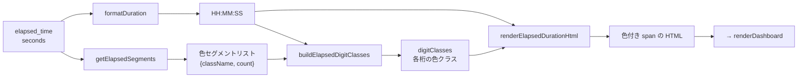

# src/celestialflow_web/static/ts/dashboard_statuses.ts

> 📅 最終更新日: 2026/09/24

ダッシュボード中央のノード状態カードをレンダリングします：`loaders.ts` が公開するノード状態スナップショットとグラフレベル派生値を読み取り、成功／待機／エラー／重複などの指標、実行モードと並列度、および実行時間のカラーセグメントを表示します。

> 本モジュールはデータを読み取るだけで、ネットワークリクエストは発行しません。`nodeStatuses`、`lastNodeStatuses`、`nodeEstimates`、`lastNodeEstimates`、`graphMeta` はすべて `loaders.ts` が管理します。グラフレベルの残り時間は `util_estimators.ts` の `calcRemaining()` によってその場で推算されます。

## 型定義

```typescript
type ElapsedSegment = {
  className: string; // 対応する色の CSS クラス名
  count: number;     // そのタイプのタスク数
};
```

> `NodeStatus` のフィールド定義は [`types.d.ts`](types.d.md)、`NodeEstimate` の定義は [`loaders.ts`](loaders.md) を参照してください。

## DOM 要素参照

| 変数 | DOM ID | 説明 |
|------|--------|------|
| `dashboardGrid` | `#dashboard-grid` | ノード状態カードのグリッドコンテナ |

## 設定駆動関数

以下の関数は `webConfig.dashboard.useTotalPendingInStatus` スイッチに応じて、状態カードの「待機タスク数」と「残り時間」のデータソースを動的に切り替えます。

### `getDisplayPending(status: NodeStatus, estimate?: NodeEstimate): number`

総待機モードが有効なときはグラフレベル推定の `estimate.total_tasks_pending` を返し、そうでなければノード自身の `status.tasks_pending` を返します。グラフメタ情報が準備できる前は `estimate` が欠落している可能性があり、その場合は 0 として扱います。

### `getDisplayRemainingTime(status: NodeStatus, estimate?: NodeEstimate): number`

総待機モードが有効なときは `estimate.total_remaining_time` を返し、そうでなければ `calcRemaining(tasks_processed, tasks_pending, elapsed_time)` を呼び出して本ノードのカウントに基づいてその場で推算します。

### `getPendingLabelHtml(): string`

待機ラベルとツールチップの HTML を返し、設定に応じて `status.pending` / `status.pendingGlobal` の 2 組の国際化キーを切り替えます。

---

## 補助関数：実行時間のカラーセグメントレンダリング

以下の 4 つの関数が協働して `elapsed_time` のカラー HTML レンダリングを実現します。色セグメントは成功／失敗／重複タスク数の比率に応じて各桁の数字に割り当てられます。

### `formatElapsedDuration(seconds, successCount, failedCount, duplicateCount): string`

エントリ関数。`formatDuration()` を呼び出して時間フォーマットのテキストを取得し、さらに `getElapsedSegments()`、`buildElapsedDigitClasses()`、`renderElapsedDurationHtml()` を通じて色付き `<span>` の HTML を生成します。

### `getElapsedSegments(successCount, failedCount, duplicateCount): ElapsedSegment[]`

非ゼロのカウントによって駆動される色セグメントのリストを生成します。

| CSS クラス | 統計フィールド | 意味 |
|--------|---------|------|
| `elapsed-success` | `tasks_succeeded` | 成功タスク |
| `elapsed-error` | `tasks_failed` | 失敗タスク |
| `elapsed-duplicate` | `tasks_duplicated` | 重複タスク |

`count > 0` のセグメントのみを返します。すべてゼロの場合は空配列を返します。

### `buildElapsedDigitClasses(segments: ElapsedSegment[], digitCount: number): string[]`

タスク状態の比率に応じて、`HH:MM:SS` からコロンを除いた各桁の数字に色クラスを割り当てます。

- **セグメント数 ≥ 桁数**：先頭から N 個のセグメントをそのまま取ります。
- **セグメント数 < 桁数**：残りの桁数を各セグメントに比例配分し、さらに剰余でソートして配分誤差を補い、各桁が必ず色クラスを持つようにします。

### `renderElapsedDurationHtml(duration, digitClasses, defaultClassName): string`

時間文字列の各文字を `<span>` で包みます。コロン `:` はその左側の数字の色クラスを使用し、数字文字は順に `digitClasses` 内のクラス名を使用します。

---

## 中核関数

### `renderDashboard(): void`

`nodeStatuses` を走査して各ノードの状態カードを生成します。

**カードレンダリングの特性：**

- **リアルタイム増分**: `lastNodeStatuses` / `lastNodeEstimates` と比較して成功／待機／失敗／重複タスクの増分を計算しカラー表示します（待機増分は `getDisplayPending()` の値に基づく）。
- **状態マーカー**: カードのクラス名がノード状態を反映します（`status-running` = 実行中、`status-stopped` = 停止済み、それ以外は通常カード）。
- **構築期メタ情報**: 実行モードと並列度は `graphMeta.node_meta[node]`（`execution_mode` / `max_workers`）から取得します。`serial` モードまたはメタ情報が欠落している場合は並列度に `-` を表示します。
- **実行時間のカラーセグメント**: `formatElapsedDuration()` を呼び出し、`elapsed_time` に対してタスクの成功／失敗／重複比率に基づく着色 HTML を生成します。
- **4 段式プログレスバー**: 成功（緑）、エラー（赤）、重複（黄）、待機（灰）の比率を直感的に表示します。
- **時間推定**: 実行済み時間、予想残り時間、平均タスク所要時間、完了進捗のパーセンテージを表示します。
- **インタラクション遷移**: カード内のエラー数をクリック（`.error-clickable`）すると、「エラーログ」タブへ自動的に遷移し、そのノードのフィルタをプリセットします。

## カードスタイルクラス

| 状態 | CSS クラス | 説明 |
|------|--------|------|
| 実行中 | `node-card status-running` | 青い左枠線 |
| 停止済み | `node-card status-stopped` | 灰色の左枠線 |
| 未起動 | `node-card` | デフォルトの灰色の左枠線 |

## 実行時間のレンダリングフロー



## 使用例

```typescript
// ノード状態オブジェクトを構築（フィールドは /api/pull_status payload と一致）
const nodeStatus: NodeStatus = {
  status: 1,
  tasks_processed: 250,
  tasks_succeeded: 240,
  tasks_failed: 5,
  tasks_duplicated: 5,
  tasks_pending: 30,
  upstream_counts: {},
  downstream_counts: {},
  start_time: 1745400000,
  elapsed_time: 3600,
};

// 今サイクルのグラフレベル派生値（loaders.ts の refreshNodeEstimates() が計算）
const estimate = { total_tasks_pending: 50, total_remaining_time: 1200 };

// 実行時間のカラーセグメントを計算
const coloredDuration = formatElapsedDuration(
  nodeStatus.elapsed_time,
  nodeStatus.tasks_succeeded,
  nodeStatus.tasks_failed,
  nodeStatus.tasks_duplicated,
);
// 色付き span の HTML 文字列を返す

// 設定に応じて表示値を取得
// getDisplayPending(nodeStatus, estimate) → 30 または 50
// getDisplayRemainingTime(nodeStatus, estimate) → その場で推算 または 1200
```
