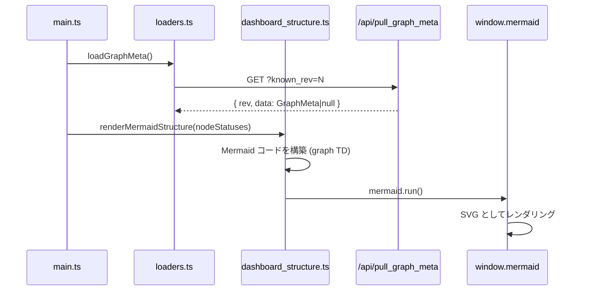

# src/celestialflow_web/static/ts/dashboard_structure.ts

> 📅 最終更新日: 2026/09/24

Mermaid.js を用いてタスク有向グラフをフローチャートとしてレンダリングし、ノード状態に応じてリアルタイムに着色し、設定に応じて辺に増分または累積ラベルを表示します。

> グラフメタ情報（`graphMeta`）は `loaders.ts` が提供し、本ファイルは読み取り専用で取得は行いません。前サイクルの状態 `lastNodeStatuses` も `loaders.ts` から供給され、辺の増分計算に使用します。

## 型定義

```typescript
/** Mermaid ノード形状。値は getNodeShape が決定する */
type NodeShape = "box" | "rhombus" | "subgraph";
```

## 関数

### `getNodeId(nodeName: string): string`

Mermaid 互換のノード ID を生成します（非単語文字を `_` に置換）。

### `getNodeShape(className?: string): NodeShape`

グラフメタ情報 `node_meta[node].class_name` に基づいて Mermaid 形状を導出します。各サイクルの状態スナップショットとは分離されています：

| `class_name` | 形状 | Mermaid 構文 | 説明 |
|--------------|------|--------------|------|
| `TaskSplitter` | `subgraph` | `[[label]]` | 分割／分流ノード |
| `TaskRouter` | `rhombus` | `{{label}}` | ルーティング／意思決定ノード |
| その他 / 欠落 | `box` | `[label]` | 通常の処理ノード |

### `getShapeWrappedLabel(label: string, shape: NodeShape): string`

形状タイプに応じて Mermaid 構文のノードラベルを生成します。`box`、`rhombus`、`subgraph` の 3 種類のみをサポートします。

### `renderMermaidStructure(statuses?: Record<string, NodeStatus>): void`

Mermaid コードを構築し、`window.mermaid.run()` を呼び出してレンダリングします。

**主な特性：**

- **空状態の処理**：グラフメタ情報がまだ準備できていない（`nodes` が空）ときは、空状態プレースホルダで `#mermaid-container` を置き換えます。
- **動的着色**：`statuses` の `status` コードに応じて `classDef` を適用します（`greenNode`=実行中、`greyNode`=停止済み、`whiteNode`=未起動）。
- **テーマ適応**：`dark-theme` クラスを識別し、`classDef` のライト／ダーク 2 組の配色を切り替えます。
- **辺ラベルモード**：`webConfig.dashboard.structureEdgeLabel` によって制御されます：
  - `none`：辺ラベルを一切表示しない；
  - `delta`：前サイクルの `downstream_counts` に対する当該辺の増分 `|+N|` を表示（増分が正の場合のみ）；
  - `cumulative`：当該上流から当該下流への累積転送数 `|N|` を表示。
- **ソースノード優先**：`source_nodes` を非ソースノードより前に並べ、トポロジ図の可読性を高めます。
- **コンテナ置換**：レンダリングのたびに新しい `#mermaid-container` を作成して旧コンテナを置き換え、Mermaid が古い DOM 状態を残す問題を回避します。

## ノード状態の色マッピング

| `status` | スタイルクラス | 意味 |
|----------|--------|------|
| `1` | `greenNode` | 実行中 |
| `2` | `greyNode` | 停止済み |
| なし / その他 | `whiteNode` | 未起動／不明 |

## データフロー



## 使用例

```typescript
// graphMeta は loaders.ts の loadGraphMeta() が管理し、構造は次のとおり：
// {
//   nodes: ["DataLoader", "Processor", "Router"],
//   edges: { DataLoader: ["Processor"], Processor: ["Router"] },
//   source_nodes: ["DataLoader"],
//   node_meta: {
//     DataLoader: { class_name: "TaskExecutor", execution_mode: "serial", max_workers: 1 },
//     Processor:  { class_name: "TaskExecutor", execution_mode: "thread", max_workers: 4 },
//     Router:     { class_name: "TaskRouter",   execution_mode: "serial", max_workers: 1 },
//   },
//   analysis: null,
// }

// ノード ID と形状を取得
// getNodeId("DataLoader") → "DataLoader"
// getNodeShape("TaskRouter") → "rhombus"

// 構造図をレンダリング（ノード状態の着色付き）
// renderMermaidStructure(nodeStatuses);
```
