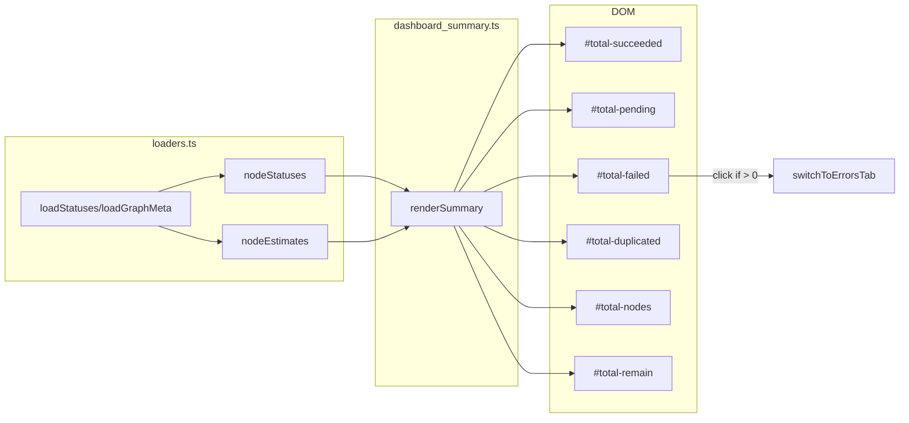

# src/celestialflow_web/static/ts/dashboard_summary.ts

> 📅 最終更新日: 2026/09/24

「全体ステータスサマリ」パネルをレンダリングします。**集計は完全にフロントエンドが `loaders.ts` の公開する `nodeStatuses` と `nodeEstimates` に基づいて計算**し、独立したバックエンド API に依存せず、バージョン番号も管理しません。

## DOM 要素参照

| 変数 | DOM ID | 説明 |
|------|--------|------|
| `totalSucceeded` | `#total-succeeded` | 成功タスク総数 |
| `totalPending` | `#total-pending` | 待機タスク総数 |
| `totalDuplicated` | `#total-duplicated` | 重複タスク総数 |
| `totalFailed` | `#total-failed` | 失敗タスク総数 |
| `totalNodes` | `#total-nodes` | アクティブノード数 |
| `totalRemain` | `#total-remain` | 残り時間の合計 |

## 関数

### `renderSummary(): void`

`nodeStatuses` の最新スナップショットに基づいて各項目の合計を集計しサマリパネルへレンダリングします。グラフレベルの残り時間は `nodeEstimates` から取得します。

**フロントエンドの集計項目：**

| 表示項目 | 計算方法 | フォーマット関数 |
|--------|---------|-----------|
| 成功タスク合計 | `sum(status.tasks_succeeded)` | `formatLargeNumber()` |
| 待機タスク合計 | `sum(status.tasks_pending)` | `formatLargeNumber()` |
| 失敗タスク合計 | `sum(status.tasks_failed)` | `formatLargeNumber()` |
| 重複タスク合計 | `sum(status.tasks_duplicated)` | `formatLargeNumber()` |
| アクティブノード数 | `count(status.status === 1)` | `formatLargeNumber()` |
| 残り時間の合計 | `max(estimate.total_remaining_time)`（`nodeEstimates` 由来） | `formatDuration()` |

> グラフレベルの残り時間は、各ノードの派生推定 `total_remaining_time` の最大値（各リンクの推定を考慮）から取得し、単純な合計ではありません。

**インタラクション特性：**

- 失敗総数が `> 0` のとき、`#total-failed` 要素に `.error-clickable` クラスが追加され、`onclick` に `switchToErrorsTab()` の呼び出しがバインドされ、クリックでエラーログページへ遷移できます。0 のときはそのクラスとイベントを削除します。

## データフロー



## 使用例

```typescript
// renderSummary() は refreshAll() が statusesChanged のときに自動的に呼び出します

// 内部の集計ロジックの概略：
const statusList = Object.values(nodeStatuses || {});
const total_succeeded = statusList.reduce((sum, s) => sum + (s.tasks_succeeded || 0), 0);
const total_pending   = statusList.reduce((sum, s) => sum + (s.tasks_pending || 0), 0);
const total_failed    = statusList.reduce((sum, s) => sum + (s.tasks_failed || 0), 0);
const total_duplicated = statusList.reduce((sum, s) => sum + (s.tasks_duplicated || 0), 0);
const total_nodes     = statusList.reduce((sum, s) => sum + (s.status === 1 ? 1 : 0), 0);
const total_remain    = Math.max(
  ...Object.values(nodeEstimates).map((e) => e.total_remaining_time),
  0,
);

// DOM を更新
totalSucceeded.innerHTML = formatLargeNumber(total_succeeded);
totalPending.innerHTML   = formatLargeNumber(total_pending);
// ... 残りの DOM 更新
totalRemain.textContent  = formatDuration(total_remain);
```
