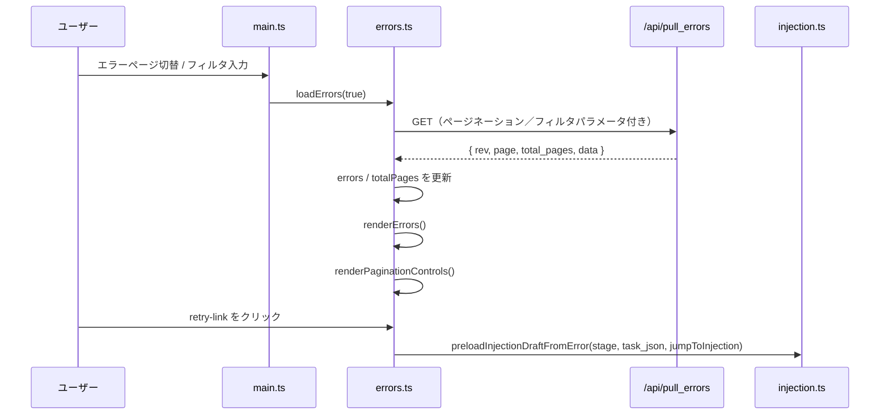

# src/celestialflow_web/static/ts/errors.ts

> 📅 最終更新日: 2026/09/24

エラーログのページネーションとフィルタのモジュール。エラー記録の非同期取得、フロントエンドのページネーションロジック、ノード／キーワード検索によるフィルタ表示、およびテーブルフィールド順序の実行時編集（`#errors-columns-editor-overlay`）を担当します。

## 型定義

`ErrorData`、`ErrorsPullResponse`、`ErrorColumnKey` などの契約型は [`types.d.ts`](types.d.md) で一括して宣言されています。本モジュール内部ではフィールドメタ情報型も定義しています：

```typescript
type ErrorColumnMeta = {
  labelKey: string;         // 列タイトルに対応する国際化キー
  headerClassName?: string; // ヘッダーの追加スタイルクラス
  cellClassName?: string;   // セルの追加スタイルクラス
};
```

## グローバル変数

| 変数 | 型 | 説明 |
|------|------|------|
| `errors` | `ErrorData[]` | 現在のページのエラー記録リスト |
| `currentPage` | `number` | 現在のページ番号。デフォルト `1` |
| `pageSize` | `number` | 1 ページあたりの表示件数。デフォルト `10`。`webConfig.errors.pageSize` により同期 |
| `errorSortOrder` | `"newest" \| "oldest"` | 現在のエラーログの並び順。デフォルト `"newest"` |
| `totalPages` | `number` | 総ページ数。デフォルト `1` |
| `errorsRev` | `number` | データバージョン番号。増分取得に使用。デフォルト `-1` |
| `lastQueryKey` | `string` | 前回クエリのキャッシュキー。フィルタ条件が変化したかの判定に使用 |
| `errorsRequestSeq` | `number` | リクエスト連番。古いレスポンスが新しい結果を上書きするのを防ぐ |
| `originalErrorColumns` | `ErrorColumnKey[]` | フィールドエディタを開いたときのフィールドスナップショット |
| `errorColumnSortableInstances` | `Partial<Record<..., SortableInstance>>` | フィールドエディタのドラッグインスタンスキャッシュ |
| `ERROR_COLUMN_META` | `Record<ErrorColumnKey, ErrorColumnMeta>` | 各フィールドの i18n key とセル／ヘッダーのクラス名 |
| `ALL_ERROR_COLUMN_IDS` | `ErrorColumnKey[]` | フィールドエディタで選択可能なすべてのフィールドキー |
| `ERROR_COLUMNS_ZONE_IDS` | `readonly [...]` | フィールドエディタの「表示済み／未表示」2 つの dropzone の ID リスト |

## DOM 要素参照

| 変数 | DOM セレクタ | 説明 |
|------|-----------|------|
| `searchInput` | `#error-search` | キーワード検索入力ボックス |
| `nodeFilter` | `#node-filter` | ノードでフィルタするドロップダウン |
| `errorSortSelect` | `#error-sort-order` | 並び順ドロップダウン |
| `errorsTableHeadRow` | `#errors-table thead tr` | エラーテーブルのヘッダー行 |
| `errorsTableBody` | `#errors-table tbody` | エラーテーブルの本体 |
| `paginationContainer` | `#pager-container` | ページネーションコントロールのコンテナ |
| `openErrorColumnsEditorBtn` | `#open-error-columns-editor` | 設定パネルの「テーブルフィールドを編集」ボタン |
| `errorColumnsEditorOverlay` | `#errors-columns-editor-overlay` | フィールドエディタのオーバーレイ |
| `errorColumnsEditorCloseBtn` | `#errors-columns-editor-close` | フィールドエディタの閉じるボタン |
| `errorColumnsSaveBtn` | `#errors-columns-save-btn` | フィールドエディタの保存ボタン |
| `errorColumnsResetBtn` | `#errors-columns-reset-btn` | フィールドエディタのデフォルトに戻すボタン |

## 関数

### `buildErrorsQueryKey(page, pageSizeValue, node, keyword, sortOrder): string`

ページネーション、ページサイズ、ノードフィルタ、キーワード、並び順を含むクエリキャッシュキーを構築し、強制全量取得が必要かを判定するために使用します。

### `loadErrors(forceReload = false): Promise<boolean>`

バックエンド `GET /api/pull_errors` から現在のフィルタ条件におけるエラーログを取得します。

- **クエリパラメータ**：`known_rev`、`page`、`page_size`、`node`、`keyword`、`sort_order`。
- **キャッシュ戦略**：フィルタ条件（`lastQueryKey`）が変化したとき、または `forceReload=true` のとき、`known_rev` を `-1` にリセットして全量取得を強制します。
- **競合保護**：`errorsRequestSeq` を用いて期限切れのレスポンスを破棄します。
- **戻り値**：バックエンドが新しいエラー記録データを返したときは `true` を返します。

### `renderErrors(): void`

`errors` 配列をテーブルにレンダリングします。各行にはエラー番号、イベント ID、エラー情報、ノード、タスクデータ、発生日時、リトライボタンが含まれます。

- `task_json !== undefined` のときはクリック可能な「タスク注入」リトライリンクを表示し、そうでなければ使用不可の「形式不明」プレースホルダを表示します。
- リトライのクリックで `preloadInjectionDraftFromError(stage, task_json, webConfig.errors.jumpToInjectionAfterRetry)` を呼び出します。
- 記録がないときは空状態プレースホルダを表示します。

### `goToErrorsPage(nextPage): Promise<void>`

指定したページ番号へ移動してデータを再読み込みします。移動先のページ番号は `[1, totalPages]` の範囲に制限されます。

### `buildPageList(current, total): Array<number \| string>`

ページネーションのページ番号リストを生成します。先頭・末尾・現在ページおよび前後ページを含み、間隔が 1 を超える場合は省略記号 `…` を挿入します。

### `renderPaginationControls(totalPages): void`

ページネーションコントロールをレンダリングします。「前へ／次へ」ボタンと省略記号付きの数字ページ番号領域を含みます。総ページ数が `<= 1` のときはレンダリングしません。

### `populateNodeFilter(statuses): void`

現在のノード状態スナップショットに基づいてノードフィルタドロップダウンを埋め、ユーザーが以前選択したフィルタ値をできるだけ保持します。選択済みノードが消えた場合は「すべてのノード」に戻します。

### フィールドエディタ（実行時にエラーテーブルのフィールド順序と表示／非表示を設定）

- `getActiveErrorColumns()`: `webConfig.errors.columns` を読み取り、`web_config.normalizeErrorColumns()` に渡して正規化します。
- `normalizeErrorColumns(rawColumns)`（`web_config.ts` 由来）: デフォルトのフィールドリストをホワイトリストとして重複を排除し、不正なフィールドをフィルタします。
- `renderErrorColumnsEditor(visibleColumns)`: 与えられた順序で「表示済み」と「未表示」の 2 つの dropzone をレンダリングし、SortableJS を初期化します。
- `openErrorColumnsEditor()` / `closeErrorColumnsEditor(restore = true)`: フィールドエディタを開く／閉じる；閉じるときに `restore=true` なら `originalErrorColumns` スナップショットにロールバックします。
- `initErrorColumnSortable()` / `destroyErrorColumnSortable()`: dropzone 上の SortableJS インスタンスを作成／破棄します（`errors-columns` グループを共用）。
- `syncErrorColumnsFromEditor()`: 現在の dropzone 順序を `webConfig.errors.columns` に書き戻します。
- `saveErrorColumns()`: 順序を書き戻し、`saveWebConfig()` を呼び出して永続化します。保存成功後にエディタを閉じます。
- `resetErrorColumns()`: `webConfig.errors.columns` を `DEFAULT_WEB_CONFIG.errors.columns` のコピーにリセットします。
- `renderErrorsTableHeader()`: 現在のフィールド順序で `<thead>` 行を再描画します。`applyConfig()` と `closeErrorColumnsEditor(restore=true)` の両方から呼び出されます。

## イベントバインディング

| 要素 | イベント | 動作 |
|------|------|------|
| `searchInput` | `input` | 1 ページ目に戻り、強制的に再取得してレンダリング |
| `nodeFilter` | `change` | 1 ページ目に戻り、強制的に再取得してレンダリング |
| `errorSortSelect` | `change` | `errorSortOrder` と `webConfig.errors.sortOrder` を更新し、1 ページ目に戻って取得・レンダリングし、`saveWebConfig()` を呼び出して設定を保存 |
| `openErrorColumnsEditorBtn` | `click` | エラーフィールドエディタを開く |
| `errorColumnsEditorCloseBtn` | `click` | フィールドエディタを閉じて元の順序を復元 |
| `errorColumnsEditorOverlay` | `click` | オーバーレイの外側をクリックしたときにエディタを閉じる（`restore=true`） |
| `errorColumnsSaveBtn` | `click` | 現在のフィールド順序を保存して永続化 |
| `errorColumnsResetBtn` | `click` | フィールド順序をデフォルト値にリセット |

## データフロー



## 使用例

```typescript
// 直接 3 ページ目へ移動
await goToErrorsPage(3);

// ノードでフィルタ（nodeFilter を設定して change を発火するのと等価）
nodeFilter.value = "Processor";
nodeFilter.dispatchEvent(new Event("change"));

// クエリキャッシュキーを構築
const key = buildErrorsQueryKey(1, 10, "Processor", "timeout", "newest");
// "1|10|Processor|timeout|newest"

// renderErrors はグローバルの errors を読み取ってテーブルをレンダリング
// renderPaginationControls(totalPages) は下部のページネーションをレンダリング
```
