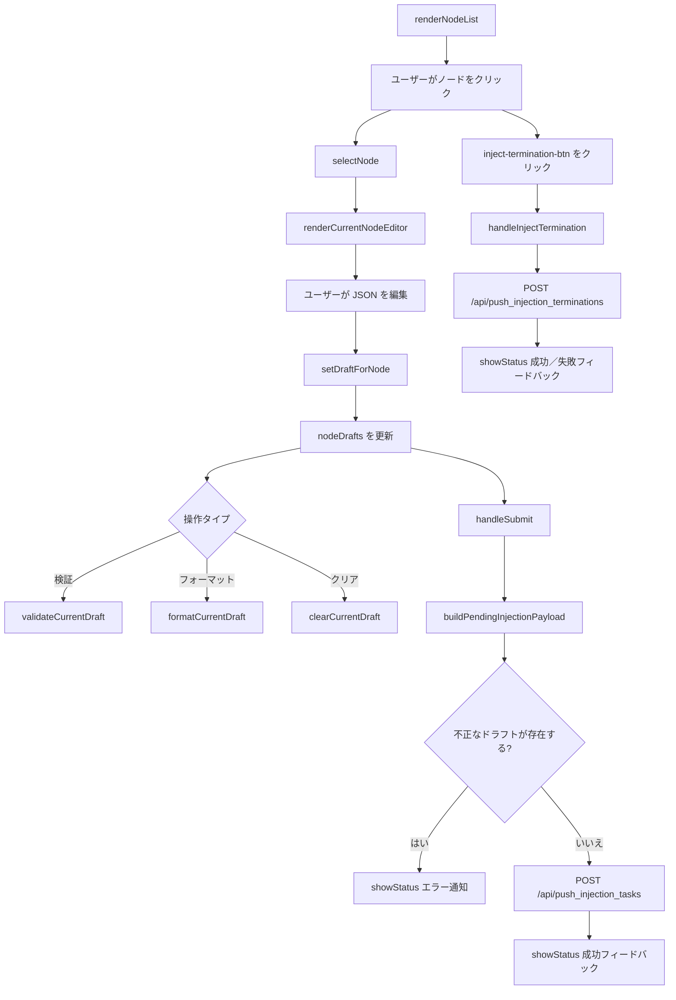

# src/celestialflow_web/static/ts/injection.ts

> 📅 最終更新日: 2026/09/24

タスクの手動注入モジュール。**単一ノード編集＋一括送信**のドラフト方式アーキテクチャを採用しています：各ノードが独立した JSON ドラフトを保持し、最終的に `{ node_name: [tasklist] }` 構造として一括送信します。終端記号の注入は独立したネットワーク操作であり、タスクドラフトとは**混在しません**。

## 型定義

```typescript
type ValidationState = "success" | "error" | "neutral";
```

## グローバル変数

| 変数 | 型 | 説明 |
|------|------|------|
| `currentNodeName` | `string \| null` | 現在編集中のノード名。未選択時は `null` |
| `nodeDrafts` | `Record<string, string>` | ノード名をキーとする JSON ドラフトテキストのマップ |
| `statusHideTimer` | `number \| null` | 下部ステータス通知の自動非表示タイマー |

## i18n メタ情報補助関数

注入ページには、言語切り替え後に再描画が必要な動的な文言が一部あるため、`data-message-key` / `data-message-args` で元の翻訳情報をキャッシュします。

| 関数 | シグネチャ | 説明 |
|------|------|------|
| `setLocalizedMessageMeta` | `(element, messageKey, args = []) => void` | 要素に翻訳キーとプレースホルダ引数を記録 |
| `getLocalizedMessageArgs` | `(element) => string[]` | キャッシュされたプレースホルダ引数を読み取って解析 |

## ステータス通知補助関数

| 関数 | シグネチャ | 説明 |
|------|------|------|
| `getStatusIconSvg` | `(isSuccess: boolean) => string` | 成功／失敗状態に応じて対応する SVG アイコンの HTML を返す |
| `renderStatusMessage` | `(statusDiv, messageKey, isSuccess, args = []) => void` | 指定コンテナ内にアイコン付きの翻訳文言をレンダリング |
| `showStatus` | `(messageKey, isSuccess = false, ...args) => void` | `#status-message` にステータス通知を表示し、3 秒後に自動で非表示 |

## DOM 要素取得関数

| 関数 | 戻り値の型 | 対応する DOM ID |
|------|----------|-------------|
| `getSearchInput` | `HTMLInputElement` | `#search-input` |
| `getInjectableOnlyToggle` | `HTMLInputElement` | `#injectable-only-toggle` |
| `getJsonTextarea` | `HTMLTextAreaElement` | `#json-textarea` |
| `getEditorButtons` | `HTMLButtonElement[]` | `#validate-json-btn`、`#format-json-btn`、`#clear-draft-btn`、`#inject-termination-btn` |

## イベントバインディング

モジュールは `DOMContentLoaded` 時に `setupEventListeners()` を呼び出して以下のインタラクションをバインドします：

| 要素 | イベント | 動作 |
|------|------|------|
| `#search-input` | `input` | 左側のノードリストをリアルタイムでフィルタ |
| `#json-textarea` | `input` | 現在のノードドラフトを同期して書き戻し、通知／プレビューを再描画 |
| `#node-list` | `click`（イベントデリゲーション） | 対応するノードへ切り替え |
| `#validate-json-btn` | `click` | 現在のドラフトを検証 |
| `#format-json-btn` | `click` | 現在のドラフトをフォーマット |
| `#clear-draft-btn` | `click` | 現在のノードドラフトをクリア |
| `#inject-termination-btn` | `click` | 現在選択中のノードに終端信号を単独で送信（`handleInjectTermination`） |
| `#submit-btn` | `click` | すべてのドラフトを一括送信 |

> 注：`#injectable-only-toggle` の `change` イベントは `main.ts` で一括してバインドされ、切り替え後に `renderInjectionPage()` を呼び出して設定を保存します。

## ノードリストと状態の同期

### `isInjectableNode(nodeName: string): boolean`

ノードが現在注入を受け付け可能か判定します。ノードが存在し、状態が停止済みでない（`status !== 2`）限り注入可能とみなします。未実行でもまだ停止していないノードは引き続き送信できます。

### `syncInjectionStateWithStatuses(): void`

ドラフト状態を最新のノード状態スナップショットに整合させます：
- 消失した、または停止済みノードのドラフトはクリアされます。
- 現在編集中のノードが注入不可になった場合、現在の選択を解除します。

### `renderNodeList(searchTerm = ""): void`

左側のノード閲覧リストをレンダリングします。以下をサポートします：
- 検索キーワードによるフィルタ（大文字小文字を区別しない）。
- 「注入可能なノードのみ表示」スイッチによるフィルタ。
- 現在選択中のノードをハイライト（`.active-node`）。
- 注入不可のノードを無効スタイルで表示（`.disabled-node`）。
- 編集済みドラフトのノードに「編集済み」ラベルを表示。

### `selectNode(nodeName: string): void`

現在編集中のノードを切り替えます。対象ノードが注入不可になった場合は、状態を同期してクリアしページを更新します。

### `renderCurrentNodeEditor(): void`

右側のエディタ領域をレンダリングします。現在のノード名、ドラフト状態ラベル、JSON 編集ボックス、操作ボタンの有効／無効状態を含みます。

### `renderInjectionPage(): void`

注入ページを全体的に更新します：順に `syncInjectionStateWithStatuses()`、`renderNodeList()`、`renderCurrentNodeEditor()`、`renderDraftList()`、`updateSubmitButtonAvailability()` を呼び出します。

## ドラフト管理

### `setDraftForNode(nodeName: string, value: string): void`

あるノードのドラフトを書き込むか削除します。空テキストはそのノードのドラフトエントリを直接クリアします。

### `preloadInjectionDraftFromError(nodeName, taskData, switchTab = true): void`

`errors.ts` から呼び出されます。エラーに関連するタスクデータを対応するノードのドラフトに追加します（既存の内容は上書きしません）。

- 現在のノードにすでに正しいドラフト配列がある場合、新しいタスクを末尾に追加します。
- `switchTab` が `true` の場合、タスク注入タブへ自動的に切り替えます。
- 完了後に JSON 編集ボックスの末尾へフォーカスします。

### `parseDraftTaskList(draftText: string): { ok: true; taskList: unknown[] } \| { ok: false; reason: "invalid_json" \| "not_array" }`

ノードのドラフトテキストを解析します。タスク注入では各ノードの値が JSON 配列である必要があります。

### `buildPendingInjectionPayload(): { payload: Record<string, unknown[]>; invalidNode: string \| null; invalidReason: "invalid_json" \| "not_array" \| null }`

すべてのドラフトを走査し、最終的にバックエンドへ送信する注入マップを構築して、最初に検証に失敗したノードとその理由を返します。

### `updateSubmitButtonAvailability(): void`

送信可能なドラフトが存在するかどうかに応じて送信ボタンを有効化または無効化します。送信中状態ではボタンの可用性を変更しません。

### `renderDraftList(): void`

下部の「送信待ちデータプレビュー」をレンダリングし、最終的に送信するデータ構造にできるだけ近づけます。ドラフトの解析に失敗した場合は、そのノードの下に `invalid_json` または `invalid_task_list` マーカーを表示します。

## 検証とフォーマット

### `setValidationMessage(messageKey: string, state: ValidationState, args: string[] = []): void`

`#json-validation` 領域に検証通知を表示し、言語切り替え後の再描画のために翻訳キーをキャッシュします。

### `validateCurrentDraft(showSyntaxError = true): boolean`

現在のノードドラフトが正しい JSON 配列かどうかを検証します。

- ノード未選択 → `injection.validationSelectNode` を表示。
- ドラフトが空 → `injection.validationEmpty` を表示。
- 検証成功 → `injection.validationOk` を表示。
- 検証失敗 → 失敗理由に応じて `injection.invalidJson` または `injection.invalidTaskList` を表示。

`true` を返すと現在のドラフトが正しいことを示します。

### `formatCurrentDraft(): void`

現在のノードドラフトに対して `JSON.parse` + `JSON.stringify(..., null, 2)` のフォーマットを実行し、テキストエリアとドラフトキャッシュに書き戻します。

### `clearCurrentDraft(): void`

現在のノードのドラフトと編集領域の内容をクリアします。

## 送信と読み込み状態

### `handleSubmit(): Promise<void>`

送信待ちのすべてのノードドラフトを送信します：
1. `syncInjectionStateWithStatuses()` を呼び出して状態を整合。
2. `buildPendingInjectionPayload()` を呼び出してペイロードを構築。
3. 検証に失敗したノードがあれば、そのノードへ移動して修正を促す。
4. 有効なペイロードがなければ、「送信可能なドラフトがありません」と通知。
5. `POST /api/push_injection_tasks` で JSON ペイロードを送信。
6. 成功後にドラフトをクリアしてページを更新；失敗時は汎用の失敗通知を表示。

### `handleInjectTermination(): Promise<void>`

現在選択中のノードに終端信号を単独で注入します。この操作は**独立**したネットワークリクエストであり、いかなるノードのドラフト内容も**変更しません**：

- `POST /api/push_injection_terminations` で現在のノード名を送信。
- 成功時は `injection.terminationInjected`、失敗時は `injection.terminationInjectFailed` を表示し、いずれもノード名のプレースホルダ引数を伴います。
- 送信の過程では `setTerminationButtonLoading(true)` でボタンをロックし、重複トリガーを防ぎます。

### `setButtonLoading(loading: boolean): void`

送信ボタンの読み込み状態を切り替えます。読み込み中は回転インジケータ（`.spinner`）と `injection.submitting` の文言を表示し、ボタンを無効化します。

### `setTerminationButtonLoading(loading: boolean): void`

終端記号注入ボタンの読み込み状態を切り替えます。読み込み中は `injection.terminationInjecting` の文言を表示してボタンを無効化し、終了後は `injection.injectTermination` の文言に戻し、ノード未選択時は再び無効化します。

### `refreshInjectionLocalizedText(): void`

言語切り替え後に注入ページの動的テキスト（検証通知、ステータス通知、終端記号ボタンの文言、送信ボタンの文言）を再描画します。

## 中核フロー



## 使用例

```typescript
// ノードドラフトデータをシミュレート
nodeDrafts["StageA"] = '[{"id": 1, "payload": "data1"}, {"id": 2, "payload": "data2"}]';
nodeDrafts["StageB"] = '[{"id": 3}]';

// ノードを選択してエディタをレンダリング
selectNode("StageA");  // 自動的に renderInjectionPage() を呼び出す

// 現在のドラフトを検証
validateCurrentDraft();  // 結果は #json-validation へレンダリング

// JSON をフォーマット
formatCurrentDraft();

// 送信ペイロードを構築
const { payload, invalidNode, invalidReason } = buildPendingInjectionPayload();
// payload = { StageA: [{id:1,...}, {id:2,...}], StageB: [{id:3}] }

// ドラフトを送信
await handleSubmit();

// 現在選択中のノードに単独で終端記号を注入（ドラフトは変更しない）
await selectNode("StageA");
await handleInjectTermination();

// エラーページからドラフトを事前入力（errors.ts が呼び出す）
preloadInjectionDraftFromError("StageA", { id: 999 }, true);
// 自動的に注入タブへ切り替え、task_999 を StageA のドラフトへ追加
```
