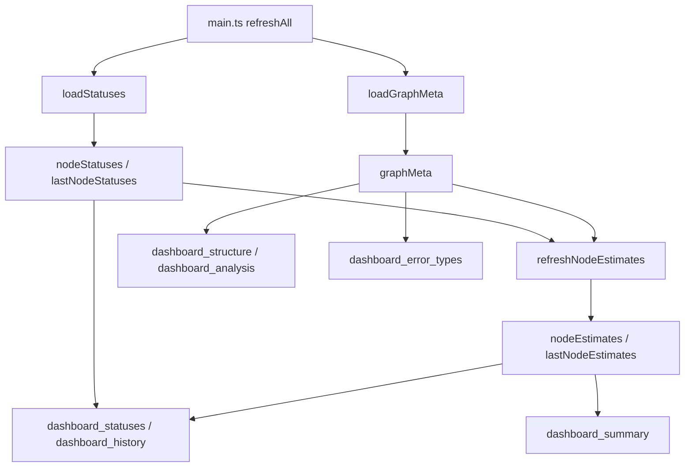

# src/celestialflow_web/static/ts/loaders.ts

> 📅 最終更新日: 2026/09/24

データ層：モデル状態と取得。指標データの取得、バージョンガード、ローカル派生を担当します。

> レンダリングモジュールはここで公開されるグローバル変数を読み取るだけで、自らリクエストを発行しません —— これにより「データがどこから来るか」と「データをどう描画するか」が同じファイルに混在しなくなります。契約型は [`types.d.ts`](types.d.md) を参照。`load*` で始まる名前の関数が唯一のネットワーク入口です。

## 型定義

```typescript
/**
 * フロントエンドが状態スナップショットと静的なトポロジから導出するグラフレベルの派生値
 *
 * NodeStatus とは混在させない：これら 2 項目はグラフ全体の情報がないと算出できず、報告内容ではなくローカル派生に属する。
 */
export type NodeEstimate = {
  total_tasks_pending: number;   // 総待機タスク数（下流リンクを含む）
  total_remaining_time: number;  // 予想される総残り秒数（各リンクの状態を考慮）
};
```

## グローバル変数

| 変数 | 型 | 説明 |
|------|------|------|
| `nodeStatuses` | `Record<string, NodeStatus>` | 現在の各ノードの実行状態 |
| `lastNodeStatuses` | `Record<string, NodeStatus>` | 前サイクルの状態スナップショット。増分計算に使用 |
| `nodeEstimates` | `Record<string, NodeEstimate>` | 今サイクルのグラフレベル派生値。`nodeStatuses` と同期してローテーション |
| `lastNodeEstimates` | `Record<string, NodeEstimate>` | 前サイクルの派生値。増分計算に使用 |
| `lastStatusTimestamp` | `number` | 直近の状態スナップショットの統一タイムスタンプ。ヒストリ曲線の記録に使用 |
| `graphMeta` | `GraphMeta` | グラフメタ情報（有向グラフ＋ノードメタ情報＋分析結果） |

モジュール内部ではリクエストバージョンと競合連番も管理します（非エクスポート）：`statusRev`、`statusesRequestSeq`、`graphMetaRev`、`graphMetaRequestSeq`。デフォルト値 `-1` は初回の全量取得を表します。

## 関数

### `loadStatuses(): Promise<boolean>`

`GET /api/pull_status?known_rev=N` から非同期的にノード状態を取得し、グローバル変数を更新します。

- **競合保護**：リクエストごとに増加する `statusesRequestSeq` を割り当て、連番が一致しない場合はレスポンスを破棄します。
- **スナップショットローテーション**：成功後に古い `nodeStatuses` を `lastNodeStatuses` へ移し、`lastStatusTimestamp` を更新します。
- **戻り値**：データバージョンが変化して正常に更新されたときは `true` を返します。
- グローバル推定とヒストリ曲線の同期は `main.ts` の `refreshAll()` が一括して処理し、本関数は担当しません。

### `loadGraphMeta(): Promise<boolean>`

`GET /api/pull_graph_meta?known_rev=N` から非同期的にグラフメタ情報（グラフトポロジ＋ノード構築期メタ情報＋グラフ分析結果）を取得し、グローバル `graphMeta` を一度に更新します。`graphMetaRequestSeq` を競合保護に使用します。

### `refreshNodeEstimates(): void`

同一スナップショット内の生のカウントと静的なトポロジに基づいて、各ノードのグラフレベル派生値 `nodeEstimates` を更新します：

- `total_tasks_pending` と `total_remaining_time` には、各ノードのカウント、各辺の出力量、およびグラフメタ情報が提供するトポロジと DAG 判定が必要です。
- グラフメタ情報がまだ準備できていない（`graphMeta.nodes` が空、または `analysis` が `null`）ときは即座に返し、退化した結果を暗黙に算出するのを避けます。
- 非 DAG ではトポロジ伝播ができないため、`total_tasks_pending` はノード自身の待機量に退化します（`calcGlobalPending` は DAG 上でのみ呼び出されます）。
- 結果を書き込む前に古い `nodeEstimates` を `lastNodeEstimates` へ移します。

推定自体は [`util_estimators.ts`](util_estimators.md) の `calcGlobalPending()` と `calcRemaining()` が行います。

## データフロー



## 使用例

```typescript
import { loadStatuses, loadGraphMeta, refreshNodeEstimates, nodeStatuses, graphMeta, nodeEstimates } from "./loaders.js";

// 1 サイクル分のデータを取得
const statusesChanged = await loadStatuses();
const graphMetaChanged = await loadGraphMeta();

// グラフメタ情報が準備できたらローカル派生を一括処理
if (statusesChanged || graphMetaChanged) {
  refreshNodeEstimates();
}

console.log(Object.keys(nodeStatuses), graphMeta.nodes, nodeEstimates);
```
