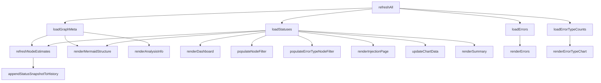
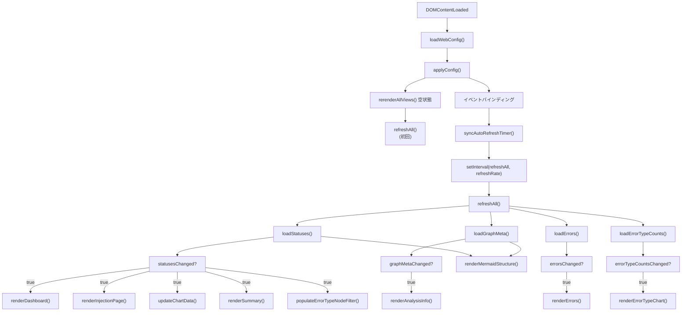

# src/celestialflow_web/static/ts/main.ts

> 📅 最終更新日: 2026/09/24

ダッシュボードのメインエントリスクリプト。グローバル初期化、イベントリスニング、設定パネルのインタラクション、および中核データポーリングロジックの調整を担当します。

> `refreshRate` は `web_config.ts` が管理します（当該モジュールのみがエクスポートし、`main.ts` がインポートして使用）。本ファイルは設定パネルのドロップダウン値を `setRefreshRate()` へ書き込む役割を担います。

## グローバル変数

| 変数 | 型 | 説明 |
|------|------|------|
| `refreshIntervalId` | `ReturnType<typeof setInterval> \| null` | ポーリングタイマー ID |
| `settingsStatusTimer` | `ReturnType<typeof setTimeout> \| null` | 設定保存ステータス通知の自動非表示タイマー |

## DOM 要素参照

| 変数 | DOM セレクタ | 説明 |
|------|-----------|------|
| `refreshSelect` | `#refresh-interval` | リフレッシュ間隔ドロップダウン |
| `autoRefreshToggle` | `#auto-refresh-toggle` | 自動リフレッシュスイッチ |
| `historyLimitSelect` | `#history-limit` | ヒストリ長ドロップダウン |
| `settingsBtn` | `#settings-btn` | 設定ギアボタン |
| `settingsPanel` | `#settings-panel` | 設定フローティングパネル |
| `themeToggleBtn` | `#theme-toggle` | テーマ切り替えボタン |
| `languageSelect` | `#language-select` | 言語選択ドロップダウン |
| `errorPageSizeSelect` | `#error-page-size` | エラーの 1 ページあたり件数ドロップダウン |
| `errorJumpToInjectionToggle` | `#error-jump-to-injection-toggle` | エラーページの再注入後ジャンプスイッチ |
| `structureEdgeLabelSelect` | `#structure-edge-label` | 構造図の辺ラベル表示モードドロップダウン（none / delta / cumulative） |
| `statusTotalPendingToggle` | `#status-total-pending-toggle` | ノード状態カードの待機値モードスイッチ |
| `injectableOnlyToggle` | `#injectable-only-toggle` | 注入ページの「注入可能なノードのみ表示」スイッチ |
| `tabButtons` | `.tab-btn` | タブボタンリスト |
| `tabContents` | `.tab-content` | タブ内容リスト |
| `settingsClose` | `#settings-close` | 設定パネルの閉じるボタン |
| `settingsStatus` | `#settings-status` | 設定保存ステータス通知 |
| `settingsCurrentGroup` | `#settings-current-group` | 現在ページの設定グループコンテナ |
| `settingsCurrentLabel` | `#settings-current-label` | 現在ページの設定グループタイトル |
| `settingsCurrentEmpty` | `#settings-current-empty` | 現在ページに専用設定がない旨の通知 |
| `settingsCurrentItems` | `[data-settings-tab]` | 現在ページの設定項目リスト |

## 中核機能

### ポーリングリフレッシュ (`refreshAll`)

各サイクルで 4 つの非同期取得を並行して発行します：`loadStatuses()`、`loadGraphMeta()`、`loadErrors()`、`loadErrorTypeCounts()`。その後、各モジュールが返す変更フラグに応じて必要時にレンダリングします。グラフレベルの派生指標はフロントエンドがローカルで推定するため、グラフメタ情報が準備できた後、レンダリングの前に一括処理する必要があります。

- `statusesChanged || graphMetaChanged` → `refreshNodeEstimates()`
- `statusesChanged` → `appendStatusSnapshotToHistory()`（前の手順で算出した `nodeEstimates` に依存）
- `statusesChanged || graphMetaChanged` → `renderMermaidStructure()`
- `graphMetaChanged` → `renderAnalysisInfo()`
- `statusesChanged` → `renderDashboard()` / `populateNodeFilter()` / `populateErrorTypeNodeFilter()` / `renderInjectionPage()` / `updateChartData()` / `renderSummary()`
- `errorsChanged` → `renderErrors()`
- `errorTypeCountsChanged` → `renderErrorTypeChart()`



> ページの初期空状態と言語切り替えが同じ再描画シーケンスを共用するため、`rerenderAllViews()` が統一されたレンダリング呼び出しを抽出します。注入ページは更新の粒度が異なる（ページ全体の再描画／文言のみの再描画）ため個別に処理します。

### 設定インタラクション

| 設定項目 | イベント | トリガー動作 |
|-------|------|----------|
| **リフレッシュ間隔** | `change` | `refreshRate` を更新し、設定を保存し、タイマーを再構築 |
| **自動リフレッシュ** | `change` | `autoRefreshEnabled` を切り替え、タイマーを同期し、設定を保存 |
| **ヒストリ長** | `change` | `historyLimit` を更新し、ヒストリをトリミングして再描画し、設定を保存 |
| **インターフェース言語** | `change` | `setLang()` + `applyI18nDOM()`、すべてのカードとチャートを全量更新 |
| **構造図の辺ラベル** | `change` | `structureEdgeLabel`（none/delta/cumulative）を切り替え、Mermaid を再描画し、設定を保存 |
| **ノード待機モード** | `change` | `useTotalPendingInStatus` を切り替え、ノードカードを再描画し、設定を保存 |
| **注入ページのノードフィルタ** | `change` | `showInjectableOnly` を切り替え、注入ページを更新し、設定を保存 |
| **エラーページサイズ** | `change` | `pageSize` を更新し、エラーリストを再読み込みし、設定を保存 |
| **エラー再注入ジャンプ** | `change` | `jumpToInjectionAfterRetry` を切り替え、設定を保存 |
| **ライト／ダークテーマ** | `click` | `dark-theme` クラスを切り替え、チャートのテーマ色を更新し、設定を保存 |

### UI 補助関数

#### `toggleDarkTheme(): boolean`
`body` 要素の `dark-theme` クラスを切り替え、切り替え後にダークモードかどうかを返します。

#### `showSettingsSaveStatus(messageKey: string): void`
設定パネルの下部に期限付きのステータス通知を表示します（成功は 2 秒、失敗は 5 秒後に自動で非表示）。

#### `updateSettingsStatusText(): void`
言語切り替え後に設定ステータス通知のテキストを更新します。

#### `syncAutoRefreshTimer(): void`
`webConfig.global.autoRefreshEnabled` に応じてポーリングタイマーを作成またはクリアします。

#### 設定パネル管理
`isSettingsPanelOpen()` / `openSettingsPanel()` / `closeSettingsPanel(options?)` / `toggleSettingsPanel()` — 設定パネルの表示／非表示とフォーカス返却を管理します。

#### タブ管理
`getActiveTab(): string` / `activateTab(button): void` / `updateCurrentPageSettings(): void` — 上部タブの切り替えと設定パネルの「現在ページ専用設定」グループを管理します。

## データフロー図



## 使用例

```typescript
// 手動で完全なリフレッシュをトリガー
// await refreshAll();

// ポーリング頻度を変更
// setRefreshRate(2000);
// syncAutoRefreshTimer();

// テーマ切り替え
// const isDark = toggleDarkTheme();
// themeToggleBtn.textContent = isDark ? t("theme.light") : t("theme.dark");
// updateChartTheme();
// renderMermaidStructure(nodeStatuses);

// タブを切り替え
// activateTab(document.querySelector('[data-tab="errors"]'));
```
