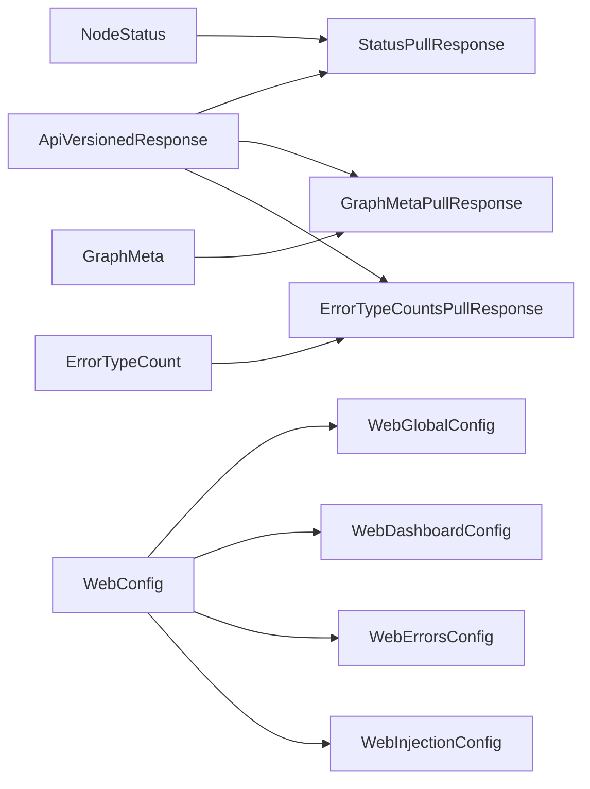

# src/celestialflow_web/static/ts/types.d.ts

> 📅 最終更新日: 2026/09/24

フロントエンド／バックエンドの契約型宣言。「本フロントエンドの外部から送られてくる」データ形状のみを収録します：HTTP インターフェースの payload / レスポンス、および設定ファイル構造。フロントエンドのローカル派生（例：`NodeEstimate`）や単一のレンダラーのみに供する語彙（例：`NodeShape`）は各ファイルに残します。

> 本ファイルは純粋な型宣言（`.d.ts`）であり、`.js` 成果物を生成しないため、`scripts.html` で参照する必要はありません。

## 共通

```typescript
export type Lang = "zh-CN" | "en" | "ja"; // サポートするインターフェース言語

type ApiVersionedResponse<T> = {
  rev: number;  // 現在のデータバージョン番号
  data: T | null; // known_rev が変化していない場合は null を返すことがある
};
```

## ノード状態：`/api/pull_status`

```typescript
/** ノードの実行時状態スナップショット定義（バックエンド payload のフィールド形状と一致） */
export type NodeStatus = {
  status: number;              // 状態コード：0-未実行, 1-実行中, 2-停止済み
  tasks_processed: number;     // 処理済みタスク総数
  tasks_pending: number;       // キュー内で待機中のタスク数
  tasks_succeeded: number;     // 正常に処理されたタスク数
  tasks_failed: number;        // 処理に失敗したタスク数
  tasks_duplicated: number;    // 重複排除でフィルタされたタスク数
  upstream_counts: Record<string, number>;   // 各上流ノードが本ノードへ転送したタスク数
  downstream_counts: Record<string, number>; // 本ノードが各下流ノードへ転送したタスク数
  start_time: number;          // 起動 Unix タイムスタンプ
  elapsed_time: number;        // 実行済み秒数
};

export type StatusPullResponse = ApiVersionedResponse<Record<string, NodeStatus>> & {
  timestamp: number; // 今回の状態スナップショットの統一タイムスタンプ
};
```

> `execution_mode` / `max_workers` などの構築期メタ情報は状態スナップショットにはなく、グラフメタ情報 `node_meta` の中にあります。

## グラフメタ情報：`/api/pull_graph_meta`

```typescript
/** ノードの構築期メタ情報。各サイクルの状態スナップショットには含まれない */
type NodeMeta = {
  class_name: string;     // ノードクラス名（TaskStage/TaskSplitter/TaskRouter）
  execution_mode: string; // 実行モード（serial/thread/async）
  max_workers: number;    // 最大並列度
};

/** グラフトポロジ分析結果。グラフメタ情報とともに一度に到着する */
type AnalysisData = {
  name: string;                            // タスクグラフ名
  startTime: number;                       // タスクグラフの起動タイムスタンプ
  className: string;                       // グラフ構造の分類名
  isDAG: boolean;                          // 現在のタスクグラフが DAG かどうか
  graphMode: string;                       // グラフレベルの実行モード名
  layersDict: Record<string, unknown>;     // レイヤー分析結果。キーの数がレイヤー数の集計に使用できる
};

/** グラフメタ情報：グラフトポロジ、各ノードの構築期メタ情報、グラフ分析結果 */
export type GraphMeta = {
  nodes: string[];                        // 全ノード名リスト
  edges: Record<string, string[]>;        // 有向辺の隣接リスト
  source_nodes: string[];                 // 入次数が 0 のソースノードリスト
  node_meta: Record<string, NodeMeta>;    // 各ノードの構築期メタ情報
  analysis: AnalysisData | null;          // グラフ分析結果；reporter がまだプッシュしていない場合は null
};

export type GraphMetaPullResponse = ApiVersionedResponse<GraphMeta>;
```

> トポロジ、`node_meta`、`analysis` は reporter が同一の push でアトミックに書き込むため、`nodes` が非空であれば 3 者すべてが準備できていることを示します。

## エラーログ：`/api/pull_errors`

```typescript
/** 単一のエラーデータ定義 */
export type ErrorData = {
  ts: number;             // ライフサイクルのタイムスタンプ。単位は秒
  stage: string;          // エラーが発生したノード／ステージ名。ノードフィルタに使用
  event_id: number;       // 失敗イベントの一意な識別 ID。グローバルに一意
  error_type: string;     // エラーの分類タイプ
  error_message: string;  // エラーの具体的な説明情報
  task_json: unknown;     // そのエラーを引き起こしたタスクデータ。表示とリトライの補填に使用
  result_json: unknown;   // 成功結果、または失敗時のプレースホルダ結果
};

export type ErrorsPullResponse = {
  rev: number;
  page: number;
  page_size: number;
  total: number;
  total_pages: number;
  sort_order: "newest" | "oldest";
  data: ErrorData[] | null;
};
```

## エラータイプ集計：`/api/pull_error_type_counts`

```typescript
export type ErrorTypeCount = {
  error_type: string; // エラータイプ名
  count: number;      // そのタイプのエラー件数
};

export type ErrorTypeCountsPullResponse = ApiVersionedResponse<ErrorTypeCount[]>;
```

## 設定：`/api/pull_config` / `/api/push_config`

```typescript
export type DashboardColumnKey = "left" | "middle" | "right";
export type DashboardLayout = Record<DashboardColumnKey, string[]>;

export type ErrorColumnKey =
  | "index" | "event_id" | "message" | "stage" | "task" | "time" | "retry";

export type StructureEdgeLabel = "none" | "delta" | "cumulative";

type WebGlobalConfig = {
  theme: "light" | "dark";
  autoRefreshEnabled: boolean;
  refreshInterval: number;
  language: Lang;
};

type WebDashboardConfig = {
  historyLimit: number;
  structureEdgeLabel: StructureEdgeLabel;
  useTotalPendingInStatus: boolean;
  layout: DashboardLayout;
};

type WebErrorsConfig = {
  pageSize: number;
  sortOrder: "newest" | "oldest";
  jumpToInjectionAfterRetry: boolean;
  columns: ErrorColumnKey[];
};

type WebInjectionConfig = {
  showInjectableOnly: boolean;
};

export type WebConfig = {
  global: WebGlobalConfig;
  dashboard: WebDashboardConfig;
  errors: WebErrorsConfig;
  injection: WebInjectionConfig;
};
```

## 型の関係



## 使用例

```typescript
import type {
  NodeStatus,
  GraphMeta,
  StatusPullResponse,
  WebConfig,
  StructureEdgeLabel,
} from "./types.js";

// /api/pull_status レスポンスを消費
const body: StatusPullResponse = await (await fetch("/api/pull_status?known_rev=-1")).json();
const statuses: Record<string, NodeStatus> = body.data ?? {};

// グラフメタ情報内の構築期メタ情報
const meta: GraphMeta["node_meta"] = {
  StageA: { class_name: "TaskExecutor", execution_mode: "thread", max_workers: 4 },
};

// 構造図の辺ラベルモード
const label: StructureEdgeLabel = "cumulative";
```
