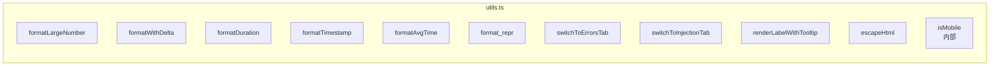

# src/celestialflow_web/static/ts/utils.ts

> 📅 最終更新日: 2026/09/24

Web フロントエンドで共通のフォーマットツール、UI 補助ロジック、DOM 操作ラッパー、および環境検出関数を含みます。

## 数値と時間のフォーマット

### `formatLargeNumber(n: number): string`
大きな数値を読みやすい HTML 形式に変換します。
- `< 10,000,000`：`toLocaleString('en-US')` の桁区切りカンマを使用。
- `>= 10,000,000`：科学的記数法の HTML に変換（例：`~1.23×10⁹`）。

### `formatWithDelta(value: number, delta: number, deltaClass: string, negClass: string): string`
増分付きの数値をフォーマットします。増分が非ゼロの場合、主数値の後ろに色付きの `+N` または `-N` の小さな `<small>` タグを追加します。

### `formatDuration(seconds: number): string`
秒数を `HH:MM:SS`（1 時間以上）または `MM:SS`（1 時間未満）の文字列にフォーマットします。正数は少なくとも 1 秒を表示します。

### `formatTimestamp(timestamp: number): string`
Unix タイムスタンプ（秒）を `YYYY-MM-DD HH:MM:SS` のローカル時刻文字列にフォーマットします。

### `formatAvgTime(elapsed: number, processed: number): string`
平均タスク所要時間をフォーマットします：`elapsed / processed >= 1` のときは `"1.44s/it"` の形で返し、そうでなければ `"8.00it/s"` の形で返します。サンプルが不足している場合（`elapsed` または `processed` が 0）は `"N/A"` を返します。

### `format_repr(obj: unknown, max_length: number): string`
任意のオブジェクトを文字列にフォーマットし、`max_length` を超える場合は切り詰めます（先頭 2/3 + `...` + 末尾 1/3）。改行とバックスラッシュは可視形式で保持します。

---

## UI とルーティングの補助

### `switchToErrorsTab(nodeFilter?: string): void`
グローバルなルーティング遷移関数。
- 「エラーログ」タブへ切り替え（`activateTab`）。
- `nodeFilter` が渡された場合、ノードフィルタドロップダウンを設定し `change` イベントを発火してクエリを開始します。

### `switchToInjectionTab(): void`
「タスク注入」タブへ切り替えます。

### `renderLabelWithTooltip(labelKey: string, tooltipKey: string): string`
ツールチップ付きのラベル HTML をレンダリングします。`i` ボタン（`.tooltip-trigger`）を含み、ホバーまたはフォーカス時に翻訳されたツールチップ文言（`.tooltip-bubble`）を表示します。

> この関数は `dashboard_statuses.ts` と `dashboard_analysis.ts` で広く使用され、`execution_mode`（実行モード）、`parallelism`（並列度）、`graphMode`（グラフモード）、`total_tasks_pending`（グローバル待機）などの専門用語に即時解説を提供します。

---

## セキュリティとツール

### `escapeHtml(str: string): string`
基本的な HTML エスケープ関数で、動的にテキストを挿入する際の XSS リスクを防ぎます。エスケープする文字：`&` `<` `>` `"` `'` `/`。

### `isMobile(): boolean`（モジュール内部）
UserAgent に基づく簡単なモバイル端末検出（`Mobi|Android|iPhone|iPad|iPod` にマッチ）。非エクスポートで、`utils.ts` 内部でのみ使用します。

---

## ❌ utils.ts に属さない関数

以下の関数は `utils.ts` で**定義されておらず**、`main.ts` に属します：

| 関数 | 実際の位置 | 説明 |
|------|---------|------|
| `toggleDarkTheme()` | **main.ts** | ライト／ダークテーマ切り替え |
| `showSettingsSaveStatus()` | **main.ts** | 設定保存ステータスの通知 |
| `calcRemaining()` | **util_estimators.ts** | 処理済み／待機／消費済み時間に基づいて残り時間を推定（旧名 `calcRemainTime`） |

---

## 関数一覧



## 使用例

```typescript
// ====== 数値フォーマット ======
formatLargeNumber(1234567);     // "1,234,567"
formatLargeNumber(1234567890);  // "~1.23×10⁹"

// ====== 増分表示 ======
formatWithDelta(1000, 5, "text-delta-success", "text-delta-success");
// "1,000<small class="text-delta-success">+5</small>"

// ====== 時間フォーマット ======
formatDuration(3661);           // "01:01:01"
formatTimestamp(1745400000);    // "2026-04-23 14:40:00"

// ====== 平均所要時間 ======
formatAvgTime(3600, 2500);      // "1.44s/it"
formatAvgTime(0, 0);            // "N/A"

// ====== 文字列の切り詰め ======
format_repr("very long string...", 10);  // "very lo...g..."

// ====== ツールチップ付きラベル ======
renderLabelWithTooltip("status.executionMode", "status.executionModeHelp");
// tooltip-trigger と tooltip-bubble を持つ HTML を返す

// ====== タブ遷移 ======
switchToErrorsTab("StageA");    // エラーページへ遷移して StageA でフィルタ
switchToInjectionTab();          // 注入ページへ遷移

// ====== HTML エスケープ ======
escapeHtml('<script>alert("xss")</script>');
// "&lt;script&gt;alert(&quot;xss&quot;)&lt;&#x2F;script&gt;"

// ====== モバイル端末検出 ======
isMobile();  // デスクトップは false、モバイルは true
```
