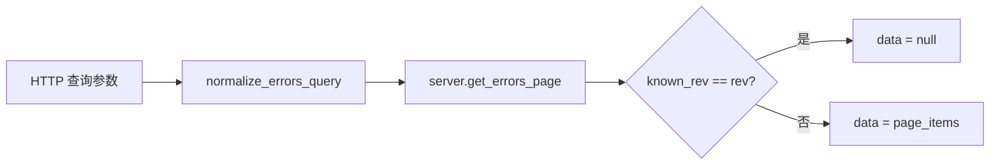

# Pull 路由（GET）— `core_pull`

> 📅 最后更新日期: 2026/07/14

## 作用

`core_pull` 模块提供客户端**拉取**数据的全部 GET 端点。大部分接口采用 **rev（版本号）守卫** 机制：当客户端传入已持有的 `known_rev` 与当前版本一致时，返回 `data: null` 以节省带宽；仅在数据变更时才返回完整数据体。

## 核心函数

### `register(router: APIRouter, server: TaskWebServer) -> None`

在给定的 `APIRouter` 上注册全部 7 个 GET 端点。

| 参数 | 类型 | 说明 |
|------|------|------|
| `router` | `APIRouter` | FastAPI 路由器实例 |
| `server` | `TaskWebServer` | 持有共享状态的 Web 服务器实例 |

---

## 端点

### 1. `GET /api/pull_server_state`

返回 reporter 同步决策所需的服务端状态。

| 参数 | 类型 | 默认值 | 说明 |
|------|------|--------|------|
| `graph_id` | `str` | `""` | Reporter 当前任务图实例的唯一标识 |

**返回：** `dict[str, Any]` — 包含 `interval`、`is_current_graph`、`has_structure`、`has_analysis`、`max_event_id_in_fail`。

### 2. `GET /api/pull_injection`

取出并清空当前待执行的注入任务队列。这是一个**一次性消费**端点：返回后队列清空，同一批任务不会被重复获取。

**返回：** `{"tasks": dict[str, list[Any]], "terminations": list[str]}`。

### 3. `GET /api/pull_config`

获取前端配置。

**返回：** 完整的 `server.config` 字典，包含 `global`、`dashboard`、`errors`、`injection` 四组配置。

### 4. `GET /api/pull_status`

获取各节点的运行状态，支持 rev 守卫。

**返回：** `{"rev": int, "timestamp": float, "data": dict | None}`

### 5. `GET /api/pull_structure`

获取图结构数据，支持 rev 守卫。

**返回：** `{"rev": int, "data": dict | None}`

### 6. `GET /api/pull_errors`

获取分页错误日志，支持节点过滤、关键词过滤、排序和 rev 守卫。

| 参数 | 类型 | 默认值 | 说明 |
|------|------|--------|------|
| `known_rev` | `int` | `-1` | 客户端已知版本号 |
| `page` | `int` | `1` | 页码 |
| `page_size` | `int` | `10` | 每页条数 |
| `node` | `str` | `""` | 按节点名称过滤 |
| `keyword` | `str` | `""` | 按关键词过滤 |
| `sort_order` | `str` | `"newest"` | 排序方式，支持 `newest` / `oldest` |

调用流程：



### 7. `GET /api/pull_analysis`

获取图拓扑分析结果。

**返回：** `{"rev": int, "data": dict | None}`  
当当前 graph 还没有分析结果时，`data` 为 `None`。

### 8. `GET /api/pull_error_type_counts`

按错误类型聚合统计结果，支持按节点过滤，也支持 rev 守卫。

**返回：** `{"rev": int, "data": list[dict[str, Any]] | None}`

---

## 关键细节

- 查询参数归一化由 `runtime.util_cal.normalize_errors_query()` 处理。
- `pull_injection` 具有副作用，会在读取后清空任务与终止符缓存。
- `pull_analysis` 当前实现不检查 `known_rev`，即使调用方传入版本号也始终返回最新分析数据。

## 使用示例

```python
import requests
import time

known_rev = -1

while True:
    resp = requests.get(
        "http://localhost:5000/api/pull_status",
        params={"known_rev": known_rev},
        timeout=3,
    )
    payload = resp.json()
    if payload["data"] is not None:
        known_rev = payload["rev"]
        print(payload["timestamp"], payload["data"])
    time.sleep(2)
```
