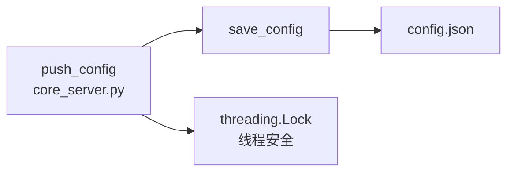

# util_config

> 📅 最后更新日期: 2026/07/14

Web 模块的配置文件读写工具，负责 `config.json` 的持久化管理。无线程锁保护——线程安全由上层调用方（`core_server.py` 的 `push_config`）保证。

## load_config

```python
def load_config(config_path: str) -> dict[str, Any]:
    """从指定路径加载并校验前端配置，返回字典。"""
```

- **文件不存在**：直接抛出 `ConfigurationError`，不会从默认模板初始化。
- 通过 `os.path.exists()` 判断文件存在性后再以 UTF-8 编码读取 JSON。

## save_config

```python
def save_config(config: dict[str, Any], config_path: str) -> bool:
    """将前端配置保存到 JSON 文件，返回是否成功。"""
```

- 以 `w` 模式写入，`indent=4`、`ensure_ascii=False` 保证可读性与中文支持。
- 无内置线程锁，多并发安全性由调用方 `core_server.py` 的 `push_config` 路由处理。
- 捕获所有 `Exception` 并在失败时打印错误信息、返回 `False`。

## 调用关系



| 函数 | 线程安全 | 异常处理 |
|------|---------|---------|
| `load_config` | 不涉及（只读） | 文件不存在 → `ConfigurationError`；JSON 解析失败 → 向上传播 |
| `save_config` | ❌ 无锁，由调用方保障 | 写入异常 → 打印错误并返回 `False` |

## 使用示例

### load_config / save_config 的完整用法示例

```python
from celestialflow_web.runtime.util_config import load_config, save_config

# 假设 config.json 为新嵌套分组结构：
# {
#     "global": {
#         "theme": "dark",
#         "refreshInterval": 5000,
#         "language": "zh-CN"
#     },
#     "dashboard": {
#         "historyLimit": 20,
#         "layout": {
#             "left": ["mermaid"],
#             "middle": ["status"],
#             "right": ["progress"]
#         }
#     }
# }

config_path = "/path/to/celestialflow_web/config.json"

# --- 读取配置 ---
try:
    config = load_config(config_path)
    print(f"加载成功，主题: {config['global']['theme']}")
    print(f"刷新间隔: {config['global']['refreshInterval']}ms")
    print(f"语言: {config['global']['language']}")
    print(f"左侧面板卡片: {config['dashboard']['layout']['left']}")
except Exception as e:
    print(f"配置加载失败: {e}")

# --- 修改并保存配置 ---
config["global"]["theme"] = "light"
config["global"]["refreshInterval"] = 3000
config["global"]["language"] = "en"

success = save_config(config, config_path)
if success:
    print("配置保存成功")
else:
    print("配置保存失败")

# --- 验证保存结果 ---
reloaded = load_config(config_path)
print(f"重载后主题: {reloaded['global']['theme']}")  # light
print(f"重载后语言: {reloaded['global']['language']}")  # en
```

### 与 WebConfigModel 配合使用

```python
from celestialflow_web.runtime.util_config import load_config, save_config

# config.json 的完整结构符合 WebConfigModel Pydantic 模型
# 建议在保存前/读取后使用 Pydantic 模型进行验证

try:
    raw_config = load_config("/path/to/config.json")

    # 使用 Pydantic 模型验证（假设在 core_server.py 中）
    from celestialflow_web.runtime.util_models import WebConfigModel
    validated = WebConfigModel.model_validate(raw_config)

    print(f"验证通过: 主题={validated.global_.theme}, 刷新={validated.global_.refreshInterval}ms")

    # 修改后保存
    validated.global_.theme = "dark"
    save_config(validated.model_dump(by_alias=True), "/path/to/config.json")
except Exception as e:
    print(f"配置处理失败: {e}")
```
