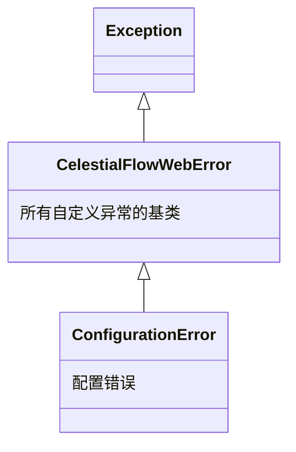

# util_errors

> 📅 最后更新日期: 2026/07/16

## 作用

`celestialflow_web.runtime.util_errors` 定义了 CelestialFlow Web 模块的自定义异常层次结构，供 `server/` 与 `runtime/` 内部使用。

## 异常层次结构



## 异常列表

### CelestialFlowWebError

```python
class CelestialFlowWebError(Exception):
    """CelestialFlow 所有自定义异常的基类"""
```

所有业务异常的根，继承自 `Exception`。自身不携带额外逻辑，仅用于分类筛选（`except CelestialFlowWebError`）。

### ConfigurationError

```python
class ConfigurationError(CelestialFlowWebError):
    """配置错误（参数非法、组合不支持等）"""
```

继承自 `CelestialFlowWebError`，表示配置相关错误。当前被 `util_config.load_config()` 在配置文件不存在时抛出。

## 使用示例

```python
from celestialflow_web.runtime.util_errors import CelestialFlowWebError, ConfigurationError

# 捕获所有 CelestialFlow 业务异常
try:
    ...
except CelestialFlowWebError as e:
    print(f"业务异常: {e}")

# 精确捕获配置错误
try:
    ...
except ConfigurationError as e:
    print(f"配置错误: {e}")
```

## 注意事项

> 这些异常类未通过 `runtime/__init__.py` 公开导出，调用方应直接从 `util_errors` 模块导入。
