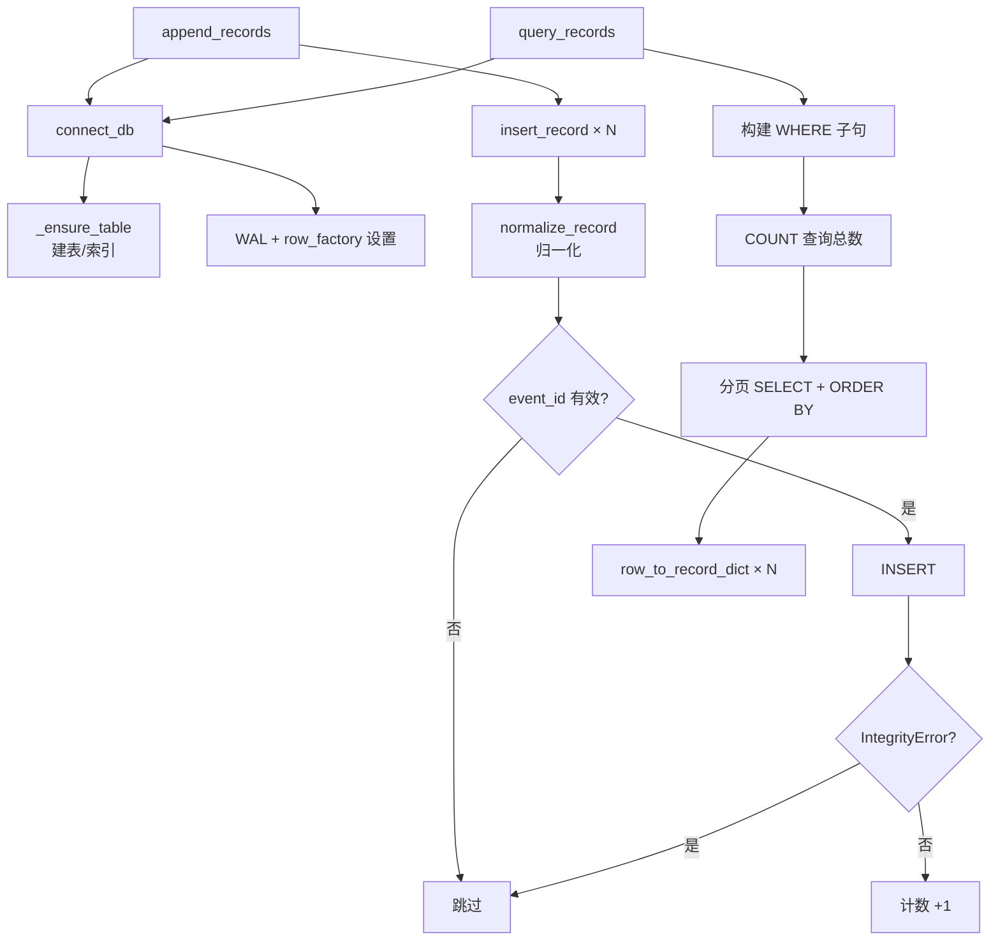

# util_sqlite

> 📅 最后更新日期: 2026/07/16

## 作用

`celestialflow_web.runtime.util_sqlite` 封装了 SQLite 错误记录数据库的全部读写操作，包括建表、插入、查询、分页和聚合统计。

数据库采用 WAL 模式（`journal_mode=WAL`）以提升并发读取性能，使用 `row_factory = sqlite3.Row` 使查询结果可按列名访问。

## 数据库表结构

| 列名 | 类型 | 说明 |
|------|------|------|
| `id` | `INTEGER PRIMARY KEY AUTOINCREMENT` | 自增主键 |
| `event_id` | `INTEGER NOT NULL` | 事件 ID，唯一索引 |
| `ts` | `REAL` | 时间戳（Unix） |
| `stage` | `TEXT NOT NULL` | 节点名称 |
| `status` | `TEXT NOT NULL` | 记录状态（如 `failed`） |
| `error_type` | `TEXT NOT NULL DEFAULT ''` | 错误类型 |
| `error_message` | `TEXT NOT NULL DEFAULT ''` | 错误消息 |
| `task_json` | `TEXT NOT NULL` | 任务数据（JSON 字符串） |
| `result_json` | `TEXT NOT NULL DEFAULT 'null'` | 结果数据（JSON 字符串） |

索引：
- `idx_records_event_id` — `event_id` 唯一索引
- `idx_records_status_id` — `(status, id)` 复合索引

## 核心函数

### 连接管理

#### `connect_db`

```python
def connect_db(db_path: str | Path) -> sqlite3.Connection:
```

创建 SQLite 连接并交给调用方管理生命周期。会自动创建数据库文件所在目录、启用 WAL 模式、设置 `row_factory`，并确保 `records` 表及索引存在。

- `check_same_thread=False` 允许多线程访问
- 自动执行 `_ensure_table()` 确保表结构存在

#### `_ensure_table`（私有）

```python
def _ensure_table(conn: sqlite3.Connection) -> None:
```

在给定连接上创建 `records` 表及索引（`CREATE TABLE IF NOT EXISTS` / `CREATE INDEX IF NOT EXISTS`），幂等安全。

### 数据归一化

#### `normalize_record`

```python
def normalize_record(record: dict[str, Any]) -> dict[str, Any] | None:
```

将原始记录字典转换为可直接写入 SQLite 的参数字典。若 `event_id` 为 `None`，返回 `None` 表示跳过该记录。

转换规则：
- `event_id` 转为 `int`
- `stage`、`status`、`error_type`、`error_message` 转为 `str`
- `ts` 转为 `float`，默认 `0.0`
- `task_json`、`result_json` 转为 JSON 字符串

#### `row_to_record_dict`

```python
def row_to_record_dict(row: sqlite3.Row) -> dict[str, Any]:
```

将 SQLite 查询行转换为对外字典。`task_json` 和 `result_json` 从 JSON 字符串反序列化为 Python 对象。

### 写入操作

#### `insert_record`

```python
def insert_record(conn: sqlite3.Connection, record: dict[str, Any]) -> bool:
```

在给定连接上插入单条记录。内部调用 `normalize_record()` 归一化数据。若归一化结果为空则返回 `False`。

> **注意**：此函数不提交事务，调用方需自行 `conn.commit()`。

#### `clear_records`

```python
def clear_records(db_path: str | Path) -> None:
```

自行创建并关闭连接，清空数据库中的全部记录（`DELETE FROM records`）。

#### `append_records`

```python
def append_records(db_path: str | Path, records: Iterable[dict[str, Any]]) -> int:
```

自行创建并关闭连接，批量追加记录。遇到 `IntegrityError`（如重复 `event_id`）时跳过该条继续。返回实际写入的记录数。

### 查询操作

#### `load_records`

```python
def load_records(db_path: str | Path, status: str = "failed") -> list[dict[str, Any]]:
```

自行创建并关闭连接，按 `id ASC` 顺序返回指定状态的全部记录。默认查询 `failed` 状态。

#### `query_records`

```python
def query_records(
    db_path: str | Path,
    page: int,
    page_size: int,
    node: str,
    keyword: str,
    sort_order: str,
    status: str = "failed",
) -> tuple[int, int, list[dict[str, Any]]]:
```

自行创建并关闭连接，按条件分页查询指定状态的记录。返回 `(total, total_pages, page_items)`。

过滤条件：
- `status` — 记录状态（WHERE `status = ?`）
- `node` — 按 `stage` 字段精确匹配（可选）
- `keyword` — 在 `error_type` / `error_message` / `task_json` 中模糊搜索（可选，大小写不敏感）
- `sort_order` — `"oldest"` 则 `ASC`，否则 `DESC`（按 `ts, id` 排序）
- 超出范围的 `page` 会被自动裁剪到有效范围

#### `get_max_event_id_in_fail`

```python
def get_max_event_id_in_fail(db_path: str | Path) -> int | None:
```

自行创建并关闭连接，返回失败记录（`status = 'failed'`）中的最大 `event_id`。若无失败记录则返回 `None`。

#### `query_error_type_counts`

```python
def query_error_type_counts(
    db_path: str | Path,
    node: str = "",
    status: str = "failed",
) -> list[dict[str, Any]]:
```

自行创建并关闭连接，按 `error_type` 分组聚合指定状态的记录数量。返回 `[{"error_type": str, "count": int}, ...]`，按 `count DESC, error_type ASC` 排序。

可选按 `node` 过滤节点名称（`stage = ?`）。

## 关键流程



## 使用示例

### 连接与写入

```python
from celestialflow_web.runtime.util_sqlite import connect_db, append_records, clear_records

db_path = "data/errors.db"

# 清空历史数据
clear_records(db_path)

# 批量追加错误记录
records = [
    {
        "event_id": 1,
        "stage": "StageA",
        "status": "failed",
        "error_type": "ValueError",
        "error_message": "输入值无效",
        "ts": 1721116800.0,
        "task_json": {"id": 1, "value": 42},
        "result_json": None,
    },
    {
        "event_id": 2,
        "stage": "StageB",
        "status": "failed",
        "error_type": "TimeoutError",
        "error_message": "连接超时",
        "ts": 1721116900.0,
        "task_json": {"id": 2, "value": 99},
    },
]

count = append_records(db_path, records)
print(f"实际写入 {count} 条记录")  # 2
```

### 分页查询

```python
from celestialflow_web.runtime.util_sqlite import query_records

total, total_pages, items = query_records(
    db_path="data/errors.db",
    page=1,
    page_size=10,
    node="",
    keyword="timeout",
    sort_order="newest",
    status="failed",
)

print(f"共 {total} 条匹配记录，{total_pages} 页")
for item in items:
    print(f"  event_id={item['event_id']}, stage={item['stage']}, error={item['error_type']}")
```

### 错误类型统计

```python
from celestialflow_web.runtime.util_sqlite import query_error_type_counts

counts = query_error_type_counts("data/errors.db", node="", status="failed")
for entry in counts:
    print(f"{entry['error_type']}: {entry['count']} 次")
# 输出示例:
# TimeoutError: 15 次
# ValueError: 8 次
```

### 获取失败记录最大事件 ID

```python
from celestialflow_web.runtime.util_sqlite import get_max_event_id_in_fail

max_id = get_max_event_id_in_fail("data/errors.db")
if max_id is not None:
    print(f"失败记录最大 event_id: {max_id}")
else:
    print("无失败记录")
```

## 注意事项

> - `connect_db` 不负责关闭连接——调用方必须在不再使用时手动 `conn.close()`。`clear_records`、`append_records`、`load_records`、`query_records`、`get_max_event_id_in_fail`、`query_error_type_counts` 已自行管理连接生命周期。
> - `append_records` 遇到重复 `event_id`（`IntegrityError`）会静默跳过，不会中断批量写入。
> - `query_records` 的 `keyword` 搜索使用 `LIKE` 进行大小写不敏感匹配，对大数据量场景性能有限。
