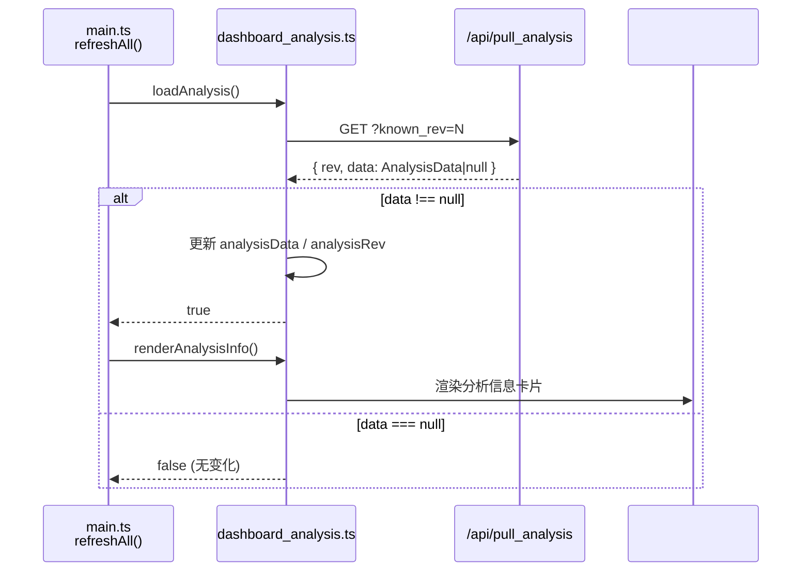

# dashboard_analysis.ts

> 📅 最后更新日期: 2026/06/11

管理图分析信息的加载与分析面板的渲染。提供对 TaskGraph 拓扑结构的深度洞察，如 DAG 检测、层级分析、调度模式等。

## 类型定义

```typescript
type AnalysisData = {
  name: string;                    // 任务图名称
  startTime: number;               // 任务图启动时间戳
  className: string;               // 图结构分类名称（Python 类名）
  isDAG: boolean;                  // 当前任务图是否为 DAG
  scheduleMode: string;            // 图级调度模式名称（eager / staged）
  layersDict: Record<string, unknown>; // 层级分析结果，键数量用于统计层数
};
```

## 全局变量

| 变量 | 类型 | 说明 |
|------|------|------|
| `analysisData` | `AnalysisData \| null` | 拓扑分析数据；未加载时为 `null` |
| `analysisRev` | `number` | 数据版本号，初始化 `-1`，用于增量拉取 |
| `analysisRequestSeq` | `number` | 请求序列号，防止旧分析响应覆盖新结果 |

## 函数

### `loadAnalysis()`

异步从 `GET /api/pull_analysis?known_rev=N` 拉取分析数据。

- **竞态保护**: 每次调用分配递增 `analysisRequestSeq`，响应回来时若序列号不匹配则丢弃。
- **增量机制**: 后端仅在 `known_rev` 过期时返回完整数据（`body.data !== null`），否则返回 `rev` 与空数据。
- **返回值**: `Promise<boolean>` — 分析版本发生变化并成功更新时返回 `true`。

---

### `renderAnalysisInfo()`

将分析数据渲染到 `#analysis-info` 容器。若 `analysisData` 为 `null`，则显示国际化空态占位文案。

**展示字段：**

| 显示标签 (i18n key) | 对应字段 | 说明 |
|---------|---------|------|
| `analysis.graphName` | `name` | 任务图名称 |
| `analysis.startTime` | `startTime` | 图启动时间戳（`> 0` 时格式化，否则显示 `-`） |
| `analysis.structType` | `className` | TaskGraph 具体的 Python 类名，带提示气泡 |
| `analysis.isDAG` | `isDAG` | `true` 时显示绿色 `.ok` 类，`false` 时显示红色 `.warn` 类 |
| `analysis.scheduleMode` | `scheduleMode` | 图级调度模式，带提示气泡 |
| `analysis.layerCount` | `layersDict` | 通过 `Object.keys(layersDict).length` 推导层级总数 |

## 数据流



## 使用示例

```typescript
// 模拟从后端获取的分析数据
const mockAnalysis: AnalysisData = {
  name: "MyTaskGraph",
  startTime: 1718000000,
  className: "TaskGraph",
  isDAG: true,
  scheduleMode: "eager",
  layersDict: { "0": ["StageA"], "1": ["StageB", "StageC"] },
};

// loadAnalysis() 拉取并更新全局变量
// const changed = await loadAnalysis();
// if (changed) renderAnalysisInfo();

// renderAnalysisInfo() 将其渲染到 #analysis-info
// 若 analysisData === null → 显示空态占位
// 否则渲染：图名称、启动时间、结构类型、是否DAG、调度模式、层级数量
```
