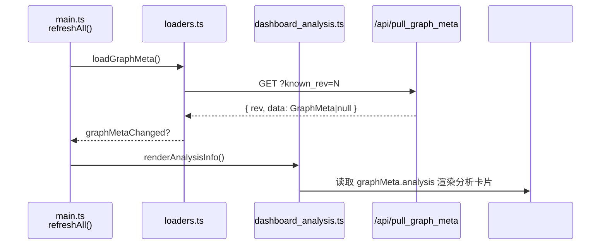

# src/celestialflow_web/static/ts/dashboard_analysis.ts

> 📅 最后更新日期: 2026/09/24

渲染"图分析信息"卡片，展示任务图拓扑结构的深度洞察（结构类型、DAG 检测、图模式、层级数量等）。

> 分析结果随图元信息一次性到达（`graphMeta.analysis`），由 `loaders.ts` 维护；本文件只读不拉，也没有独立的请求/版本号逻辑。

## 类型定义

分析结果 `AnalysisData`（定义见 [`types.d.ts`](types.d.md)）：

| 字段 | 类型 | 说明 |
|------|------|------|
| `name` | `string` | 任务图名称 |
| `startTime` | `number` | 任务图启动时间戳 |
| `className` | `string` | 图结构分类名称 |
| `isDAG` | `boolean` | 当前任务图是否为 DAG |
| `graphMode` | `string` | 图级执行模式名称（serial / thread / async） |
| `layersDict` | `Record<string, unknown>` | 层级分析结果，键数量用于统计层数 |

## 函数

### `renderAnalysisInfo(): void`

读取 `graphMeta.analysis` 并渲染到 `#analysis-info` 容器；`analysis` 为 `null` 时显示国际化空态占位（`analysis.noData`）。

**展示字段：**

| 显示标签 (i18n key) | 对应字段 | 说明 |
|---------|---------|------|
| `analysis.graphName` | `name` | 任务图名称 |
| `analysis.graphMode` | `graphMode` | 图级执行模式，带提示气泡 |
| `analysis.startTime` | `startTime` | 图启动时间戳（`> 0` 时格式化，否则显示 `-`） |
| `analysis.structType` | `className` | 图结构分类名称，带提示气泡 |
| `analysis.isDAG` | `isDAG` | `true` 时显示绿色 `.ok` 类，`false` 时显示红色 `.warn` 类 |
| `analysis.layerCount` | `layersDict` | 通过 `Object.keys(layersDict).length` 推导层级总数 |

## 数据流


```mermaid
sequenceDiagram
    participant Main as main.ts<br/>refreshAll()
    participant Loaders as loaders.ts
    participant Analysis as dashboard_analysis.ts
    participant API as /api/pull_graph_meta
    participant DOM as #analysis-info

    Main->>Loaders: loadGraphMeta()
    Loaders->>API: GET ?known_rev=N
    API-->>Loaders: { rev, data: GraphMeta|null }
    Loaders-->>Main: graphMetaChanged?
    Main->>Analysis: renderAnalysisInfo()
    Analysis->>DOM: 读取 graphMeta.analysis 渲染分析卡片
```

## 使用示例

```typescript
// graphMeta.analysis 由 loaders.ts 的 loadGraphMeta() 从图元信息中解出：
// {
//   name: "MyTaskGraph",
//   startTime: 1718000000,
//   className: "TaskGraph",
//   isDAG: true,
//   graphMode: "thread",
//   layersDict: { "0": ["StageA"], "1": ["StageB", "StageC"] },
// }

// 由 refreshAll() 在 graphMetaChanged 时调用：
renderAnalysisInfo();

// 若 graphMeta.analysis === null → 显示空态占位
// 否则渲染：图名称、图模式、启动时间、结构类型、是否 DAG、层级数量
```
