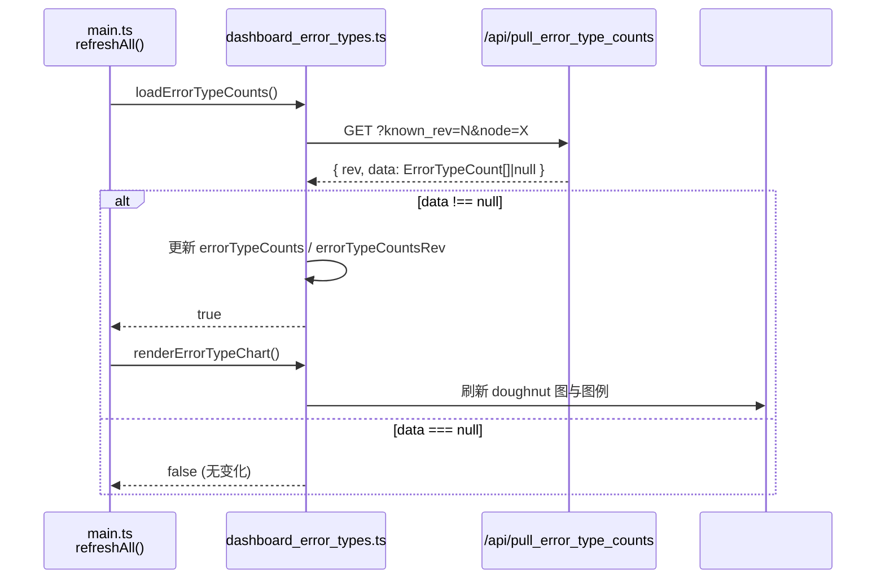
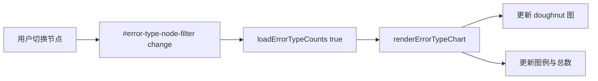

# dashboard_error_types.ts

> 📅 最后更新日期: 2026/07/16

错误类型分布卡片模块。负责按节点筛选的错误类型聚合数据拉取、doughnut 图渲染以及图例展示。

## 数据类型

```typescript
type ErrorTypeCount = {
  error_type: string; // 错误类型名称
  count: number;      // 该类型的错误条数
};

type ErrorTypeCountsPullResponse = ApiVersionedResponse<ErrorTypeCount[]>;
// 错误类型聚合 API 响应，遵循通用版本化响应格式
```

## 全局变量

| 变量 | 类型 | 说明 |
|------|------|------|
| `errorTypeCounts` | `ErrorTypeCount[]` | 当前筛选条件下的错误类型聚合结果 |
| `errorTypeCountsRev` | `number` | 错误类型聚合数据版本号，初始化 `-1` |
| `errorTypeCountsQueryKey` | `string` | 最近一次请求使用的筛选条件缓存键 |
| `errorTypeRequestSeq` | `number` | 请求序号，避免慢响应覆盖新筛选结果 |
| `errorTypeChart` | `ChartInstance \| null` | Chart.js doughnut 图实例 |
| `ERROR_TYPE_COLORS` | `string[]` | 扇区色板，8 色循环使用 |

## 函数

### `getErrorTypeNodeFilter(): HTMLSelectElement | null`

获取错误类型图表的节点筛选下拉框（`#error-type-node-filter`）。

---

### `getErrorTypeLabel(errorType: string): string`

将错误类型名称归一为可展示文本。空字符串回退为国际化文案 `errorTypes.unknown`。

---

### `getErrorTypeColor(index: number): string`

按索引从 `ERROR_TYPE_COLORS` 中取色，取模循环。

---

### `getEmptyErrorTypeColor(): string`

返回无数据时空环图使用的占位颜色。根据 `dark-theme` 类名判断深浅色主题：

- 深色主题：`#4b5563`
- 浅色主题：`#e5e7eb`

---

### `initErrorTypeChart(): void`

初始化 Chart.js doughnut 图实例并绑定到 canvas `#error-type-chart`。

**图表配置要点：**

- 类型：`doughnut`，空心比例 `58%`
- 图例隐藏（由 `renderErrorTypeLegend` 手动渲染）
- 动画关闭（`animation: false`），适用实时数据刷新

---

### `renderErrorTypeLegend(): void`

根据 `errorTypeCounts` 渲染自定义图例到 `#error-type-legend` 容器，同时在 `#error-type-total` 元素显示错误总数。

- **有数据**：逐行展示颜色块、错误类型名、计数和百分比。
- **无数据**：显示单行占位，颜色使用 `getEmptyErrorTypeColor()`，标签为国际化 `errorTypes.noData`。

---

### `renderErrorTypeChart(): void`

根据当前聚合结果 `errorTypeCounts` 刷新图表和图例。若图表实例不存在则先调用 `initErrorTypeChart()` 初始化。

- 无数据时，图表显示单一占位扇区并回退空态图例。

---

### `loadErrorTypeCounts(forceReload = false): Promise<boolean>`

从后端 `GET /api/pull_error_type_counts` 拉取当前节点筛选下的错误类型聚合结果。

- **查询参数**：`known_rev`、`node`。
- **缓存策略**：当筛选条件（`errorTypeCountsQueryKey`）变化或 `forceReload=true` 时，`known_rev` 重置为 `-1` 强制全量拉取。
- **竞态保护**：使用 `errorTypeRequestSeq` 丢弃过期响应。
- **返回值**：当后端返回了新的聚合数据时返回 `true`；若仅返回版本号或响应被丢弃则返回 `false`。

---

### `populateErrorTypeNodeFilter(statuses: Record<string, NodeStatus>): void`

根据当前节点状态快照填充 `#error-type-node-filter` 下拉框。

- 按节点名排序生成选项，尽量保留用户之前的筛选值。
- 若已选节点已消失则保留上次选中值（仍在下拉列表中可见）。

## 事件绑定

| 元素 | 事件 | 行为 |
|------|------|------|
| `#error-type-node-filter` | `change` | 强制重新拉取 `loadErrorTypeCounts(true)` 并刷新图表 `renderErrorTypeChart()` |

事件在 `DOMContentLoaded` 后绑定。

## 数据流



筛选器变更时：



## 与其他模块的协作

| 协作对象 | 方式 | 说明 |
|---------|------|------|
| `main.ts` / `refreshAll()` | 直接调用 | 每轮刷新周期调用 `loadErrorTypeCounts()`，若返回 `true` 则调用 `renderErrorTypeChart()` |
| `i18n.ts` | `t()` | 使用 `errorTypes.*` 系列键获取国际化文案 |
| `utils.ts` | `escapeHtml()` | 图例渲染时对错误类型标签做 HTML 转义 |
| `globals.d.ts` | 类型声明 | 使用 `ErrorTypeCount`、`ErrorTypeCountsPullResponse`、`ChartInstance` 等全局类型 |
| `dashboard_statuses.ts` | 传入 `NodeStatus` | `populateErrorTypeNodeFilter()` 接收节点状态快照来填充筛选器 |

## 使用示例

```typescript
// 从 refreshAll 中自动调用：
// const errorTypeCountsChanged = await loadErrorTypeCounts();
// if (errorTypeCountsChanged) renderErrorTypeChart();

// 手动强制重新加载：
await loadErrorTypeCounts(true);
renderErrorTypeChart();

// 填充节点筛选器（节点状态由 dashboard_statuses.ts 维护）：
populateErrorTypeNodeFilter(nodeStatuses);

// 修改后的 errorTypeCounts 示例：
// [
//   { error_type: "TimeoutError", count: 42 },
//   { error_type: "ValueError",  count: 18 },
// ]
// renderErrorTypeChart() 将据此渲染 2 个扇区的 doughnut 图
```
