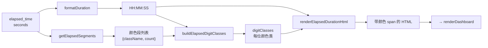

# dashboard_statuses.ts

> 📅 最后更新日期: 2026/06/11

管理各节点运行状态数据的加载、同步与仪表盘状态卡片的动态渲染。提供运行时间彩色分段渲染能力。

> ⚠️ **已变更**: 旧版文档提及的 `draggingNodeName` 变量和 `initSortableDashboard()` 函数已移除（拖拽排序功能已迁移至 `layout_editor.ts` 布局编辑器）。新增了等待值模式切换和剩余时间展示配置相关函数。

## 类型定义

```typescript
type NodeStatus = {
  status: number;              // 状态码：0-未运行, 1-运行中, 2-已停止
  tasks_processed: number;     // 已处理任务总数
  tasks_pending: number;       // 队列中等待的任务数
  tasks_succeeded: number;     // 成功处理的任务数
  tasks_failed: number;        // 处理失败的任务数
  tasks_duplicated: number;    // 被去重过滤的任务数
  stage_mode: string;          // 节点模式（serial/thread）
  execution_mode: string;      // 运行模式（serial/thread/async）
  max_workers: number;         // 最大并发数
  start_time: number;          // 启动 Unix 时间戳
  elapsed_time: number;        // 已运行秒数
  remaining_time: number;      // 预计剩余秒数（当前链路）
  total_tasks_pending: number; // 总待处理任务数（含下游链路）
  total_remaining_time: number;// 预计总剩余秒数（考虑各条链路状态）
  task_avg_time: string;       // 平均每个任务耗时文本
};

type ElapsedSegment = {
  className: string; // 对应的颜色 CSS 类名
  count: number;     // 该类型任务数量
};
```

## 全局变量

| 变量 | 类型 | 说明 |
|------|------|------|
| `nodeStatuses` | `Record<string, NodeStatus>` | 所有节点的当前状态快照 |
| `lastNodeStatuses` | `Record<string, NodeStatus>` | 上一轮状态快照，用于计算增量显示 |
| `statusRev` | `number` | 上次拉取的版本号，初始化 `-1`，用于增量拉取 |
| `statusesRequestSeq` | `number` | 请求序列号，防止旧状态响应覆盖新结果 |

## 配置驱动函数

以下函数根据 `webConfig.dashboard.useTotalPendingInStatus` 开关动态切换节点状态卡中"等待任务数"和"剩余时间"的数据来源。

### `getStatusPendingField(): "tasks_pending" | "total_tasks_pending"`

返回当前状态卡应采用的等待值字段。当配置启用 `useTotalPendingInStatus` 时返回 `"total_tasks_pending"`（含下游链路总等待），否则返回 `"tasks_pending"`（仅当前节点队列）。

### `getDisplayPending(status: NodeStatus): number`

根据当前配置从状态快照中提取等待任务数。

### `getDisplayRemainingTime(status: NodeStatus): number`

根据当前配置从状态快照中提取剩余时间。启用总等待模式时使用 `total_remaining_time`。

### `getPendingLabelHtml(): string`

返回等待标签及提示气泡的 HTML，根据配置模式切换国际化键（`status.pending` vs `status.pendingGlobal`）。

---

## 辅助函数：运行时间彩色分段渲染

以下四个函数共同实现对 `elapsed_time` 的彩色 HTML 渲染。颜色段根据成功/失败/重复任务数的比例分配给每一位数字。

### `formatElapsedDuration(seconds, successCount, failedCount, duplicateCount): string`

入口函数。调用 `formatDuration()` 获取时间格式文本，再通过 `getElapsedSegments()`、`buildElapsedDigitClasses()`、`renderElapsedDurationHtml()` 生成带颜色 `<span>` 的 HTML。

### `getElapsedSegments(successCount, failedCount, duplicateCount): ElapsedSegment[]`

生成由非零计数驱动的颜色段列表。

| CSS 类 | 统计字段 | 含义 |
|--------|---------|------|
| `elapsed-success` | `tasks_succeeded` | 成功任务 |
| `elapsed-error` | `tasks_failed` | 失败任务 |
| `elapsed-duplicate` | `tasks_duplicated` | 重复任务 |

返回仅包含 `count > 0` 的段。若全部为零，返回空数组。

### `buildElapsedDigitClasses(segments: ElapsedSegment[], digitCount: number): string[]`

按任务状态比例为 `HH:MM:SS` 去掉冒号后的每一位数字分配颜色类。

- **段数 ≥ 位数**：直接取前 N 个段。
- **段数 < 位数**：等比例分配剩余位数给各段，再通过余数排序补齐分配误差，确保每位均有颜色类。

### `renderElapsedDurationHtml(duration, digitClasses, defaultClassName): string`

将时间字符串的每个字符包裹在 `<span>` 中。冒号 `:` 使用其左侧数字的颜色类；数字字符依次使用 `digitClasses` 中的类名。

---

## 核心函数

### `loadStatuses(): Promise<boolean>`

异步从 `GET /api/pull_status?known_rev=N` 拉取节点状态。

- **竞态保护**: 使用 `statusesRequestSeq` 丢弃过时响应。
- **状态快照保存**: 成功后保存上一轮状态到 `lastNodeStatuses`。
- **历史联动**: 成功后调用 `appendStatusSnapshotToHistory()` 同步更新前端本地历史序列。
- **返回值**: 状态版本发生变化并成功更新时返回 `true`。

---

### `renderDashboard(): void`

遍历 `nodeStatuses` 为每个节点生成状态卡片。

**卡片渲染特性：**

- **实时增量**: 对比 `lastNodeStatuses` 自动计算成功/失败/等待/重复任务的增量并彩色显示。
- **状态标记**: 卡片左侧边框颜色反映节点状态（蓝色=运行中 `status-running`，灰色=已停止 `status-stopped`）。
- **运行时间彩色分段**: 调用 `formatElapsedDuration()` 为 `elapsed_time` 生成基于任务成功/失败/重复比例染色的 HTML。
- **四段式进度条**: 直观展示成功（绿）、错误（红）、重复（黄）、等待（灰）的比例。
- **时间预估**: 显示已运行时间、预计剩余时间、平均任务耗时和进度百分比。
- **交互跳转**: 点击卡片中的错误数（`.error-clickable`），自动跳转至"错误日志"标签页并预设该节点过滤器。

## 卡片样式类

| 状态 | CSS 类 | 说明 |
|------|--------|------|
| 运行中 | `node-card status-running` | 蓝色左边框 |
| 已停止 | `node-card status-stopped` | 灰色左边框 |
| 未启动 | `node-card` | 默认灰色左边框 |

## 运行时间渲染流程



## 使用示例

```typescript
// 构造一个完整的 NodeStatus 对象
const nodeStatus: NodeStatus = {
  status: 1,
  tasks_processed: 250, tasks_succeeded: 240,
  tasks_failed: 5, tasks_duplicated: 5,
  tasks_pending: 30, total_tasks_pending: 50,
  stage_mode: "thread", execution_mode: "thread",
  max_workers: 4,
  start_time: 1745400000, elapsed_time: 3600,
  remaining_time: 600, total_remaining_time: 1200,
  task_avg_time: "1.44s/it",
};

// 计算运行时间彩色分段
const coloredDuration = formatElapsedDuration(
  nodeStatus.elapsed_time,
  nodeStatus.tasks_succeeded,
  nodeStatus.tasks_failed,
  nodeStatus.tasks_duplicated,
);
// 返回带颜色 span 的 HTML 字符串

// 根据配置获取展示值
// getDisplayPending(nodeStatus) → 30 或 50
// getDisplayRemainingTime(nodeStatus) → 600 或 1200
```
