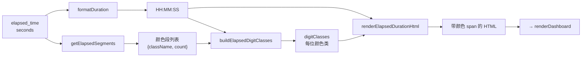

# src/celestialflow_web/static/ts/dashboard_statuses.ts

> 📅 最后更新日期: 2026/09/24

渲染仪表盘中间的节点状态卡片：读取 `loaders.ts` 暴露的节点状态快照与图级派生值，展示成功/等待/错误/重复等指标、执行模式与并发数，以及运行时间彩色分段。

> 本模块只读数据、不发起网络请求。`nodeStatuses`、`lastNodeStatuses`、`nodeEstimates`、`lastNodeEstimates`、`graphMeta` 均由 `loaders.ts` 维护；图级剩余时间就地由 `util_estimators.ts` 的 `calcRemaining()` 推算。

## 类型定义

```typescript
type ElapsedSegment = {
  className: string; // 对应的颜色 CSS 类名
  count: number;     // 该类型任务数量
};
```

> `NodeStatus` 的字段定义见 [`types.d.ts`](types.d.md)，`NodeEstimate` 的定义见 [`loaders.ts`](loaders.md)。

## DOM 元素引用

| 变量 | DOM ID | 说明 |
|------|--------|------|
| `dashboardGrid` | `#dashboard-grid` | 节点状态卡片网格容器 |

## 配置驱动函数

以下函数根据 `webConfig.dashboard.useTotalPendingInStatus` 开关动态切换状态卡中"等待任务数"和"剩余时间"的数据来源。

### `getDisplayPending(status: NodeStatus, estimate?: NodeEstimate): number`

开启总等待模式时返回图级估算的 `estimate.total_tasks_pending`；否则返回节点自身的 `status.tasks_pending`。图元信息就绪前 `estimate` 可能缺失，此时按 0 处理。

### `getDisplayRemainingTime(status: NodeStatus, estimate?: NodeEstimate): number`

开启总等待模式时返回 `estimate.total_remaining_time`；否则调用 `calcRemaining(tasks_processed, tasks_pending, elapsed_time)` 基于本节点计数就地推算。

### `getPendingLabelHtml(): string`

返回等待标签及提示气泡的 HTML，按配置在 `status.pending` / `status.pendingGlobal` 两组国际化键之间切换。

---

## 辅助函数：运行时间彩色分段渲染

以下四个函数共同实现对 `elapsed_time` 的彩色 HTML 渲染。颜色段根据成功/失败/重复任务数的比例分配给每一位数字。

### `formatElapsedDuration(seconds, successCount, failedCount, duplicateCount): string`

入口函数。调用 `formatDuration()` 获取时间格式文本，再通过 `getElapsedSegments()`、`buildElapsedDigitClasses()`、`renderElapsedDurationHtml()` 生成带颜色 `<span>` 的 HTML。

### `getElapsedSegments(successCount, failedCount, duplicateCount): ElapsedSegment[]`

生成由非零计数驱动的颜色段列表。

| CSS 类 | 统计字段 | 含义 |
|--------|---------|------|
| `elapsed-success` | `tasks_succeeded` | 成功任务 |
| `elapsed-error` | `tasks_failed` | 失败任务 |
| `elapsed-duplicate` | `tasks_duplicated` | 重复任务 |

返回仅包含 `count > 0` 的段。若全部为零，返回空数组。

### `buildElapsedDigitClasses(segments: ElapsedSegment[], digitCount: number): string[]`

按任务状态比例为 `HH:MM:SS` 去掉冒号后的每一位数字分配颜色类。

- **段数 ≥ 位数**：直接取前 N 个段。
- **段数 < 位数**：等比例分配剩余位数给各段，再通过余数排序补齐分配误差，确保每位均有颜色类。

### `renderElapsedDurationHtml(duration, digitClasses, defaultClassName): string`

将时间字符串的每个字符包裹在 `<span>` 中。冒号 `:` 使用其左侧数字的颜色类；数字字符依次使用 `digitClasses` 中的类名。

---

## 核心函数

### `renderDashboard(): void`

遍历 `nodeStatuses` 为每个节点生成状态卡片。

**卡片渲染特性：**

- **实时增量**: 对比 `lastNodeStatuses` / `lastNodeEstimates` 计算成功/等待/失败/重复任务的增量并彩色显示（等待增量基于 `getDisplayPending()` 的值）。
- **状态标记**: 卡片类名反映节点状态（`status-running` = 运行中，`status-stopped` = 已停止，否则为普通卡片）。
- **构建期元信息**: 执行模式与并发数取自 `graphMeta.node_meta[node]`（`execution_mode` / `max_workers`）；`serial` 模式或元信息缺失时并发数显示 `-`。
- **运行时间彩色分段**: 调用 `formatElapsedDuration()` 为 `elapsed_time` 生成基于任务成功/失败/重复比例染色的 HTML。
- **四段式进度条**: 直观展示成功（绿）、错误（红）、重复（黄）、等待（灰）的比例。
- **时间预估**: 显示已运行时间、预计剩余时间、平均任务耗时和完成进度百分比。
- **交互跳转**: 点击卡片中的错误数（`.error-clickable`），自动跳转至"错误日志"标签页并预设该节点过滤器。

## 卡片样式类

| 状态 | CSS 类 | 说明 |
|------|--------|------|
| 运行中 | `node-card status-running` | 蓝色左边框 |
| 已停止 | `node-card status-stopped` | 灰色左边框 |
| 未启动 | `node-card` | 默认灰色左边框 |

## 运行时间渲染流程


```mermaid
flowchart LR
    A["elapsed_time<br/>seconds"] --> B[formatDuration]
    B --> C["HH:MM:SS"]
    A --> D[getElapsedSegments]
    D --> E["颜色段列表<br/>{className, count}"]
    C --> F[buildElapsedDigitClasses]
    E --> F
    F --> G["digitClasses<br/>每位颜色类"]
    C --> H[renderElapsedDurationHtml]
    G --> H
    H --> I["带颜色 span 的 HTML"]
    I --> J[→ renderDashboard]
```

## 使用示例

```typescript
// 构造一个节点状态对象（字段与 /api/pull_status payload 一致）
const nodeStatus: NodeStatus = {
  status: 1,
  tasks_processed: 250,
  tasks_succeeded: 240,
  tasks_failed: 5,
  tasks_duplicated: 5,
  tasks_pending: 30,
  upstream_counts: {},
  downstream_counts: {},
  start_time: 1745400000,
  elapsed_time: 3600,
};

// 本轮图级派生值（由 loaders.ts 的 refreshNodeEstimates() 计算）
const estimate = { total_tasks_pending: 50, total_remaining_time: 1200 };

// 计算运行时间彩色分段
const coloredDuration = formatElapsedDuration(
  nodeStatus.elapsed_time,
  nodeStatus.tasks_succeeded,
  nodeStatus.tasks_failed,
  nodeStatus.tasks_duplicated,
);
// 返回带颜色 span 的 HTML 字符串

// 根据配置获取展示值
// getDisplayPending(nodeStatus, estimate) → 30 或 50
// getDisplayRemainingTime(nodeStatus, estimate) → 就地推算 或 1200
```
