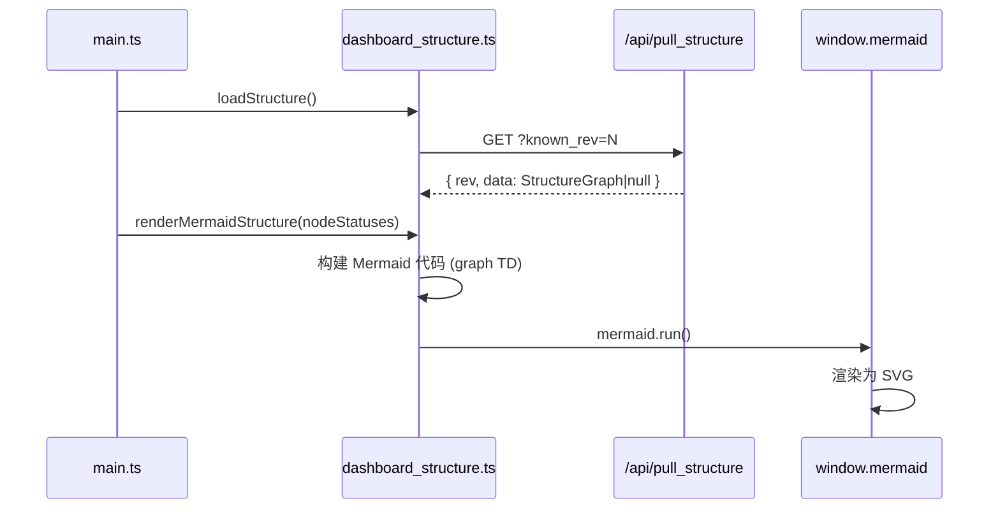

# dashboard_structure.ts

> 📅 最后更新日期: 2026/06/11

管理任务图结构数据的加载与 Mermaid 流程图的可视化渲染，支持基于节点状态的实时着色和边增量显示。

> ⚠️ **已变更**: `structureData` 类型已从旧版的 `any[]`（数组）变更为 `StructureGraph` 对象类型（含 `nodes`、`edges`、`source_nodes`）。新增了 `getNodeShape()` 函数和完整的类型定义。

## 类型定义

```typescript
type StructureNodeMeta = {
  func_name: string;       // 节点函数名，用于推导节点类型（如 _split, _route）
  execution_mode: string;  // 节点执行模式
  stage_mode: string;      // 节点阶段模式
  max_workers: number;     // 并发 worker 数上限
};

type StructureGraph = {
  nodes: Record<string, StructureNodeMeta>; // 节点名到元信息的映射
  edges: Record<string, string[]>;         // 有向边邻接表
  source_nodes: string[];                   // 入度为 0 的源节点列表
};
```

## 全局变量

| 变量 | 类型 | 说明 |
|------|------|------|
| `structureData` | `StructureGraph` | 任务结构图数据（有向图），默认含空的 `nodes`/`edges`/`source_nodes` |
| `structureRev` | `number` | 上次拉取的版本号，初始化 `-1`，用于增量拉取 |
| `structureRequestSeq` | `number` | 请求序列号，防止旧结构响应覆盖新结果 |

## 函数

### `loadStructure(): Promise<boolean>`

异步从 `GET /api/pull_structure?known_rev=N` 拉取图结构。使用 `structureRequestSeq` 作竞态保护。

---

### `getNodeId(nodeName: string): string`

生成 Mermaid 兼容的节点 ID（替换非单词字符为 `_`）。

---

### `getNodeShape(nodeMeta: StructureNodeMeta): string`

根据节点元信息的 `func_name` 推导 Mermaid 形状类型。

| `func_name` | 形状 | 说明 |
|-------------|------|------|
| `_split` | `subgraph` | 分流/拆分节点 |
| `_route` | `rhombus` | 路由/决策节点 |
| `_transport` / `_source` / `_ack` | `parallelogram` | 输入输出类节点 |
| 其他 | `box` | 普通处理节点 |

---

### `getShapeWrappedLabel(label: string, shape?: string): string`

根据形状类型生成 Mermaid 语法的节点标签。支持 10 种形状：`box`、`circle`、`round`、`rhombus`、`subgraph`、`parallelogram`、`db`、`cloud`、`hex`、`arrow`。

---

### `renderMermaidStructure(statuses?: Record<string, NodeStatus>): void`

构建 Mermaid 流程图代码并调用 `window.mermaid.run()` 渲染。

**主要特性：**

- **动态着色**：根据 `statuses` 中的 `status` 码自动应用颜色类（`greenNode`=运行中，`greyNode`=已停止，`whiteNode`=未启动）。
- **主题适配**：自动识别 `dark-theme` 类，切换 Mermaid 的 `classDef` 颜色方案（深色/浅色两套）。
- **边增量显示**：若 `webConfig.dashboard.showStructureEdgeDelta` 开启，在边（Edge）上显示 `|+N|` 标签（取自上一轮到本轮的 `tasks_succeeded` 增量）。
- **源节点优先**：`source_nodes` 排在非源节点之前，增强拓扑图可读性。
- **容器替换**：每次渲染创建新 `#mermaid-container` 替换旧容器，避免 Mermaid 对旧 DOM 状态的残留问题。

## 节点状态颜色映射

| `status` | 样式类 | 含义 |
|----------|--------|------|
| `1` | `greenNode` | 运行中 |
| `2` | `greyNode` | 已停止 |
| 无/其他 | `whiteNode` | 未启动/未知 |

## 数据流



## 使用示例

```typescript
// 模拟结构数据
const mockStructure: StructureGraph = {
  nodes: {
    "DataLoader": { func_name: "_source", execution_mode: "serial", stage_mode: "serial", max_workers: 1 },
    "Processor":  { func_name: "process", execution_mode: "thread", stage_mode: "thread", max_workers: 4 },
    "Router":     { func_name: "_route", execution_mode: "serial", stage_mode: "serial", max_workers: 1 },
  },
  edges: {
    "DataLoader": ["Processor"],
    "Processor":  ["Router"],
  },
  source_nodes: ["DataLoader"],
};

// structureData = mockStructure;

// 获取节点 ID 和形状
// getNodeId("DataLoader") → "DataLoader"
// getNodeShape(mockStructure.nodes["Router"]) → "rhombus"

// 渲染结构图（带节点状态着色）
// renderMermaidStructure(nodeStatuses);
```
