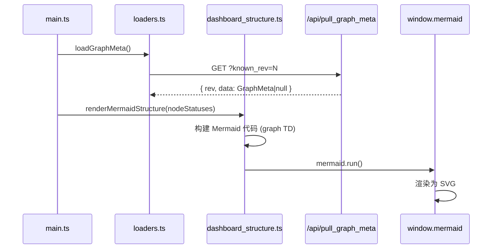

# src/celestialflow_web/static/ts/dashboard_structure.ts

> 📅 最后更新日期: 2026/09/24

用 Mermaid.js 将任务有向图渲染为流程图，并根据节点状态实时着色、按配置在边上显示增量或累计标签。

> 图元信息（`graphMeta`）由 `loaders.ts` 提供，本文件只读不拉；上一轮状态 `lastNodeStatuses` 亦来自 `loaders.ts`，用于计算边增量。

## 类型定义

```typescript
/** Mermaid 节点形状，取值由 getNodeShape 决定 */
type NodeShape = "box" | "rhombus" | "subgraph";
```

## 函数

### `getNodeId(nodeName: string): string`

生成 Mermaid 兼容的节点 ID（将非单词字符替换为 `_`）。

### `getNodeShape(className?: string): NodeShape`

根据图元信息 `node_meta[node].class_name` 推导 Mermaid 形状，与每轮状态快照解耦：

| `class_name` | 形状 | Mermaid 语法 | 说明 |
|--------------|------|--------------|------|
| `TaskSplitter` | `subgraph` | `[[label]]` | 拆分/分流节点 |
| `TaskRouter` | `rhombus` | `{{label}}` | 路由/决策节点 |
| 其他 / 缺失 | `box` | `[label]` | 普通处理节点 |

### `getShapeWrappedLabel(label: string, shape: NodeShape): string`

根据形状类型生成 Mermaid 语法的节点标签，仅支持 `box`、`rhombus`、`subgraph` 三种。

### `renderMermaidStructure(statuses?: Record<string, NodeStatus>): void`

构建 Mermaid 代码并调用 `window.mermaid.run()` 渲染。

**主要特性：**

- **空态处理**：图元信息尚未就绪（`nodes` 为空）时，用空态占位替换 `#mermaid-container`。
- **动态着色**：按 `statuses` 中的 `status` 码应用 `classDef`（`greenNode`=运行中，`greyNode`=已停止，`whiteNode`=未启动）。
- **主题适配**：识别 `dark-theme` 类，切换 `classDef` 深浅两套配色。
- **边标签模式**：由 `webConfig.dashboard.structureEdgeLabel` 控制：
  - `none`：不显示任何边标签；
  - `delta`：显示该边相对上一轮 `downstream_counts` 的增量 `|+N|`（仅当增量为正）；
  - `cumulative`：显示该上游到该下游的累计传输数 `|N|`。
- **源节点优先**：`source_nodes` 排在非源节点之前，增强拓扑图可读性。
- **容器替换**：每次渲染创建新 `#mermaid-container` 替换旧容器，避免 Mermaid 对旧 DOM 状态的残留问题。

## 节点状态颜色映射

| `status` | 样式类 | 含义 |
|----------|--------|------|
| `1` | `greenNode` | 运行中 |
| `2` | `greyNode` | 已停止 |
| 无/其他 | `whiteNode` | 未启动/未知 |

## 数据流


```mermaid
sequenceDiagram
    participant Main as main.ts
    participant Loaders as loaders.ts
    participant Struct as dashboard_structure.ts
    participant API as /api/pull_graph_meta
    participant Mermaid as window.mermaid

    Main->>Loaders: loadGraphMeta()
    Loaders->>API: GET ?known_rev=N
    API-->>Loaders: { rev, data: GraphMeta|null }
    Main->>Struct: renderMermaidStructure(nodeStatuses)
    Struct->>Struct: 构建 Mermaid 代码 (graph TD)
    Struct->>Mermaid: mermaid.run()
    Mermaid->>Mermaid: 渲染为 SVG
```

## 使用示例

```typescript
// graphMeta 由 loaders.ts 的 loadGraphMeta() 维护，结构形如：
// {
//   nodes: ["DataLoader", "Processor", "Router"],
//   edges: { DataLoader: ["Processor"], Processor: ["Router"] },
//   source_nodes: ["DataLoader"],
//   node_meta: {
//     DataLoader: { class_name: "TaskExecutor", execution_mode: "serial", max_workers: 1 },
//     Processor:  { class_name: "TaskExecutor", execution_mode: "thread", max_workers: 4 },
//     Router:     { class_name: "TaskRouter",   execution_mode: "serial", max_workers: 1 },
//   },
//   analysis: null,
// }

// 获取节点 ID 和形状
// getNodeId("DataLoader") → "DataLoader"
// getNodeShape("TaskRouter") → "rhombus"

// 渲染结构图（带节点状态着色）
// renderMermaidStructure(nodeStatuses);
```
