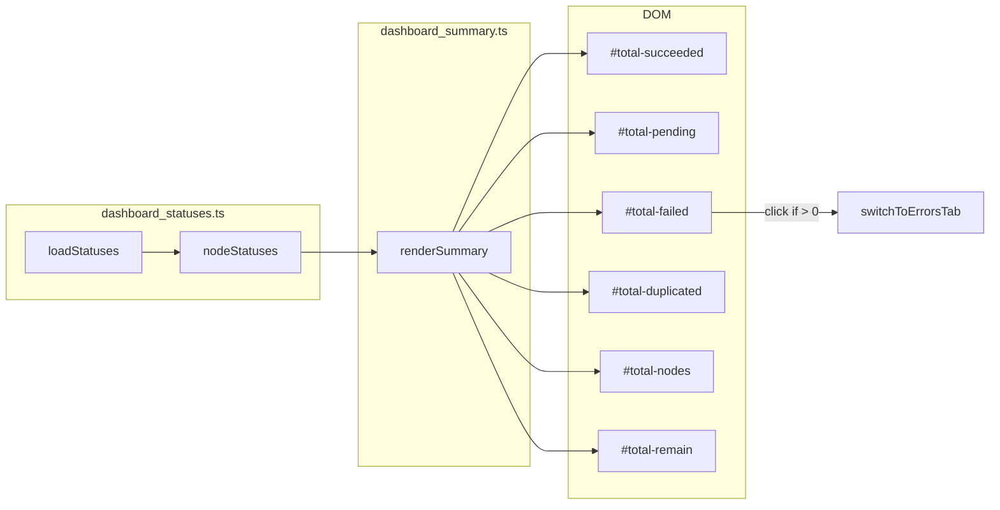

# dashboard_summary.ts

> 📅 最后更新日期: 2026/06/11

管理全局汇总统计数据的渲染。**汇总完全由前端基于 `nodeStatuses` 实时聚合计算**，不依赖独立的后端 API。

> ⚠️ **已变更**: 旧版文档提及的 `loadSummary()` 函数和 `/api/pull_summary` 端点已移除。当前版本中，`renderSummary()` 直接从 `nodeStatuses`（由 `dashboard_statuses.ts` 维护）中聚合所有统计项。

## 全局变量

| 变量 | 类型 | 说明 |
|------|------|------|
| `summaryRev` | `number` | 数据版本号（当前保留但未使用增量拉取逻辑） |

## DOM 元素引用

| 变量 | DOM ID | 说明 |
|------|--------|------|
| `totalSucceeded` | `#total-succeeded` | 总成功任务数 |
| `totalPending` | `#total-pending` | 总等待任务数 |
| `totalDuplicated` | `#total-duplicated` | 总重复任务数 |
| `totalFailed` | `#total-failed` | 总失败任务数 |
| `totalNodes` | `#total-nodes` | 活动节点数 |
| `totalRemain` | `#total-remain` | 总剩余时间 |

## 函数

### `renderSummary(): void`

基于 `nodeStatuses`（全局变量，由 `dashboard_statuses.ts` 维护）的最新快照，前端聚合计算各项总量并渲染到汇总面板。

**前端聚合项：**

| 显示项 | 计算方式 | 格式化函数 |
|--------|---------|-----------|
| 总成功任务 | `sum(status.tasks_succeeded)` | `formatLargeNumber()` |
| 总等待任务 | `sum(status.tasks_pending)` | `formatLargeNumber()` |
| 总失败任务 | `sum(status.tasks_failed)` | `formatLargeNumber()` |
| 总重复任务 | `sum(status.tasks_duplicated)` | `formatLargeNumber()` |
| 活动节点数 | `count(status === 1)` | `formatLargeNumber()` |
| 总剩余时间 | `max(status.total_remaining_time)` | `formatDuration()` |

> 图级剩余时间取自各节点 `total_remaining_time` 的最大值（考虑各条链路的估算），而非简单求和。

**交互特性：**

- 当总失败数 `> 0` 时，`#total-failed` 元素被添加 `.error-clickable` 类并绑定 `onclick` 调用 `switchToErrorsTab()`，点击可跳转至错误日志页。

## 数据流



## 使用示例

```typescript
// renderSummary() 由 refreshAll() 在 statusesChanged 时自动调用

// 内部聚合逻辑示意：
const statusList = Object.values(nodeStatuses || {});
const total_succeeded = statusList.reduce((sum, s) => sum + (s.tasks_succeeded || 0), 0);
const total_pending   = statusList.reduce((sum, s) => sum + (s.tasks_pending || 0), 0);
const total_failed    = statusList.reduce((sum, s) => sum + (s.tasks_failed || 0), 0);
const total_duplicated = statusList.reduce((sum, s) => sum + (s.tasks_duplicated || 0), 0);
const total_nodes     = statusList.reduce((sum, s) => sum + (s.status === 1 ? 1 : 0), 0);
const total_remain    = Math.max(...statusList.map(s => s.total_remaining_time || 0), 0);

// 更新 DOM
totalSucceeded.innerHTML = formatLargeNumber(total_succeeded);
totalPending.innerHTML   = formatLargeNumber(total_pending);
// ... 其余 DOM 更新
totalRemain.textContent  = formatDuration(total_remain);
```
