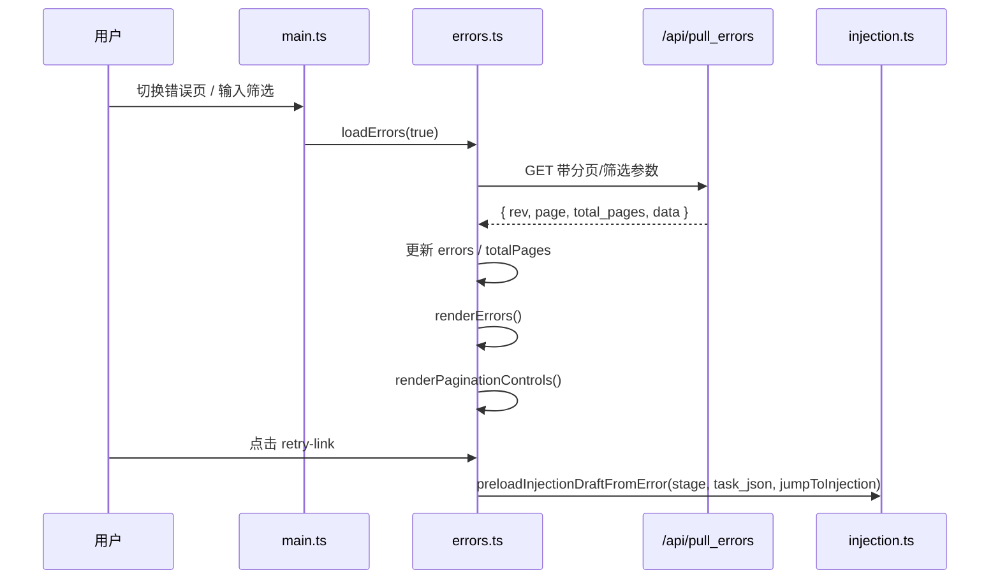

# errors.ts

> 📅 最后更新日期: 2026/06/22

错误日志分页与过滤模块。负责错误记录的异步拉取、前端分页逻辑以及按节点/关键词搜索的过滤展示。

## 类型定义

```typescript
type ErrorData = {
  ts: number;            // 生命周期时间戳，单位为秒
  stage: string;         // 错误发生的节点/阶段名称，用于节点筛选
  event_id: number;      // 失败事件的唯一标识 ID，全局唯一
  error_type: string;    // 错误的分类类型
  error_message: string; // 错误的具体描述信息
  task_json: unknown;    // 触发该错误的任务数据，用于展示与重试回填
  result_json: unknown;  // 成功结果或失败时的占位结果
};
```

## 全局变量

| 变量 | 类型 | 说明 |
|------|------|------|
| `errors` | `ErrorData[]` | 当前页错误记录列表 |
| `currentPage` | `number` | 当前分页页码，默认 `1` |
| `pageSize` | `number` | 每页显示条数，默认 `10`，由 `webConfig.errors.pageSize` 同步 |
| `errorSortOrder` | `"newest" \| "oldest"` | 当前错误日志排序方式，默认 `"newest"` |
| `totalPages` | `number` | 总页数，默认 `1` |
| `errorsRev` | `number` | 数据版本号，用于增量拉取，默认 `-1` |
| `lastQueryKey` | `string` | 上次查询缓存键，用于判断筛选条件是否变化 |
| `errorsRequestSeq` | `number` | 请求序列号，防止旧响应覆盖新结果 |

## DOM 元素引用

| 变量 | DOM 选择器 | 说明 |
|------|-----------|------|
| `searchInput` | `#error-search` | 关键词搜索输入框 |
| `nodeFilter` | `#node-filter` | 按节点筛选下拉框 |
| `errorSortSelect` | `#error-sort-order` | 排序方式下拉框 |
| `errorsTableBody` | `#errors-table tbody` | 错误表格主体 |
| `paginationContainer` | `#pager-container` | 分页控件容器 |

## 函数

### `buildErrorsQueryKey(page, pageSizeValue, node, keyword, sortOrder): string`

构建包含分页、页大小、节点筛选、关键词和排序方式的查询缓存键，用于判断是否需要强制全量拉取。

### `loadErrors(forceReload = false): Promise<boolean>`

从后端 `GET /api/pull_errors` 拉取当前筛选条件下的错误日志。

- **查询参数**：`known_rev`、`page`、`page_size`、`node`、`keyword`、`sort_order`。
- **缓存策略**：当筛选条件（`lastQueryKey`）变化或 `forceReload=true` 时，`known_rev` 重置为 `-1` 强制全量拉取。
- **竞态保护**：使用 `errorsRequestSeq` 丢弃过期响应。
- **返回值**：当后端返回了新的错误记录数据时返回 `true`。

### `renderErrors(): void`

将 `errors` 数组渲染到表格中。每行包含错误序号、事件 ID、错误信息、节点、任务数据、发生时间和重试按钮。

- 当 `task_json` 可解析且不是以 `<` 开头的字符串时，显示可点击的“任务注入”重试链接。
- 重试点击调用 `preloadInjectionDraftFromError(stage, task_json, webConfig.errors.jumpToInjectionAfterRetry)`。
- 无记录时显示空态占位。

### `goToErrorsPage(nextPage): Promise<void>`

跳转到指定页码并重新加载数据。目标页码会被限制在 `[1, totalPages]` 范围内。

### `buildPageList(current, total): Array<number \| string>`

生成分页页码列表，包含首尾、当前页及前后页，间隔超过 1 时插入省略号 `…`。

### `renderPaginationControls(totalPages): void`

渲染分页控件，包括“上一页/下一页”按钮和带省略号的数字页码区。当总页数 `<= 1` 时不渲染。

### `populateNodeFilter(statuses): void`

根据当前节点状态快照填充节点筛选下拉框，并尽量保留用户之前的筛选值。若已选节点已消失则恢复为“全部节点”。

## 事件绑定

| 元素 | 事件 | 行为 |
|------|------|------|
| `searchInput` | `input` | 回到第一页，强制重新拉取并渲染 |
| `nodeFilter` | `change` | 回到第一页，强制重新拉取并渲染 |
| `errorSortSelect` | `change` | 更新 `errorSortOrder` 与 `webConfig.errors.sortOrder`，回到第一页，拉取渲染，并调用 `saveWebConfig()` 保存设置 |

## 数据流



## 使用示例

```typescript
// 直接跳转到第 3 页
await goToErrorsPage(3);

// 按节点筛选（等效于设置 nodeFilter 并触发 change）
nodeFilter.value = "Processor";
nodeFilter.dispatchEvent(new Event("change"));

// 构建查询缓存键
const key = buildErrorsQueryKey(1, 10, "Processor", "timeout", "newest");
// "1|10|Processor|timeout|newest"

// renderErrors 会读取全局 errors 并渲染表格
// renderPaginationControls(totalPages) 会渲染底部分页
```
