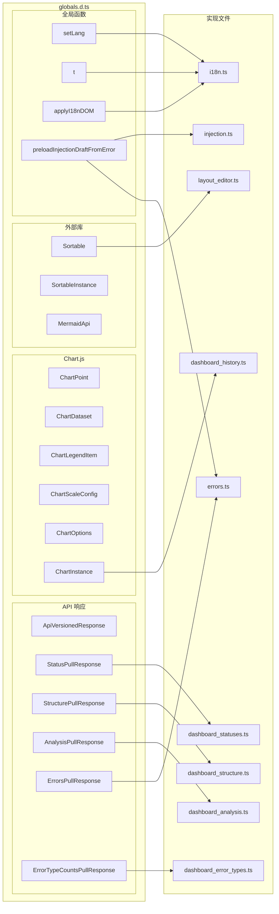

# globals.d.ts

> 📅 最后更新日期: 2026/07/16

TypeScript 全局类型声明文件，为 CDN 引入的第三方库（Chart.js、Sortable.js）、全局变量、跨模块共享函数以及后端 API 响应结构提供完整类型定义。

> ⚠️ **已变更**: 旧版文档中 `Chart`/`Sortable` 简化声明为 `any`。当前版本已展开为完整的最小类型定义，并新增了全部 API 响应类型和前端内部结构类型。

## API 响应类型

```typescript
type ApiVersionedResponse<T> = {
  rev: number;       // 当前数据版本号
  data: T | null;    // 当 known_rev 未变化时可能返回 null
};

type StatusPullResponse = ApiVersionedResponse<Record<string, NodeStatus>> & {
  timestamp: number; // 本次状态快照的统一时间戳
};

type StructurePullResponse = ApiVersionedResponse<StructureGraph>;

type AnalysisPullResponse = ApiVersionedResponse<AnalysisData>;

type ErrorsPullResponse = {
  rev: number;
  page: number;
  page_size: number;
  total: number;
  total_pages: number;
  sort_order: "newest" | "oldest";
  data: ErrorData[] | null;
};

type ErrorTypeCount = {
  error_type: string; // 错误类型名称
  count: number;      // 该类型的错误条数
};

type ErrorTypeCountsPullResponse = ApiVersionedResponse<ErrorTypeCount[]>;
```

## 仪表盘布局类型

```typescript
type DashboardColumnKey = "left" | "middle" | "right";

type DashboardLayout = Record<DashboardColumnKey, string[]>;
```

## Chart.js 类型

```typescript
type ChartPoint = { x: number; y: number };

type ChartDataset = {
  label: string;
  data: ChartPoint[] | number[];
  borderColor?: string | string[];
  backgroundColor?: string | string[];
  borderWidth?: number;
  fill?: boolean;
  tension?: number;
  hidden?: boolean;
};

type ChartLegendItem = {
  datasetIndex: number;
  hidden?: boolean;
};

type ChartLegend = {
  legendItems: ChartLegendItem[];
};

type ChartScaleConfig = {
  ticks: { color: string };
  grid: { color: string };
  title: { display: boolean; text: string; color: string };
  border: { color: string };
};

type ChartOptions = {
  animation: boolean;
  responsive: boolean;
  plugins: {
    legend?: {
      display?: boolean;
      labels?: { color: string };
      onClick?: (event: Event, legendItem: ChartLegendItem, legend: { chart: ChartInstance }) => void;
    };
  };
  interaction?: { intersect: boolean; mode: string };
  scales?: { x: ChartScaleConfig; y: ChartScaleConfig };
  cutout?: string;
};

interface ChartInstance {
  data: { labels: string[]; datasets: ChartDataset[] };
  options: ChartOptions;
  legend?: ChartLegend;
  destroy(): void;
  update(): void;
  getDatasetMeta(index: number): { hidden: boolean | null };
}

declare const Chart: {
  new (ctx: CanvasRenderingContext2D | null, config: {
    type: string;
    data: ChartInstance["data"];
    options: ChartOptions;
  }): ChartInstance;
};
```

## Sortable.js 类型

```typescript
type SortableInstance = {
  destroy(): void;
};

declare const Sortable: {
  create(element: HTMLElement, options: {
    group: string;
    animation: number;
    ghostClass: string;
    dragClass: string;
  }): SortableInstance;
};
```

## Mermaid 类型

```typescript
type MermaidApi = {
  run(): void; // 扫描页面中的 Mermaid 源码并执行渲染
};

interface Window {
  mermaid: MermaidApi;
}
```

## 国际化类型与全局声明

```typescript
type Lang = "zh-CN" | "en" | "ja";

declare var currentLang: Lang;
declare function setLang(lang: Lang): void;
declare function t(key: string, ...args: string[]): string;
declare function applyI18nDOM(): void;
```

## 跨模块函数声明

```typescript
declare function preloadInjectionDraftFromError(
  nodeName: string,
  taskData: unknown,
): void;
```

`preloadInjectionDraftFromError` 定义于 `injection.ts`，由 `errors.ts` 中重注入列调用，用于将错误关联的任务数据预填到注入页编辑器。

> ⚠️ **已变更**: 声明文件仅包含 2 个参数（`nodeName`、`taskData`），但 `injection.ts` 实际实现接受第 3 个参数 `switchTab`（默认 `true`）。调用方（`errors.ts`）传入 3 个参数（第 3 个为 `webConfig.errors.jumpToInjectionAfterRetry`）。声明文件与实际签名不一致，以实际实现为准。

## 类型关系


