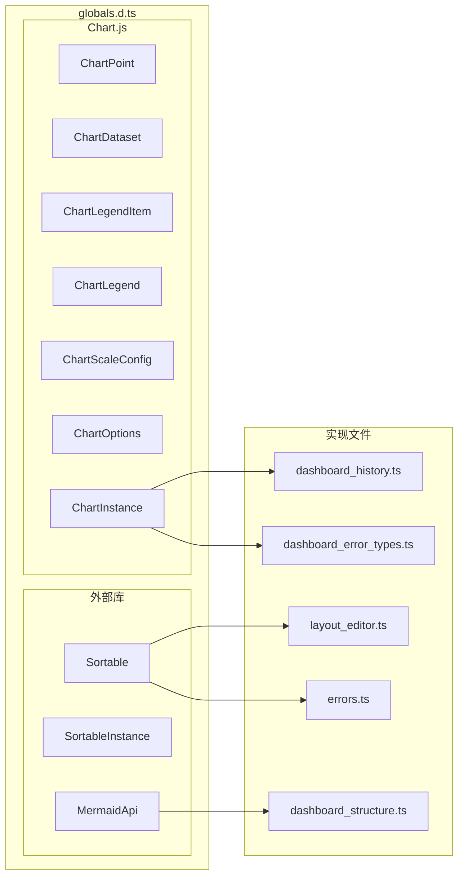

# src/celestialflow_web/static/ts/globals.d.ts

> 📅 最后更新日期: 2026/09/24

全局类型声明文件，只包含由 CDN 外部脚本注入、需要全局可见的最小类型：Chart.js、Sortable.js 与 Mermaid。

> 前后端契约类型（接口 payload / 响应、配置结构等）统一放在 [`types.d.ts`](types.d.md)；本文件是纯类型声明（`.d.ts`），不产生 `.js` 产物，因此无需在 `scripts.html` 中引用。

## Chart.js 类型

```typescript
type ChartPoint = { x: number; y: number };

type ChartDataset = {
  label: string;
  data: ChartPoint[] | number[];
  borderColor?: string | string[];
  backgroundColor?: string | string[];
  borderWidth?: number;
  fill?: boolean;
  tension?: number;
  hidden?: boolean;
};

type ChartLegendItem = {
  datasetIndex: number;
  hidden?: boolean;
};

type ChartLegend = {
  legendItems: ChartLegendItem[];
};

type ChartScaleConfig = {
  ticks: { color: string };
  grid: { color: string };
  title: { display: boolean; text: string; color: string };
  border: { color: string };
};

type ChartOptions = {
  animation: boolean;
  responsive: boolean;
  plugins: {
    legend?: {
      display?: boolean;
      labels?: { color: string };
      onClick?: (event: Event, legendItem: ChartLegendItem, legend: { chart: ChartInstance }) => void;
    };
  };
  interaction?: { intersect: boolean; mode: string };
  scales?: { x: ChartScaleConfig; y: ChartScaleConfig };
  cutout?: string;
};

interface ChartInstance {
  data: { labels: string[]; datasets: ChartDataset[] };
  options: ChartOptions;
  legend?: ChartLegend;
  destroy(): void;
  update(): void;
  getDatasetMeta(index: number): { hidden: boolean | null };
}

declare const Chart: {
  new (ctx: CanvasRenderingContext2D | null, config: {
    type: string;
    data: ChartInstance["data"];
    options: ChartOptions;
  }): ChartInstance;
};
```

## Sortable.js 类型

```typescript
type SortableInstance = {
  destroy(): void;
};

declare const Sortable: {
  create(element: HTMLElement, options: {
    group: string;
    animation: number;
    ghostClass: string;
    dragClass: string;
  }): SortableInstance;
};
```

## Mermaid 类型

```typescript
type MermaidApi = {
  run(): void; // 扫描页面中的 Mermaid 源码并执行渲染
};

interface Window {
  mermaid: MermaidApi;
}
```

`mermaid` 由 `partials/head.html` 中的 ESM `<script type="module">` 初始化并挂到 `window` 上，供 `dashboard_structure.ts` 调用 `window.mermaid.run()`。

## 类型关系


```mermaid
flowchart LR
    subgraph "globals.d.ts"
        direction TB
        subgraph "Chart.js"
            CPT[ChartPoint]
            CDS[ChartDataset]
            CLI[ChartLegendItem]
            CLE[ChartLegend]
            CSC[ChartScaleConfig]
            COP[ChartOptions]
            CI[ChartInstance]
        end
        subgraph "外部库"
            SORT[Sortable]
            SORTI[SortableInstance]
            MER[MermaidApi]
        end
    end

    subgraph "实现文件"
        DH[dashboard_history.ts]
        DET[dashboard_error_types.ts]
        LE[layout_editor.ts]
        ER[errors.ts]
        DST[dashboard_structure.ts]
    end

    CI --> DH
    CI --> DET
    SORT --> LE
    SORT --> ER
    MER --> DST
```

## 使用示例

```typescript
// 这些类型为全局声明，无需 import 即可在任意 TS 模块中直接使用：
const ctx = (document.getElementById("node-progress-chart") as HTMLCanvasElement).getContext("2d");
const chart: ChartInstance = new Chart(ctx, {
  type: "line",
  data: { labels: [], datasets: [] },
  options: { animation: false, responsive: true },
});
chart.destroy();

const zone = document.getElementById("layout-dropzone-left")!;
const sortable = Sortable.create(zone, {
  group: "dashboard-layout",
  animation: 150,
  ghostClass: "dragging",
  dragClass: "dragging",
});
sortable.destroy();

window.mermaid.run();
```
