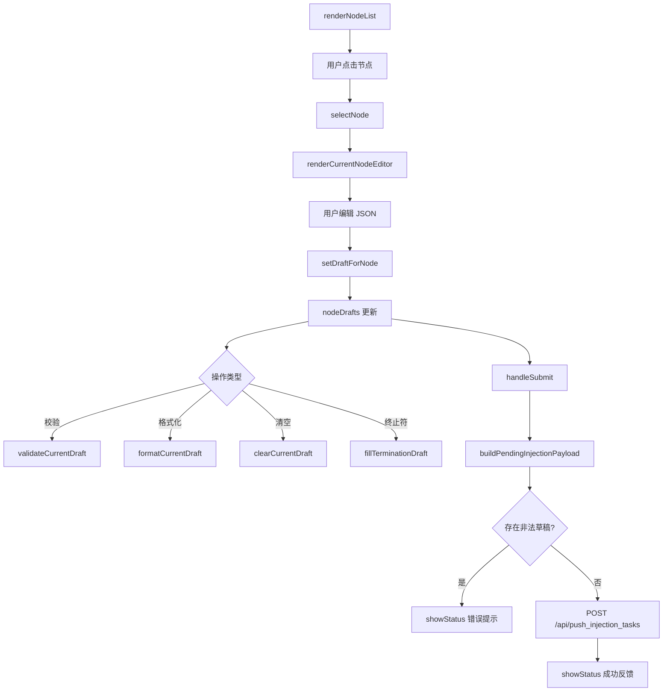

# injection.ts

> 📅 最后更新日期: 2026/06/22

任务手动注入模块。采用**单节点编辑 + 批量提交**的草稿式架构：每个节点维护独立 JSON 草稿，最终统一发送为 `{ node_name: [tasklist] }` 结构。

## 类型定义

```typescript
type ValidationState = "success" | "error" | "neutral";
```

## 全局变量

| 变量 | 类型 | 说明 |
|------|------|------|
| `currentNodeName` | `string \| null` | 当前正在编辑的节点名，未选择时为 `null` |
| `nodeDrafts` | `Record<string, string>` | 以节点名为键的 JSON 草稿文本映射 |
| `statusHideTimer` | `number \| null` | 底部状态提示的自动隐藏定时器 |

## i18n 元信息辅助函数

注入页中有部分动态文案需要在语言切换后重绘，因此用 `data-message-key` / `data-message-args` 缓存原始翻译信息。

| 函数 | 签名 | 说明 |
|------|------|------|
| `setLocalizedMessageMeta` | `(element, messageKey, args = []) => void` | 在元素上记录翻译键与占位参数 |
| `clearLocalizedMessageMeta` | `(element) => void` | 清除元素上的翻译元信息 |
| `getLocalizedMessageArgs` | `(element) => string[]` | 读取并解析缓存的占位参数 |

## 状态提示辅助函数

| 函数 | 签名 | 说明 |
|------|------|------|
| `getStatusIconSvg` | `(isSuccess: boolean) => string` | 根据成功/失败状态返回对应的 SVG 图标 HTML |
| `renderStatusMessage` | `(statusDiv, messageKey, isSuccess, args = []) => void` | 在指定容器内渲染带图标的翻译文案 |
| `showStatus` | `(messageKey, isSuccess = false, ...args) => void` | 在 `#status-message` 显示状态提示，3 秒后自动隐藏 |

## DOM 元素获取函数

| 函数 | 返回类型 | 对应 DOM ID |
|------|----------|-------------|
| `getSearchInput` | `HTMLInputElement` | `#search-input` |
| `getInjectableOnlyToggle` | `HTMLInputElement` | `#injectable-only-toggle` |
| `getJsonTextarea` | `HTMLTextAreaElement` | `#json-textarea` |
| `getEditorButtons` | `HTMLButtonElement[]` | `#validate-json-btn`、`#format-json-btn`、`#clear-draft-btn`、`#fill-termination-btn` |

## 事件绑定

模块在 `DOMContentLoaded` 时调用 `setupEventListeners()` 绑定以下交互：

| 元素 | 事件 | 行为 |
|------|------|------|
| `#search-input` | `input` | 实时过滤左侧节点列表 |
| `#json-textarea` | `input` | 同步写回当前节点草稿并重绘提示/预览 |
| `#node-list` | `click`（事件委托） | 切换到对应节点 |
| `#validate-json-btn` | `click` | 校验当前草稿 |
| `#format-json-btn` | `click` | 格式化当前草稿 |
| `#clear-draft-btn` | `click` | 清空当前节点草稿 |
| `#fill-termination-btn` | `click` | 在草稿末尾追加终止信号 |
| `#submit-btn` | `click` | 批量提交所有草稿 |

> 注：`#injectable-only-toggle` 的 `change` 事件在 `main.ts` 中统一绑定，切换后会调用 `renderInjectionPage()` 并保存配置。

## 节点列表与状态同步

### `isInjectableNode(nodeName: string): boolean`

判断节点当前是否允许接收注入。只要节点存在且状态不是已停止（`status !== 2`）即视为可注入；未运行但尚未停止的节点仍可提交。

### `syncInjectionStateWithStatuses(): void`

将草稿状态与最新节点状态快照对齐：
- 已消失或已停止节点的草稿会被清理。
- 当前编辑节点如果已不可注入，则取消当前选择。

### `renderNodeList(searchTerm = ""): void`

渲染左侧节点浏览列表。支持：
- 搜索关键词过滤（不区分大小写）。
- “仅显示可注入节点”开关过滤。
- 当前选中节点高亮（`.active-node`）。
- 不可注入节点显示为禁用样式（`.disabled-node`）。
- 已编辑草稿节点显示“已编辑”标签。

### `selectNode(nodeName: string): void`

切换当前编辑节点。若目标节点已不可注入，则同步清理状态并刷新页面。

### `renderCurrentNodeEditor(): void`

渲染右侧编辑器区域，包括当前节点名称、草稿状态标签、JSON 编辑框和操作按钮的启用/禁用状态。

### `renderInjectionPage(): void`

整体刷新注入页：依次调用 `syncInjectionStateWithStatuses()`、`renderNodeList()`、`renderCurrentNodeEditor()`、`renderDraftList()` 和 `updateSubmitButtonAvailability()`。

## 草稿管理

### `setDraftForNode(nodeName: string, value: string): void`

写入或删除某个节点的草稿。空文本会直接清除该节点草稿条目。

### `preloadInjectionDraftFromError(nodeName, taskData, switchTab = true): void`

由 `errors.ts` 调用。将错误关联的任务数据追加到对应节点草稿中（不覆盖已有内容）。

- 若当前节点已有合法草稿数组，则把新任务追加到末尾。
- 若 `switchTab` 为 `true`，自动切换到任务注入页签。
- 完成后聚焦到 JSON 编辑框末尾。

### `parseDraftTaskList(draftText: string): { ok: true; taskList: unknown[] } \| { ok: false; reason: "invalid_json" \| "not_array" }`

解析节点草稿文本。任务注入要求每个节点的值必须是 JSON 数组。

### `buildPendingInjectionPayload(): { payload: Record<string, unknown[]>; invalidNode: string \| null; invalidReason: "invalid_json" \| "not_array" \| null }`

遍历所有草稿，构建最终提交给后端的注入映射，并返回首个校验失败的节点及其原因。

### `updateSubmitButtonAvailability(): void`

根据是否存在可提交的草稿来启用或禁用提交按钮。提交中状态下不修改按钮可用性。

### `renderDraftList(): void`

渲染底部“待发送数据预览”，尽量贴近最终发送的数据结构。若草稿解析失败，则在该节点下展示 `invalid_json` 或 `invalid_task_list` 标记。

## 校验与格式化

### `setValidationMessage(messageKey: string, state: ValidationState, args: string[] = []): void`

在 `#json-validation` 区域显示校验提示，并缓存翻译键供语言切换后重绘。

### `clearValidationMessage(): void`

清空校验提示区域。

### `validateCurrentDraft(showSyntaxError = true): boolean`

校验当前节点草稿是否为合法 JSON 数组。

- 未选择节点 → 显示 `injection.validationSelectNode`。
- 草稿为空 → 显示 `injection.validationEmpty`。
- 校验通过 → 显示 `injection.validationOk`。
- 校验失败 → 根据失败原因显示 `injection.invalidJson` 或 `injection.invalidTaskList`。

返回 `true` 表示当前草稿合法。

### `formatCurrentDraft(): void`

对当前节点草稿执行 `JSON.parse` + `JSON.stringify(..., null, 2)` 格式化，并写回文本域和草稿缓存。

### `clearCurrentDraft(): void`

清空当前节点的草稿与编辑区内容。

### `fillTerminationDraft(): void`

在当前节点草稿数组末尾追加字符串 `"TERMINATION_SIGNAL"`，用于向节点发送终止信号。

## 提交与加载状态

### `handleSubmit(): Promise<void>`

提交所有待发送节点草稿：
1. 调用 `syncInjectionStateWithStatuses()` 对齐状态。
2. 调用 `buildPendingInjectionPayload()` 构建载荷。
3. 若有校验失败节点，跳转到该节点并提示修正。
4. 若无有效载荷，提示“没有可提交的草稿”。
5. 通过 `POST /api/push_injection_tasks` 发送 JSON 载荷。
6. 成功后清空草稿并刷新页面；失败时显示通用失败提示。

### `setButtonLoading(loading: boolean): void`

切换提交按钮的加载状态。加载中时显示旋转指示器（`.spinner`）和 `injection.submitting` 文案，并禁用按钮。

### `refreshInjectionLocalizedText(): void`

语言切换后重绘注入页中的动态文本，包括校验提示、状态提示和提交按钮文案。

## 核心流程



## 使用示例

```typescript
// 模拟节点草稿数据
nodeDrafts["StageA"] = '[{"id": 1, "payload": "data1"}, {"id": 2, "payload": "data2"}]';
nodeDrafts["StageB"] = '[{"id": 3}]';

// 选择节点并渲染编辑器
selectNode("StageA");  // 自动调用 renderInjectionPage()

// 校验当前草稿
validateCurrentDraft();  // 结果渲染到 #json-validation

// 格式化 JSON
formatCurrentDraft();

// 构建提交载荷
const { payload, invalidNode, invalidReason } = buildPendingInjectionPayload();
// payload = { StageA: [{id:1,...}, {id:2,...}], StageB: [{id:3}] }

// 提交草稿
await handleSubmit();

// 从错误页预填草稿（由 errors.ts 调用）
preloadInjectionDraftFromError("StageA", { id: 999 }, true);
// 自动切换到注入页签并追加 task_999 到 StageA 的草稿
```
